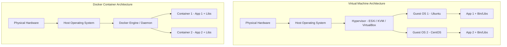

# Level 1 — Docker Fundamentals

---

## 1. 💡 Concept & Fundamentals

### What is Docker?
Docker is an open-source platform that enables developers to package applications, dependencies, and environment configurations into lightweight, standalone executable units called **containers**.

### Why Docker? What Problem Does It Solve?
Before containers, software faced the infamous **"It works on my machine"** problem. Differences in OS versions, shared C libraries, Java SDK patch releases, and environment variables caused silent deployment bugs.

Docker solves this by bundling:
1. Application binary / code (`.jar`, `.py`, `.js`)
2. Runtime environment (Java JRE, Python interpreter, Node.js)
3. System libraries & dependencies (`glibc`, `openssl`)
4. Environment configurations into a single immutable image.

---

## 2. 📐 Visual Architecture: VM vs Docker



### Detailed Architecture Comparison

| Feature | Virtual Machines (VM) | Docker Containers |
| :--- | :--- | :--- |
| **OS Abstraction** | Abstraction at Hardware level | Abstraction at OS / Kernel level |
| **Guest OS** | Requires complete Guest OS per VM (GBs) | Shares Host Kernel (MBs) |
| **Startup Speed** | Minutes (Booting Guest OS) | Milliseconds to Seconds |
| **Resource Overhead** | High (CPU/Memory reserved for OS) | Near Zero (Native OS processes) |
| **Portability** | Heavy VM images (`.iso`, `.vmdk`) | Extremely lightweight Docker images |

---

## 3. 🏗️ Docker Core Engine Components

```
┌───────────────────────────────────────────────────────────┐
│                        Docker CLI                         │
└─────────────────────────────┬─────────────────────────────┘
                              │ REST API
┌─────────────────────────────▼─────────────────────────────┐
│                       Docker Daemon                       │
│  ┌─────────────────┐ ┌─────────────────┐ ┌─────────────┐  │
│  │   Image Builder │ │ Storage Driver  │ │ Network Mgr │  │
│  └─────────────────┘ └─────────────────┘ └─────────────┘  │
└─────────────────────────────┬─────────────────────────────┘
                              │ gRPC
┌─────────────────────────────▼─────────────────────────────┐
│                        containerd                         │
└─────────────────────────────┬─────────────────────────────┘
                              │
┌─────────────────────────────▼─────────────────────────────┐
│                           runc                            │
└───────────────────────────────────────────────────────────┘
```

* **Docker CLI**: Command-line interface tool (`docker run`, `docker ps`).
* **Docker Daemon (`dockerd`)**: Background server process that manages images, containers, networks, and volumes.
* **Docker Registry**: Storage repository for images (e.g., Docker Hub, AWS ECR).
* **Images**: Read-only blueprint containing system files and application code.
* **Containers**: Runnable instance of an image with a writeable container layer.

---

## 4. 💻 Practical Hands-On: Run First Nginx & Java Container

### Step 1: Run Nginx Container
```bash
# Pull and start Nginx in detached mode on port 8080
docker run -d -p 8080:80 --name my-nginx nginx:alpine
```

### Step 2: Verify Container
```bash
# List running containers
docker ps

# Test HTTP response
curl http://localhost:8080
```

### Step 3: Run Interactive Java Container
```bash
# Run interactive JDK shell inside container
docker run -it --rm eclipse-temurin:21-jre java -version
```

---

## 5. 💥 Break It (Troubleshooting)

### Scenario: Port Conflict Error
Try running a second container bound to the exact same host port:

```bash
docker run -d -p 8080:80 --name nginx-2 nginx:alpine
```

**Expected Error Output**:
```text
docker: Error response from daemon: driver failed programming external connectivity on endpoint nginx-2: Bind for 0.0.0.0:8080 failed: port is already allocated.
```

**Root Cause**:
Two processes on the Host machine cannot bind to the exact same host port (`8080`).

**Fix**:
Map to a different host port (e.g. `8081:80`):
```bash
docker run -d -p 8081:80 --name nginx-2 nginx:alpine
```

---

## 6. ❓ Interview Questions

### Q1: What is the fundamental difference between a Docker Image and a Docker Container?
> **Answer**: A **Docker Image** is a read-only, immutable package containing software code, binaries, libraries, and runtime settings (similar to an OOP **Class**). A **Docker Container** is an isolated, executable instance created from that image with a thin read-write filesystem layer on top (similar to an OOP **Object**).

### Q2: Why are Docker containers faster to start than Virtual Machines?
> **Answer**: Containers do not boot a full guest operating system or initialize virtualized hardware. Instead, they share the existing host OS Linux kernel and execute natively as isolated user-space processes via Linux `namespaces` and `cgroups`.

---

## 7. 🏋️ Mini Challenge

1. Run an Apache Web Server container (`httpd:alpine`) detached on host port `9090`.
2. Access `http://localhost:9090` using `curl` or browser.
3. Stop and remove the container.

<details>
<summary>🔍 Show Solution</summary>

```bash
# 1. Run container
docker run -d -p 9090:80 --name my-apache httpd:alpine

# 2. Verify response
curl http://localhost:9090

# 3. Cleanup
docker stop my-apache
docker rm my-apache
```
</details>
