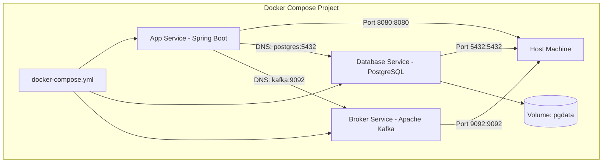

# Level 6 — Docker Compose

---

## 1. 💡 Concept & Multi-Container Orchestration

**Docker Compose** is a tool for defining and running multi-container applications using a declarative YAML configuration file (`docker-compose.yml`).

Instead of running 10 separate verbose `docker run` shell commands with custom network and volume flags, Docker Compose manages the complete application lifecycle with a single command: `docker compose up`.

---

## 2. 📐 Architecture: Multi-Service Environment



---

## 3. 📄 Production Example `docker-compose.yml`

```yaml
version: '3.8'

services:
  app:
    build:
      context: .
      dockerfile: Dockerfile
    container_name: spring-backend
    ports:
      - "8080:8080"
    environment:
      - SPRING_DATASOURCE_URL=jdbc:postgresql://postgres-db:5432/demodb
      - SPRING_DATASOURCE_USERNAME=postgres
      - SPRING_DATASOURCE_PASSWORD=secret
    depends_on:
      postgres-db:
        condition: service_healthy
    networks:
      - app-network

  postgres-db:
    image: postgres:16-alpine
    container_name: postgres-db
    ports:
      - "5432:5432"
    environment:
      - POSTGRES_DB=demodb
      - POSTGRES_USER=postgres
      - POSTGRES_PASSWORD=secret
    volumes:
      - postgres-data:/var/lib/postgresql/data
    healthcheck:
      test: ["CMD-SHELL", "pg_isready -U postgres"]
      interval: 5s
      timeout: 5s
      retries: 5
    networks:
      - app-network

volumes:
  postgres-data:

networks:
  app-network:
    driver: bridge
```

---

## 4. 💻 Practical Commands Cheat Sheet

```bash
# Start all services in detached mode (builds images if missing)
docker compose up -d

# Force rebuild of image and start
docker compose up -d --build

# View aggregated live logs across all containers
docker compose logs -f

# View logs for a specific service
docker compose logs -f app

# List container status & port mappings
docker compose ps

# Execute command inside a specific service container
docker compose exec postgres-db psql -U postgres

# Stop containers without deleting volumes
docker compose stop

# Stop containers AND delete virtual network & container instances
docker compose down

# Stop containers AND delete volumes (CAUTION: wipes database state)
docker compose down -v
```

---

## 5. 💥 Break It (Troubleshooting)

### Scenario: Race Condition (`depends_on` without Health Check)

```yaml
# Flawed Configuration
services:
  app:
    image: myapp
    depends_on:
      - postgres-db  # Only waits for container to start, NOT DB ready!
```

**What happens**:
Docker starts `postgres-db` container. In 50ms, Docker considers `postgres-db` container "started" and immediately boots `app`.
However, PostgreSQL engine requires 3–5 seconds to initialize files and accept TCP connections!
Spring Boot boots immediately, fails database connection, and crashes (`JDBC Connection Exception`).

**Fix**: Use `condition: service_healthy` with a valid `healthcheck` block inside postgres service!

---

## 6. ❓ Interview Questions

### Q1: What is the difference between `depends_on` and `healthcheck` in Docker Compose?
> **Answer**: `depends_on` defines the **startup order** of services. However, by default `depends_on` only waits until the target container process is spawned. Pairing `depends_on` with `condition: service_healthy` ensures Docker Compose waits until the database process is fully initialized and accepting socket connections before launching dependent services.

### Q2: What is the difference between `docker-compose` and `docker compose`?
> **Answer**: `docker-compose` (with hyphen) is the legacy V1 standalone Python script. `docker compose` (without hyphen) is the modern V2 Compose plugin written in Go integrated directly into Docker CLI.

---

## 7. 🏋️ Mini Challenge

Write a simple `docker-compose.yml` file containing:
1. `web` service running `nginx:alpine` on host port `8000`.
2. `redis` service running `redis:alpine` with an anonymous volume.

<details>
<summary>🔍 Show Solution</summary>

```yaml
version: '3.8'

services:
  web:
    image: nginx:alpine
    ports:
      - "8000:80"
    depends_on:
      - redis

  redis:
    image: redis:alpine
```
</details>
