# 🏢 HR Fundamentals & General Interview Questions

HR and initial hiring manager screens are designed to evaluate your communication clarity, cultural alignment, career trajectory, enthusiasm, self-awareness, and team fit before advancing you into expensive technical loops.

---

## 🧭 Question Breakdown Matrix

```mermaid
flowchart TD
    ROOT["🎯 HR &amp; General Interview Core"]
    
    ROOT --> C1["📜 Career Narrative<br/>• Tell me about yourself<br/>• Why are you leaving?<br/>• 5-Year Career Vision"]
    ROOT --> C2["🏢 Company Alignment<br/>• Why this company?<br/>• Why this product?<br/>• Cultural &amp; Team Fit"]
    ROOT --> C3["🧠 Self-Awareness<br/>• Greatest Strengths<br/>• Genuine Weaknesses<br/>• Handling Feedback"]
    ROOT --> C4["❓ Candidate Reverse-Questions<br/>• Engineering Health<br/>• Team Dynamics<br/>• Success Metrics"]
    
    style ROOT fill:#1e1e2e,stroke:#89b4fa,stroke-width:2px;
    style C1 fill:#181a24,stroke:#a6e3a1,stroke-width:1px;
    style C2 fill:#181a24,stroke:#b4befe,stroke-width:1px;
    style C3 fill:#181a24,stroke:#fab387,stroke-width:1px;
    style C4 fill:#181a24,stroke:#f38ba8,stroke-width:1px;
```



---

## 1. "Tell Me About Yourself" / "Walk Me Through Your Resume"

### 🎯 Interviewer's Hidden Goal
The interviewer is assessing your **executive communication**, ability to summarize complex career paths in under 90–120 seconds, and whether your recent technical trajectory aligns with the open role.

### 📐 The Present-Past-Future Framework
```
[Present Role & Core Impact] ──► [Past High-Leverage Experiences] ──► [Future Alignment & Why Here]
 (30-40 seconds)                  (30-40 seconds)                      (20-30 seconds)
```

### 💬 Model Answer (Hariom Nayma — Java Backend & Full-Stack Developer)
> *"I'm a Java Full-Stack and Backend Developer with hands-on production experience architecting and deploying scalable backend systems using **Java, Spring Boot, Kafka, Redis, and AWS**.*
>
> *At **Dollop Infotech**, I work on **Smart Tracko**—our flagship LMS platform serving 100+ daily active students. In this role, I engineered over 60+ secured REST API endpoints with granular Role-Based Access Control (RBAC), implemented Redis caching that reduced average API latency by ~35%, and built an asynchronous event-driven notification pipeline using Apache Kafka.*
>
> *One of my signature projects was taking 0-to-1 ownership of our **in-browser coding IDE**: I integrated the Monaco Editor on Angular, designed a secure remote execution sandbox using isolated Docker containers with CPU/memory limits, and streamed real-time terminal outputs over WebSockets.*
>
> *I also built and deployed independent production systems like a full-featured real-time Social Media application with WebSocket chat, Google OAuth2, and Stripe webhooks. I’m looking for my next challenge at a product-driven engineering team where I can solve high-concurrency distributed backend challenges and contribute to scalable systems from day one."*

### ⚠️ Fatal Red Flags
- ❌ Reciting your resume chronologically starting from high school or college graduation.
- ❌ Rambling past 2.5 minutes without checking in.
- ❌ Focusing purely on personal hobbies rather than professional craft and business impact.

### 🔍 Probable Follow-Ups
- *"You mentioned building an in-browser code editor—how did you prevent students from executing malicious infinite loops or fork-bombs on your host server?"*
- *"How did your Kafka notification system handle high-volume bursts, and how did you prevent duplicate emails during consumer retries?"*

---

## 2. "Why Do You Want to Work at Our Company?"

### 🎯 Interviewer's Hidden Goal
To determine if you did authentic research or if you are spamming applications. They want to see genuine excitement for their **product problem space**, **engineering culture**, or **scale challenges**.

### 📐 The 3-Pillar Formula
1. **The Product/Mission**: What specific problem they solve that excites you.
2. **The Engineering Challenge**: The scale, architecture, or tech stack alignment.
3. **Your Contribution**: What unique value or perspective you bring to their roadmap.

### 💬 Model Answer
> *"I’ve been following [Target Company]’s engineering journey, specifically how your team handles high-throughput event processing and real-time user experiences at scale. In my work on Smart Tracko, I tackled similar distributed challenges when building our Kafka event streaming pipeline and WebSocket terminal streaming.*
>
> *I love working where backend performance directly impacts user trust and learning velocity. I want to bring my hands-on experience in Spring Boot, Redis caching, Kafka concurrency, and containerized Docker environments to help your team scale your core platforms."*

### ⚠️ Fatal Red Flags
- ❌ Giving generic answers: *"You are a big well-known company with great perks and prestige."*
- ❌ Confusing the company's product with a competitor's.

---

## 3. "Why Are You Looking to Leave Your Current Company?"

### 🎯 Interviewer's Hidden Goal
Are you running *away* from a toxic pattern (poor performance, interpersonal conflict) or running *towards* legitimate career growth and greater technical impact?

### 📐 The Rule of Positive Momentum
Always frame your departure around **growth, new challenges, and career evolution**, never around venting about past management or colleagues.

```
[Acknowledge Gratitude & Growth] ──► [Natural Plateau / Evolution] ──► [Alignment With New Opportunity]
```

### 💬 Model Answer
> *"I’ve had an incredible experience at Dollop Infotech. Starting as an intern and quickly stepping up to Software Developer, I was given end-to-end ownership of major backend modules—from designing 60+ RBAC endpoints in Spring Boot to architecting our Docker-based code execution sandbox and Kafka event pipelines.*
>
> *However, having stabilized and scaled Smart Tracko for our current user base, I am looking to step into a high-scale product-based engineering environment where I can tackle deeper distributed systems challenges, work with massive transactional scale, and collaborate with senior engineering teams."*

### ⚠️ Fatal Red Flags
- ❌ Complaining about compensation, long hours, bad management, or office politics.
- ❌ Saying *"I’m bored"* or *"My manager doesn't appreciate me"*.

---

## 4. "What Are Your Greatest Strengths and Weaknesses?"

### 🎯 Interviewer's Hidden Goal
- **Strengths**: Can you demonstrate self-awareness backed by evidence and measurable impact?
- **Weaknesses**: Are you genuinely humble and actively actively working to improve your blind spots?

### 📐 The Authentic Growth Formula (Weakness)
```
[Authentic, Non-Fatal Weakness] ──► [Real-World Awareness / Trigger] ──► [Concrete Systemic Fix in Practice]
```

### 💬 Model Strength Answer
> *"My greatest strength is my ability to take end-to-end ownership of complex, high-ambiguity technical features and see them through to secure production deployment. When I built the Smart Tracko remote code executor, I didn't stop at making code run—I designed Docker cgroup resource limits to prevent server exhaustion, implemented WebSockets for live terminal streaming, and architected the system so it could seamlessly scale to Kafka queues and worker clusters in the future."*

### 💬 Model Weakness Answer
> *"Earlier in my backend development journey, I used to rely heavily on database-level checks for data integrity. For example, during our Saturday attendance email spike, I assumed our MySQL MailHistory table was sufficient for deduplication—until I discovered that under asynchronous Kafka retry conditions, database checks alone can suffer from race conditions before a transaction commits.*
>
> *That experience shifted my mindset: I now design distributed systems with **idempotency as a first-class citizen** from day one, leveraging Redis distributed locks, TTLs, and idempotent consumer keys rather than assuming single-node database invariants."*

### ⚠️ Fatal Red Flags
- ❌ Humble-brags: *"I'm a perfectionist"* or *"I work too hard and care too much."*
- ❌ Disqualifying weaknesses: *"I struggle with writing unit tests"* or *"I have trouble with git"*.

---

## 5. "Where Do You See Yourself in 3 to 5 Years?"

### 🎯 Interviewer's Hidden Goal
Are your ambitions realistic and aligned with what the company can offer? Are you looking to grow as an Individual Contributor (Staff/Principal) or transition into Engineering Management?

### 💬 Model Answer (Technical Track)
> *"Over the next 3 to 5 years, my goal is to continue growing along the Staff Engineer track. In the immediate 1–2 years, I want to deeply master your domain, establish best practices across our distributed services, and deliver high-impact roadmap initiatives.*
>
> *In the 3–5 year window, I want to lead architectural decisions that span across multiple engineering teams, establish engineering standards for reliability and observability, and mentor the next cohort of senior engineers."*

---

## 6. High-Impact Questions to Ask the Interviewer (Reverse Interviewing)

Never end an interview with *"No, I think you covered everything."* The quality of your questions signals your seniority and technical curiosity.

### 🏆 Top Tier Questions for HR / Recruiters
1. *"What differentiates engineers who merely perform well in this role from those who truly excel and get accelerated promotions?"*
2. *"How does the engineering organization support continuous learning and internal mobility?"*
3. *"What are the biggest challenges or organizational changes the company is currently navigating?"*

### 🏆 Top Tier Questions for Engineering Managers
1. *"How does the team balance shipping business features against paying down architectural technical debt?"*
2. *"What does your on-call rotation look like, and what was the nature of your most recent P0/P1 production incident?"*
3. *"How are technical decisions resolved when two senior engineers have conflicting architectural viewpoints?"*
