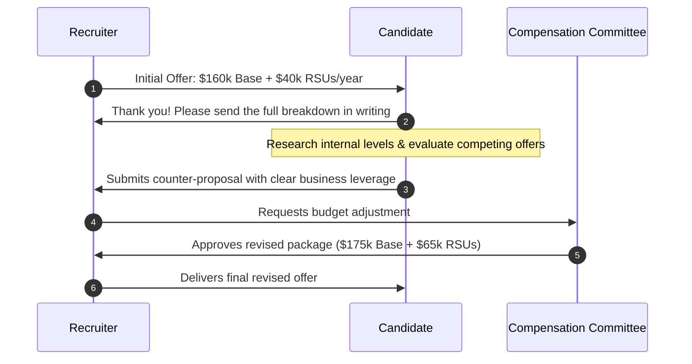

# 💰 Compensation Negotiation & Offer Closing Strategy

Negotiating your compensation as a software engineer is an engineering optimization problem. Total compensation (TC) encompasses Base, Bonuses, Equity (RSUs / Stock Options), and Benefits. Understanding the financial levers enables you to maximize your offer without jeopardizing the relationship.

---

## 📊 Total Compensation (TC) Anatomy

```mermaid
flowchart TD
    TC["Total Compensation (Year 1)"]
    TC --> B["Base Salary<br/>(Guaranteed Cash)"]
    TC --> SB["Signing Bonus<br/>(Year 1 / Year 2 Cash)"]
    TC --> PB["Performance Bonus<br/>(% of Base)"]
    TC --> EQ["Equity / RSUs<br/>(Vested over 4 Years)"]
    
    subgraph EquityModels ["Equity Structures"]
        RSU["Public Co: Liquid RSUs<br/>(Quarterly / Annual Vesting)"]
        ISO["Startup: Stock Options (ISOs/NSOs)<br/>(Illiquid until Exit/IPO)"]
    end
    
    EQ --> EquityModels
    
    style TC fill:#1e1e2e,stroke:#f9e2af,stroke-width:2px;
    style B fill:#181a24,stroke:#89b4fa,stroke-width:1px;
    style SB fill:#181a24,stroke:#a6e3a1,stroke-width:1px;
    style PB fill:#181a24,stroke:#b4befe,stroke-width:1px;
    style EQ fill:#181a24,stroke:#f38ba8,stroke-width:1px;
```

---

## 1. Deflecting Early Salary Questions (The Anchor Game)

### 🎯 The Recruiter's Goal
Recruiters ask for your current salary or expectations in the first 15-minute phone screen to anchor your compensation at the bottom of their internal salary band.

### 🛡️ Deflection Strategies & Scripts

#### Script A: When Asked for Your Expected Number
> *"Right now, my primary focus is understanding whether this is the right technical and cultural fit for both of us. Once we agree that I’m the right engineer to solve your team's challenges, I’m confident we can agree on a package that is competitive with top-of-market compensation for this level. What is the approved salary band for this position?"*

#### Script B: When Pressed Repeatedly ("I need a number to move forward")
> *"Based on my research for Senior Distributed Systems roles in this market, I’m seeing ranges between $X and $Y total compensation. However, where I fall within that range depends on the overall scope, equity structure, and total benefits package."*

#### Script C: When Asked "What is your current compensation?"
> *"I’ve signed a non-disclosure agreement regarding specific compensation details at my current company. However, for my next move, I am evaluating opportunities calibrated to market value for senior engineering roles with this level of architectural scope."*

---

## 2. The Negotiation Phase (After Receiving the First Offer)

Never accept an offer immediately on the phone. Always express enthusiastic gratitude and request the written offer breakdown.

### 💬 The High-Impact Counter-Offer Script

> *"Hi [Recruiter Name],*
>
> *Thank you so much for putting this offer together. I’m genuinely excited about the team, the vision for the platform replatforming, and the opportunity to work with [Hiring Manager].*
>
> *I’ve reviewed the full package with my family. Given my technical background in high-throughput distributed systems and the fact that I am in final stages with another top-tier company offering a higher total compensation package, I would love to make this an immediate 'yes' today.*
>
> *If we can bring the **Base Salary to $180,000**, increase the **Equity grant to $260,000 over 4 years**, and add a **$25,000 Signing Bonus**, I am ready to decline my other processes and sign immediately.*
>
> *Is this something you can take back to the compensation committee?"*

---

## 3. Leverage Matrix: What to Negotiate When

| Leverage Level | Best Component to Target | Rationale |
| :--- | :--- | :--- |
| **High** *(Multiple competing offers)* | **Base Salary + Total Equity** | Companies will stretch bands to win top talent against competitors. |
| **Medium** *(Strong interview feedback, 1 offer)* | **Signing Bonus + Equity** | Signing bonuses come from separate hiring budgets and don't disrupt internal salary equity bands. |
| **Low** *(Only offer, switching domains)* | **Signing Bonus + Early Review Clause** | Ask for a signing bonus or a guaranteed 6-month performance & compensation review. |

---

## 4. How to Handle "Exploding Offers" (Tight Deadlines)

### 🎯 Recruiter Pressure Tactic
*"We need your answer within 48 hours or this offer will be rescinded."*

### 🛡️ Professional Deadline Extension Script
> *"I understand your need to finalize hiring timelines quickly. However, choosing my next long-term career home is a major decision. I have a final-round technical interview scheduled with another team next Tuesday that I am committed to completing.*
>
> *I want to give your offer the thorough and serious consideration it deserves. Can we extend the decision deadline to next Friday? That will allow me to conclude all conversations and make an enthusiastic, 100% committed decision."*

---

## 5. Dangerous Pitfalls & Red Flags

> [!WARNING]
> - **Never Bluff Fake Offers**: Recruiters network across companies. If asked for proof and caught lying, your offer will be immediately revoked.
> - **Don't Negotiate Incrementally**: Submit **all** your asks at once in a single, well-structured counter-proposal. Going back 3 or 4 separate times makes you look disorganized.
> - **Don't Ignore Non-Cash Value**: Consider 401(k) match, health premiums, remote stipends, vacation policies, and conference budgets.
