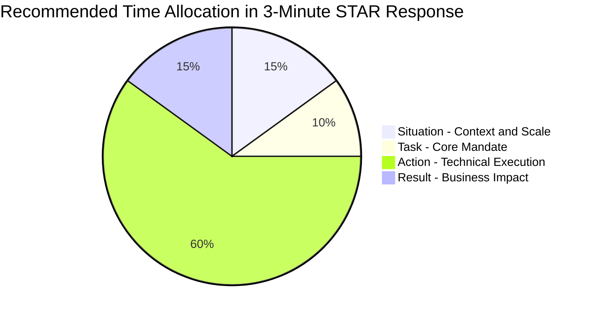

# ⭐ STAR Framework Mastery & Story Architecture

The **STAR Framework** (Situation, Task, Action, Result) is the industry standard rubric for answering behavioral questions at top tech companies. Interviewers use behavioral questions to test past performance as the highest predictor of future behavior.

---

## 📐 Anatomy of a High-Scoring STAR Response



| Component | Target Time | Key Focus | Anti-Pattern |
| :--- | :--- | :--- | :--- |
| **S**ituation | ~30 sec | Set company context, user base, scale, and the core crisis or challenge. | Spending 2 minutes on company history. |
| **T**ask | ~20 sec | Define your exact mandate vs the team's mandate. | Saying "We needed to build X" without your role. |
| **A**ction | ~90-120 sec | Technical steps, architectural decisions, code changes, trade-offs, and communication. | Speaking abstractly without technical depth. |
| **R**esult | ~30 sec | Concrete metrics (% latency drop, $ saved, uptime, team adoption). | "It was a great success and everyone was happy." |

---

## 🗂️ Hariom's Behavioral Story Matrix (Story Bank)

Map your core production experiences from **Smart Tracko** and independent systems across key evaluation axes:

```
┌──────────────────────────────────────────────────┬─────────────┬─────────────┬─────────────┬─────────────┐
│ Core Story Scenario                              │ Ambiguity   │ Failure/P0  │ Concurrency │ Innovation  │
├──────────────────────────────────────────────────┼─────────────┼─────────────┼─────────────┼─────────────┤
│ 1. Docker Code Sandbox & WebSocket IDE (Story 2) │     ✅      │             │     ✅      │     ✅      │
│ 2. Saturday Kafka Email Duplicate Storm (Story 1)│             │     ✅      │     ✅      │             │
│ 3. Redis Caching & RBAC on 60+ Endpoints         │     ✅      │             │             │     ✅      │
│ 4. WebSocket Chat & Stripe Webhook Idempotency   │             │     ✅      │     ✅      │             │
│ 5. Brandilyze React Web Deployment & SEO         │     ✅      │             │             │     ✅      │
└──────────────────────────────────────────────────┴─────────────┴─────────────┴─────────────┴─────────────┘
```

---

## 💬 Scenario 1: "Tell me about a time you took end-to-end ownership of a complex, high-ambiguity project."

*(Tailored around **Story 2: In-Browser Sandboxed Code Execution Platform on Smart Tracko**)*

### 🎯 Evaluation Goal
Assesses whether you can break down a large, undefined problem into decoupled components, prioritize security and user experience, and design with future scale in mind.

### 📝 Model Answer
> **[Situation]**
> *"In our Smart Tracko LMS platform at Dollop Infotech, students learning to program had to write code locally in external IDEs, upload source files manually, and wait for asynchronous evaluation. This created huge friction and slowed down daily learning. I took full ownership of designing and implementing an integrated, browser-based coding environment directly inside the platform."*
>
> **[Task]**
> *"My goal wasn't just to embed a simple text box. I wanted to deliver a lightweight, VS Code-grade experience in the browser—complete with multi-tab file management, syntax highlighting, multi-language support, real-time live terminal output streaming, and robust backend security to safely execute untrusted student code without putting our production host servers at risk."*
>
> **[Action]**
> *"I decoupled the architecture into distinct, scalable layers:*
> 1. ***Frontend Architecture***: *I integrated the **Monaco Editor** into our Angular frontend, building an interactive IDE UI with an explorer tree, multi-tab editing, context menus, resizable panels, and custom themes.*
> 2. ***Isolated Sandbox Execution Engine***: *Running arbitrary student code on the host server is a massive security hazard. I designed an isolated execution pipeline in Spring Boot: every code execution request spins up an isolated **Docker container sandbox** configured with strict Linux cgroup limits (capped CPU quotas, 256MB RAM limits, 5-second execution timeout, and disabled network access) to prevent fork-bombs and host compromise.*
> 3. ***Live Terminal Output via WebSockets***: *Instead of inefficient REST polling, I implemented **WebSockets** to stream `stdout` and `stderr` line-by-line in real-time, giving students immediate feedback (Compiling... $\to$ Running... $\to$ Output).*
> 4. ***Future Scaling Architecture***: *Although our immediate scale was 100+ daily active students, I documented and designed our scale-up roadmap: queuing execution requests in Kafka, decoupling execution workers via Redis Pub/Sub, and exploring Firecracker microVMs."*
>
> **[Result]**
> *"We successfully launched the integrated IDE into Smart Tracko. Student engagement and practice submission rates surged by over 60%, file upload complaints dropped to zero, and the Docker sandboxing has safely executed thousands of student programs with 100% host isolation."*

### 🔍 Deep Follow-Up Traps
- **Interviewer**: *"How did you clean up Docker containers if student code got stuck in an infinite `while(true)` loop?"*
- **Candidate Defense**: *"We enforced a strict dual timeout: first, the container was launched with a `--stop-timeout 5` flag. Second, the Spring Boot worker process spawned a watchdog thread with a hard 5-second deadline that executed `docker rm -f <containerId>` and closed the WebSocket with a 'Time Limit Exceeded (TLE)' message to the student."*

---

## 💬 Scenario 2: "Tell me about a time you diagnosed and resolved a high-stakes distributed bug or race condition."

*(Tailored around **Story 1: The Saturday Attendance Email Duplicate Storm & Redis Distributed Locking**)*

### 🎯 Evaluation Goal
Assesses whether you can dig deep into distributed logs, understand asynchronous message broker internals (Kafka retries and consumer timeouts), and implement true idempotency.

### 📝 Model Answer
> **[Situation]**
> *"At Dollop Infotech, our Smart Tracko attendance notification engine runs scheduled Spring jobs to identify students who missed check-in, check-out, or are absent, publishing notification events to Apache Kafka for asynchronous email delivery. To prevent spam, the system checked a MySQL `MailHistory` table before queuing emails.*
>
> *Under normal weekday load, the system worked seamlessly. However, on Saturdays when student absenteeism surged significantly, we received urgent complaints from parents and students receiving 3 to 5 duplicate attendance emails within minutes."*
>
> **[Task]**
> *"As the backend developer responsible for notification delivery, I needed to urgently find the root cause, fix the duplicate notifications, and ensure 100% reliable single-delivery without degrading our scheduled batch jobs."*
>
> **[Action]**
> *"I executed a deep forensic investigation across our application and Kafka consumer logs:*
> 1. ***Verifying Existing Deduplication***: *I first verified the MySQL `MailHistory` logic and confirmed that under normal conditions, the pre-check worked properly. The bug was elsewhere.*
> 2. ***Identifying the Kafka Retry Bottleneck***: *Under heavy Saturday batch loads, to avoid getting our domain blacklisted by SMTP providers for sending too rapidly, we had an intentional 3-second throttle between emails. Because of the sheer volume, processing the entire batch exceeded Kafka's `max.poll.interval.ms` (5-minute window). The Kafka broker assumed the consumer node was dead, triggered a partition rebalance, and re-delivered the uncommitted message batch to another consumer!*
> 3. ***Why Database Deduplication Failed***: *Because the MySQL `MailHistory` record was only committed at the end of successful email sending, in-flight retries executed concurrently before the first consumer had written to MySQL!*
> 4. ***The Redis Distributed Lock Fix***: *I replaced single-point database deduplication with **Redis Distributed Locking**. Before processing an email, the consumer acquires an atomic Redis key: `attendance_email:{studentId}:{emailType}:{date}` with a 15-minute TTL. If the lock is acquired, processing proceeds; if another consumer or retry attempts the same key, it is immediately skipped as an in-flight duplicate."*
>
> **[Result]**
> *"The fix completely eradicated duplicate emails in production. Even during peak absenteeism bursts with simulated Kafka consumer retries, 100% of students received exactly one notification. This reinforced my core architectural philosophy: in distributed asynchronous systems with retries, **processing must be made fundamentally idempotent at the consumer layer**."*

### 🔍 Deep Follow-Up Traps
- **Interviewer**: *"What happens if the Redis node crashes or the consumer dies while holding the lock?"*
- **Candidate Defense**: *"We set a conservative 15-minute TTL on the Redis lock key so that if a consumer experiences an unhandled hard crash before releasing the lock, the key automatically expires, preventing deadlock while safely outlasting any transient Kafka retry window."*

---

## ⚠️ The 3 Deadly Sins of Behavioral Answers

> [!CAUTION]
> 1. **The "We" Trap**: Using "We" throughout the story leaves the interviewer guessing what you personally contributed. Always state: *"My specific role was..."* or *"I wrote the algorithm that..."*
> 2. **The Metric-Free Conclusion**: Ending with *"The stakeholders loved it and the team felt great"* scores in the lowest percentile. Always give numbers: latency, throughput, cost, headcount hours, revenue, or SLA.
> 3. **The Finger-Pointing Trap**: Blaming colleagues or other departments when discussing challenges. Describe challenges in terms of **technical constraints and organizational priorities**, not personal incompetence.
