# 🤝 Conflict, Failure & Team Dynamics Scenarios

Engineering is a team sport. Interviewers frequently probe your ability to navigate high-stakes conflict, recover gracefully from catastrophic failures, and influence without authority.

---

## 🧭 Conflict & Disagreement Architecture

```mermaid
flowchart TD
    D["Technical or Priority Disagreement"] --> A["1. Separate Ego from Architecture"]
    A --> B["2. Anchor on Data, Benchmarks & User Needs"]
    B --> C{"Can Consensus Be Reached?"}
    
    C -- Yes --> RES["Implement Agreed Solution"]
    C -- No --> DC["3. 'Disagree and Commit' Framework"]
    DC --> EXP["Run a Time-Boxed Spike / Proof of Concept"]
    EXP --> RES
    
    style D fill:#1e1e2e,stroke:#f38ba8,stroke-width:2px;
    style A fill:#181a24,stroke:#89b4fa,stroke-width:1px;
    style B fill:#181a24,stroke:#a6e3a1,stroke-width:1px;
    style DC fill:#181a24,stroke:#fab387,stroke-width:1px;
    style RES fill:#181a24,stroke:#b4befe,stroke-width:1px;
```



---

## 1. "Tell me about a time you had a technical disagreement with a teammate or Tech Lead."

### 🎯 Evaluation Goal
Do you engage in toxic debate, become passive-aggressive, or use **data-driven decision making and respectful collaboration** to find the right architectural outcome?

### 📝 Model Answer
> **[Situation]**
> *"During the design phase of our real-time notification engine, our Principal Architect wanted to implement an Apache Cassandra cluster for storing transient notification logs. I strongly advocated for using our existing PostgreSQL cluster with pg_partman table partitioning and Redis caching."*
>
> **[Task]**
> *"I needed to ensure we made the right long-term architectural choice without creating unnecessary operational complexity or delaying our delivery schedule by 2 months."*
>
> **[Action]**
> *"Instead of debating in Slack or meetings based on opinions, I took a structured approach:*
> 1. *I scheduled a 30-minute design alignment sync and laid out the explicit trade-off matrix: Cassandra offered higher write throughput at extreme scale, but our projected traffic was 2,500 writes/second—well within Postgres capabilities. Furthermore, none of our SREs had Cassandra operational experience.*
> 2. *I built a reproducible JMeter benchmark spike over two days showing that Postgres with partitioned tables handled 6,000 writes/sec at sub-10ms latency.*
> 3. *I presented the benchmark numbers alongside the total cost of ownership (TCO) calculation to the architect, showing we would save $35,000/year in cloud infrastructure and avoid introducing a new database to support on-call.*
>
> *The architect appreciated the concrete data and agreed to proceed with PostgreSQL."*
>
> **[Result]**
> *"We delivered the notification system 3 weeks ahead of schedule. The system has operated for 18 months with zero data loss and flawless performance, while saving the team significant operational overhead."*

### 🔍 Deep Follow-Up Traps
- **Interviewer**: *"What would you have done if the Architect had still insisted on Cassandra despite your data?"*
- **Candidate Defense**: *"I practice 'Disagree and Commit'. If a final decision is made by leadership after data is presented, I fully commit to making Cassandra successful without any passive-aggressive remarks or finger-pointing. I would have focused on learning Cassandra deeply and writing runbooks for the on-call team."*

---

## 2. "Tell me about a time you made a major technical mistake or caused a production outage."

### 🎯 Evaluation Goal
Interviewers do not want someone who has "never failed" (which signals lack of experience or lack of honesty). They evaluate **accountability, blameless root-cause analysis, and systemic prevention**.

### 📝 Model Answer
> **[Situation]**
> *"Two years ago, I was tasked with adding a new `status` index to our core `orders` table in PostgreSQL to optimize a high-traffic query for our customer portal. The table had over 80 million records."*
>
> **[Task]**
> *"My goal was to deploy the index migration during our weekly maintenance release window."*
>
> **[Action]**
> *"In my migration script, I executed a standard `CREATE INDEX idx_orders_status ON orders(status);` instead of `CREATE INDEX CONCURRENTLY`.*
>
> *The standard command acquired an `ACCESS EXCLUSIVE` table lock on the `orders` table. Within 90 seconds, incoming API write requests piled up, connection pools were exhausted, and our checkout service threw 504 Gateway Timeouts across production.*
>
> *As soon as the alert fired, I took immediate ownership:*
> 1. *I joined the incident bridge, identified that my migration query was holding the exclusive lock, and immediately canceled the PID transaction in PostgreSQL to release the lock.*
> 2. *Our services recovered within 4 minutes.*
> 3. *Instead of sweeping it under the rug, I led the blameless post-mortem. I didn't just tell the team 'I will be more careful.' I instituted a structural safeguard: I added a linter rule to our CI/CD pipeline (Squawk/pg-query) that automatically fails any PR containing non-concurrent index creations on tables with over 100k records."*
>
> **[Result]**
> *"Because of that CI guardrail, our engineering org of 60+ engineers has never experienced a database locking outage in the two years since."*

---

## 3. "Tell me about a time you had to push back against a Product Manager's deadline or scope."

### 🎯 Evaluation Goal
Can you negotiate business priorities while protecting system reliability, security, and team sustainable pace?

### 📝 Model Answer
> **[Situation]**
> *"Our Product Manager wanted to release our new multi-currency checkout feature in time for a major marketing campaign in 3 weeks. However, the initial engineering estimate was 6 weeks because it required updating our ledger accounting system to handle currency conversion floating-point precision and reconciliation."*
>
> **[Task]**
> *"I needed to protect the financial integrity of our ledger while still helping Product capture the marketing window."*
>
> **[Action]**
> *"Rather than simply saying 'No, it's impossible,' I collaborated with the PM on a phased MVP strategy:*
> 1. *I broke down the feature requirements into P0 (essential for launch) and P1 (enhancements).*
> 2. *I demonstrated that 80% of our international marketing traffic came from just two currencies (EUR and GBP). Supporting all 25 currencies dynamically was what drove the 6-week timeline.*
> 3. *I proposed Phase 1: Launch in 3 weeks supporting USD, EUR, and GBP with static daily exchange rates cached in Redis. Phase 2: Roll out full dynamic real-time FX rates for all 25 currencies in the subsequent sprint."*
>
> **[Result]**
> *"The PM enthusiastically agreed. We launched on time for the marketing campaign, captured $380k in new European sales in week one, and had zero financial discrepancy bugs in our end-of-month reconciliation."*

---

## 💡 The Blameless Post-Mortem Principles

```
┌─────────────────────────────────────────────────────────────────────────────┐
│ 1. Focus on the System, Not the Individual                                  │
│    "Why did the system allow a dangerous command to reach production?"      │
│    NOT "Why was Gaurav careless?"                                           │
├─────────────────────────────────────────────────────────────────────────────┤
│ 2. The Five Whys Method                                                     │
│    Root causes are almost always organizational, tooling, or missing tests. │
├─────────────────────────────────────────────────────────────────────────────┤
│ 3. Automated Guardrails > Human Checklists                                  │
│    Fix human error with CI linters, automated rollbacks, and circuit breaks.│
└─────────────────────────────────────────────────────────────────────────────┘
```
