# 💻 Core CS, OOP & Concurrency Mastery

Senior technical interviewers frequently probe fundamental computer science principles, concurrency hazards, memory models, and design patterns to distinguish engineers who copy-paste code from those who understand runtime execution at the silicon and OS level.

---

## 🧵 Process vs Thread vs Coroutine

```mermaid
flowchart TD
    OS["Operating System Kernel"]
    
    subgraph Process ["Process (Isolated Memory Space)"]
        P_Mem["Virtual Address Space<br/>(Text, Data, Heap)"]
        
        subgraph Threads ["OS Kernel Threads (Preemptive)"]
            T1["Thread 1<br/>(Stack & Registers)"]
            T2["Thread 2<br/>(Stack & Registers)"]
        end
        
        subgraph Coroutines ["User-Space Coroutines / Go Routines / Virtual Threads"]
            C1["Coroutine A (~2-4 KB)"]
            C2["Coroutine B (~2-4 KB)"]
            C3["Coroutine C (~2-4 KB)"]
        end
    end
    
    OS --> Process
    Threads -.-> Coroutines
    
    style OS fill:#1e1e2e,stroke:#89b4fa,stroke-width:2px;
    style Process fill:#181a24,stroke:#b4befe,stroke-width:1px;
    style Threads fill:#181a24,stroke:#fab387,stroke-width:1px;
    style Coroutines fill:#181a24,stroke:#a6e3a1,stroke-width:1px;
```



| Dimension | Process | Kernel Thread | Coroutine / Fiber / Virtual Thread |
| :--- | :--- | :--- | :--- |
| **Memory Isolation** | Fully isolated virtual address space | Shared heap, isolated stack | Shared heap, tiny user-space stack (2–4 KB) |
| **Creation Cost** | High (fork/exec, page tables) | Medium (~1 MB stack allocation) | Negligible (millions can run concurrently) |
| **Context Switching** | Expensive (CPU cache invalidation, MMU TLB flush) | Moderate (~1-2 μs, kernel mode switch) | Ultra-fast (~10-50 ns, user-space cooperative switch) |
| **Scheduling** | Kernel preemptive | Kernel preemptive | User-space cooperative or M:N work-stealing |

---

## ⚠️ Concurrency Hazards & Synchronization Primitives

### 1. Race Conditions & Data Races
- **Race Condition**: Program correctness depends on the non-deterministic interleaving of execution paths.
- **Data Race**: Two threads access the same memory location concurrently where at least one access is a **write**, without synchronization.

```java
// ❌ Dangerous Data Race
public class Counter {
    private int count = 0; // count++ is NOT atomic: READ -> MODIFY -> WRITE
    public void increment() { count++; }
}

// ✅ Thread-Safe using Compare-And-Swap (CAS) lock-free hardware instructions
import java.util.concurrent.atomic.AtomicInteger;
public class Counter {
    private final AtomicInteger count = new AtomicInteger(0);
    public void increment() { count.incrementAndGet(); }
}
```

---

### 2. Deadlocks & The 4 Coffman Conditions
A deadlock can ONLY occur if **all four** of the following conditions hold simultaneously:
1. **Mutual Exclusion**: Resources cannot be shared.
2. **Hold and Wait**: A process holds resource A while waiting for resource B.
3. **No Preemption**: Resources cannot be forcibly seized.
4. **Circular Wait**: Thread 1 waits for Thread 2, which waits for Thread 1.

```mermaid
flowchart LR
    T1["Thread 1"]
    T2["Thread 2"]
    R1["Lock A"]
    R2["Lock B"]
    
    T1 -->|Holds| R1
    T1 -->|Requests| R2
    T2 -->|Holds| R2
    T2 -->|Requests| R1
    
    style T1 fill:#1e1e2e,stroke:#f38ba8,stroke-width:2px;
    style T2 fill:#1e1e2e,stroke:#f38ba8,stroke-width:2px;
    style R1 fill:#181a24,stroke:#89b4fa,stroke-width:1px;
    style R2 fill:#181a24,stroke:#89b4fa,stroke-width:1px;
```



#### 🛡️ How to Prevent Deadlocks:
- **Lock Ordering**: Always acquire locks in a strict global alphabetical/hierarchical order.
- **Lock Timeouts**: Use `tryLock(timeout)` instead of indefinite blocking.
- **Deadlock Detection**: Maintain a resource-allocation wait-for graph with cycle detection algorithms.

---

## 🧠 Memory Management: Stack vs Heap & Garbage Collection

```
┌──────────────────────────────────────┬──────────────────────────────────────┐
│ STACK MEMORY                         │ HEAP MEMORY                          │
├──────────────────────────────────────┼──────────────────────────────────────┤
│ • Fast, LIFO allocation              │ • Dynamic, runtime allocation        │
│ • Stores primitive types & references│ • Stores objects, collections, arrays│
│ • Automatically freed on frame exit  │ • Reclaimed by Garbage Collector     │
│ • Thread-local (No sync needed)      │ • Shared across all threads          │
└──────────────────────────────────────┴──────────────────────────────────────┘
```

### 🔍 How Garbage Collection Works (Generational Hypothesis)
Most objects die young (*infant mortality*). Modern collectors (Java G1/ZGC, Go GC, V8) divide heap memory into:
- **Young Generation (Eden + Survivor Spaces)**: Fast, frequent Minor GCs using compacting pointer bumps.
- **Old / Tenured Generation**: Objects surviving $N$ GC cycles are promoted; collected via concurrent Mark-Sweep-Compact to avoid long Stop-The-World (STW) pauses.

### ❓ Top Interview Question: "Can you get a Memory Leak in Java or Go?"
> **Answer**: *"Yes! In managed garbage-collected runtimes, a memory leak occurs when an object is **unintentionally retained in the live object reference graph**, preventing the GC root from reclaiming it.*
>
> *Common causes include:*
> 1. *Static collections (e.g., `static Map` used as an unbounded cache without eviction/TTL).*
> 2. *Unclosed I/O streams, database connection pools, or sockets.*
> 3. *Dangling event listeners or callbacks that retain references to outer classes.*
> 4. *ThreadLocal variables in web application servers (like Tomcat) where thread pools are reused, retaining large objects across requests."*

---

## 🏛️ SOLID Principles in Practice

```
S — Single Responsibility: A class should have one and only one reason to change.
O — Open/Closed: Open for extension, closed for modification (use Polymorphism/Interfaces).
L — Liskov Substitution: Subtypes must be substitutable for their base types without breaking correctness.
I — Interface Segregation: Clients should not be forced to depend on interfaces they do not use.
D — Dependency Inversion: Depend upon abstractions (interfaces), not concrete implementations.
```

### ❓ Deep Follow-Up: "Why prefer Composition over Inheritance?"
> **Answer**: *"Inheritance creates tight coupling (*white-box reuse*) and exposes internal implementation details of the parent class to subclasses, violating encapsulation. Subclasses can break if the parent class modifies private invariants.*
>
> *Composition (*black-box reuse*) defines behavior via interfaces and injected references at runtime, enabling loose coupling, easy mocking in unit tests, and dynamic runtime strategy swapping."*
