# 🗄️ Databases, APIs & System Architectural Pillars

Backend and full-stack technical rounds rigorously test your understanding of data persistence, network protocols, caching dynamics, and distributed system trade-offs.

---

## 🌳 Database Indexing Internals: B+ Tree vs LSM Tree

```mermaid
flowchart TD
    subgraph BTree ["B+ Tree (Read Optimized / Relational DBs)"]
        Root["Root Node (Memory)"] --> I1["Internal Node"]
        Root --> I2["Internal Node"]
        I1 --> L1["Leaf Page (Disk Block)"]
        I1 --> L2["Leaf Page (Disk Block)"]
        L1 <-->|Doubly Linked List| L2
    end
    
    subgraph LSM ["LSM Tree (Write Optimized / NoSQL DBs)"]
        W["Incoming Write"] --> WAL["Write-Ahead Log (Disk)"]
        W --> MT["MemTable (RAM / SkipList)"]
        MT -->|Flushed when full| SST0["SSTable L0 (Disk)"]
        SST0 -->|Compaction| SST1["SSTable L1 (Disk)"]
    end
    
    style BTree fill:#181a24,stroke:#89b4fa,stroke-width:1px;
    style LSM fill:#181a24,stroke:#a6e3a1,stroke-width:1px;
```



| Dimension | B+ Tree (PostgreSQL, MySQL InnoDB) | LSM Tree (Cassandra, RocksDB, ScyllaDB) |
| :--- | :--- | :--- |
| **Write Strategy** | In-place random page updates (high write amplification) | Sequential append-only writes to MemTable + WAL |
| **Read Latency** | Ultra-fast ($O(\log N)$ deterministic page lookup) | Slower (may need to check Bloom filters & multiple SSTables) |
| **Space Utilization** | Page fragmentation over time (~60-70% full) | High sequential density with background compaction |
| **Best Used For** | OLTP transactional systems with mixed Read/Write workloads | Write-heavy telemetry, time-series, event logging, high ingest |

---

## 🔒 SQL Transaction Isolation Levels & Phenomena

ANSI SQL defines 4 isolation levels based on three concurrency phenomena:

| Isolation Level | Dirty Read | Non-Repeatable Read | Phantom Read | Mechanism / Lock Cost |
| :--- | :---: | :---: | :---: | :--- |
| **Read Uncommitted** | ❌ Allowed | ❌ Allowed | ❌ Allowed | No read locks (dirty reads) |
| **Read Committed** *(Default in Postgres)* | 🛡️ Prevented | ❌ Allowed | ❌ Allowed | Read locks released immediately; MVCC snapshot per query |
| **Repeatable Read** *(Default in MySQL)* | 🛡️ Prevented | 🛡️ Prevented | ❌ Allowed *(MySQL uses Next-Key locks)* | MVCC snapshot taken at start of transaction |
| **Serializable** | 🛡️ Prevented | 🛡️ Prevented | 🛡️ Prevented | Strict 2-Phase Locking (2PL) or Serializable Snapshot Isolation (SSI) |

---

## 🌐 API Protocols: REST vs gRPC vs GraphQL

```
┌─────────────────┬──────────────────────────┬──────────────────────────┬──────────────────────────┐
│ Feature         │ REST (JSON over HTTP/1.1)│ gRPC (Protobuf / HTTP/2) │ GraphQL (Query over HTTP)│
├─────────────────┼──────────────────────────┼──────────────────────────┼──────────────────────────┤
│ Protocol Format │ Text (JSON/XML)          │ Compact Binary (Protobuf)│ Text (JSON payload)      │
│ Transport       │ HTTP/1.1 or HTTP/2       │ HTTP/2 (Multiplexing)    │ HTTP/1.1 or HTTP/2       │
│ Performance     │ Medium (JSON parsing CPU)│ Ultra-fast (Binary serialize)│ Moderate (Server parse) │
│ Schema Contract │ Optional (OpenAPI/Swagger)│ Strict (`.proto` file)  │ Strict GraphQL Schema    │
│ Over-fetching   │ High risk                │ Low (Defined fields)     │ Eliminated (Client asks) │
│ Streaming       │ Complex (WebSockets/SSE) │ Native bi-directional    │ Subscriptions (WebSocket)│
│ Ideal Use-Case  │ Public APIs, Mobile Web  │ Internal Microservices   │ Complex Mobile / UI Hubs │
└─────────────────┴──────────────────────────┴──────────────────────────┴──────────────────────────┘
```

### ❓ Top Follow-Up: "How do you solve the N+1 Query problem in GraphQL?"
> **Answer**: *"The N+1 problem occurs when a GraphQL resolver fetches a parent list of $N$ items in 1 query, and then executes $N$ individual database queries to resolve a nested relation.*
>
> *We solve this using **DataLoader (Batching & Caching)**. DataLoader batches multiple concurrent ID lookup requests within a single NodeJS/Java event loop tick into a single `SELECT * FROM items WHERE id IN (...)` query and caches results for the duration of the request."*

---

## ⚡ Caching Strategies & Failure Modes

```mermaid
flowchart LR
    subgraph Strategies ["Caching Topologies"]
        CA["1. Cache-Aside<br/>(App reads Cache -> Miss -> Reads DB -> Sets Cache)"]
        WT["2. Write-Through<br/>(App writes Cache -> Cache writes DB synchronously)"]
        WB["3. Write-Behind / Write-Back<br/>(App writes Cache -> Async Queue writes DB)"]
    end
    style Strategies fill:#181a24,stroke:#89b4fa,stroke-width:1px;
```



### 💥 The 3 Critical Cache Failure Modes & Mitigations

#### 1. Cache Stampede / Thundering Herd
- **Problem**: A hot key expires, and 10,000 concurrent requests simultaneously miss the cache and overwhelm the database.
- **Solution**: **Distributed Mutex Lock** (e.g. Redis `SETNX`) around cache replenishment, or **Probabilistic Early Expiration (XFetch)**.

#### 2. Cache Penetration
- **Problem**: Malicious clients query non-existent keys (e.g. `userId = -999999`), bypassing cache and hitting DB on every request.
- **Solution**: **Bloom Filters** at the cache layer to quickly reject non-existent keys, or caching `NULL` with a short 60s TTL.

#### 3. Cache Avalanche
- **Problem**: Hundreds of thousands of cached keys share the exact same TTL and expire at the exact same second.
- **Solution**: Add **Random Jitter** to TTLs (e.g., `TTL = 3600s + rand(0, 300)s`).

---

## 📐 CAP Theorem vs PACELC Theorem

In distributed systems, network partitions ($P$) are unavoidable.

```
                  ┌───────────────────────────────┐
                  │ PACELC Theorem Extended Model │
                  └──────────────┬────────────────┘
                                 │
                 If there is a Partition (P)?
                 ┌───────────────┴───────────────┐
                 ▼                               ▼
       Choose Availability (A)         Choose Consistency (C)
       [e.g., Cassandra, Dynamo]       [e.g., HBase, Spanner]
                 │                               │
                 └───────────────┬───────────────┘
                                 ▼
                         ELSE (Normal State)?
                 ┌───────────────┴───────────────┐
                 ▼                               ▼
       Choose Latency (L)              Choose Consistency (C)
       [e.g., MongoDB / DynamoDB]      [e.g., PostgreSQL Sync Rep]
```
