# 🌐 APIs, Protocols & Networking (2+ YOE Technical Prep)

Backend and full-stack technical rounds for **2+ years experienced engineers** evaluate network protocol efficiency, REST/gRPC/GraphQL trade-offs, API gateway architecture, rate-limiting algorithms, WebSocket horizontal scaling, and idempotent endpoint design.

---

## 🚀 API Architectural Protocols Comparison

```
┌─────────────────┬──────────────────────────┬──────────────────────────┬──────────────────────────┬──────────────────────────┐
│ Feature         │ REST (HTTP/1.1 or 2)     │ gRPC (Protobuf / HTTP/2) │ GraphQL (Query over HTTP)│ WebSockets (Full Duplex) │
├─────────────────┼──────────────────────────┼──────────────────────────┼──────────────────────────┼──────────────────────────┤
│ Protocol Format │ JSON / XML (Text)        │ Binary (Protocol Buffers)│ JSON Payload             │ Frame-Based Binary/Text  │
│ Transport       │ HTTP/1.1 or HTTP/2       │ HTTP/2 (Multiplexing)    │ HTTP/1.1 or HTTP/2       │ Single Persistent TCP    │
│ Performance     │ Medium (JSON CPU overhead│ Ultra-Fast (Small footprint) Moderate (Server parse) │ Low Latency (No HTTP head│
│ Schema Contract │ Optional (OpenAPI)       │ Strict (`.proto` file)   │ Strict GraphQL Schema    │ Custom / Event-driven    │
│ Streaming       │ SSE / Polling            │ Bi-directional native    │ Subscriptions (WS)       │ Native Bi-directional    │
│ Ideal Use-Case  │ Public APIs, Web Frontends│ Inter-microservice RPC   │ Mobile App Aggregation   │ Real-time Chat / Trading │
└─────────────────┴──────────────────────────┴──────────────────────────┴──────────────────────────┴──────────────────────────┘
```

---

## 🛡️ API Gateway, Rate Limiting & Resilience Mechanics

```mermaid
flowchart LR
    subgraph RateLimiting ["Rate Limiting Algorithms"]
        TB["1. Token Bucket<br/>(Refills at fixed rate; supports traffic bursts)"]
        LB["2. Leaky Bucket<br/>(Smooths traffic output; fixed outflow rate)"]
        SW["3. Sliding Window Counter<br/>(Hybrid memory-efficient accurate counter)"]
    end
    style RateLimiting fill:#181a24,stroke:#89b4fa,stroke-width:1px;
```



### Circuit Breaker States (Resilience4j in Java)

```
        ┌─────────────────────────────────────────────────────────────┐
        │                        CLOSED                               │
        │             (Requests flow normally to DB/API)               │
        └──────────────┬───────────────────────────────▲──────────────┘
                       │                               │
            Failure Rate > Threshold                   │ Success Rate > Threshold
            (e.g., 50% failures in 100 requests)       │ (e.g., 10 consecutive successes)
                       │                               │
                       ▼                               │
        ┌──────────────────────────────┐    ┌──────────┴──────────────────┐
        │             OPEN             │───>│          HALF_OPEN          │
        │  (Calls fail fast instantly  │    │ (Test phase: routing 10%    │
        │    without hitting backend)  │    │  traffic to check recovery) │
        └──────────────────────────────┘    └─────────────────────────────┘
```

---

## ❓ 2+ YOE Top API & Protocols Interview Questions & Gold-Standard Answers

### Question 1: How do you design a strictly Idempotent REST API endpoint in Java / Spring Boot to prevent duplicate billing charges on network retries?

> **Best Possible Answer**:
> *"Network retries by mobile clients or payment webhooks can cause a single HTTP `POST /api/v1/payments` request to be delivered multiple times. To guarantee idempotency, I implement the **Idempotency Key Pattern using Redis Distributed Lock & Cache**:*
>
> *1. **Client Header**: The client generates a unique UUID (e.g. `Idempotency-Key: 7b89f4a1-...`) and sends it in the HTTP header.*
> *2. **Spring Boot Interceptor / Aspect**: An AOP `@Around` aspect intercepts the request before controller execution:*
>    - *Executes `SET idempotency_key:{key} "PROCESSING" NX EX 120` in Redis.*
>    - *If Redis returns `FALSE` (key already exists), inspect key value:*
>      - *If value is `"PROCESSING"`, return `HTTP 429 Too Many Requests` or `HTTP 409 Conflict` (request currently inflight).*
>      - *If value contains a cached JSON response, immediately return the cached payload with `HTTP 200 OK` without hitting backend services or credit card gateways.*
> *3. **Processing & Caching**: If Redis returns `TRUE` (first time), proceed with payment processing inside a database transaction. Upon success, update Redis key value to the serialized response payload (`SET idempotency_key:{key} "{...json...}" EX 86400`).*
> *4. **Failure Cleanup**: If payment processing fails due to a transient exception, delete the Redis key so the client can safely retry."*

#### 💡 Interviewer Follow-Up Question:
*"What happens if the client sends two concurrent HTTP requests with the exact same Idempotency Key at the exact same millisecond?"*
> **Follow-Up Answer**: *"Redis single-threaded command execution guarantees atomicity for `SET ... NX` (Set if Not Exists). Exactly one request will successfully set the key and receive `OK`. The second concurrent request will evaluate `NX` to `NULL` and immediately get rejected with `HTTP 409 Conflict` or wait for the first request's cached result."*

---

### Question 2: Why and when would you migrate microservice-to-microservice communication from REST/JSON to gRPC over HTTP/2?

> **Best Possible Answer**:
> *"We migrate internal inter-service RPC from REST to gRPC when microservices experience **high network serialization latency, heavy CPU usage, or scaling bottlenecks**.*
>
> *Key technical advantages of gRPC:*
> *1. **HTTP/2 Multiplexing**: Unlike HTTP/1.1 (which requires a dedicated TCP connection per concurrent request or suffers head-of-line blocking), HTTP/2 multiplexes hundreds of concurrent requests over a **single long-lived TCP connection** via frames. This eliminates TCP handshake latency ($3\text{-way handshake} + \text{TLS negotiation}$).*
> *2. **Binary Protocol Buffers vs JSON**: Protobuf serializes data into compact binary payloads. JSON string parsing requires heavy CPU allocation and regex string scanning. Protobuf serialization is up to $5\times\text{--}10\times$ faster and produces payloads that are $60\text{--}80\%$ smaller.*
> *3. **Strict Schema Contract (`.proto`)**: Interface definition files compile automatically into strongly typed Java stubs (`protoc` compiler), catching API breaking changes at build time rather than runtime.*
>
> *Trade-off*: gRPC is bad for public web clients due to browser binary payload limitations and lack of native debugging tools like browser DevTools Network tab."*

#### 💡 Interviewer Follow-Up Question:
*"How does gRPC handle load balancing across instances if HTTP/2 uses a single long-lived TCP connection?"*
> **Follow-Up Answer**: *"L4 (Transport Layer) load balancers like standard AWS NLB route TCP connections, so all multiplexed HTTP/2 streams over one TCP connection would get pinned to a single backend pod forever. To fix this, we must use **L7 (Application Layer) Load Balancing** (e.g. Envoy Proxy, AWS ALB with HTTP/2 support, or gRPC Client-side Lookaside Load Balancing using gRPC NameResolver and Headless Kubernetes Services) to balance individual HTTP/2 streams across backend pods."*

---

### Question 3: How do WebSockets maintain stateful TCP connections across horizontally auto-scaled Spring Boot microservice instances behind an AWS Application Load Balancer (ALB)?

> **Best Possible Answer**:
> *"WebSockets start as an HTTP/1.1 request containing `Upgrade: websocket` and `Connection: Upgrade` headers. Once the ALB handles the HTTP 101 Switching Protocols handshake, the TCP connection remains open between client, ALB, and a specific Spring Boot pod.*
>
> *Because WebSockets are stateful, scaling to 10 Spring Boot pods introduces two core challenges:*
> *1. **Connection Stickiness & Termination**: ALB sticky sessions (via cookies) ensure reconnection attempts land on the same pod if alive, but pod auto-scaling or pod termination drops connections.*
> *2. **Cross-Node Message Broadcast (Pub/Sub Redis/RabbitMQ)**: If User A is connected to Pod 1, and User B is connected to Pod 2, Pod 1 cannot directly deliver a message to User B.*
>
> *Solution*: We decouple client socket state from application logic using a **Redis Pub/Sub or Kafka Message Broker Backplane**:*
> - *When Pod 1 receives a message for User B, it publishes the message to Redis channel `user_channel:UserB`.*
> - *All 10 Spring Boot pods subscribe to Redis Pub/Sub channels. Pod 2 receives the Redis event, identifies that User B holds an active WebSocket session in its local `ConcurrentHashMap<String, WebSocketSession>`, and pushes the frame to User B's socket."*

#### 💡 Interviewer Follow-Up Question:
*"What happens to WebSocket clients when a Spring Boot pod is terminated during a deployment rolling update?"*
> **Follow-Up Answer**: *"During Kubernetes pod termination, we implement **Graceful Shutdown**:*
> *1. Intercept `SIGTERM` signal in Spring Boot.*
> *2. Stop accepting new WebSocket handshakes.*
> *3. Send a WebSocket Close Frame (`CloseStatus.GOING_AWAY` code 1001) to active clients.*
> *4. Clients execute automated exponential backoff reconnect logic, which the ALB load-balances to newly started healthy pods."*

---

### Question 4: What is the GraphQL N+1 Query problem, and how does DataLoader eliminate it in Java/Spring GraphQL?

> **Best Possible Answer**:
> *"The N+1 problem occurs when a GraphQL query requests a list of $N$ parent records along with nested child attributes. If the GraphQL engine resolves each child independently:*
> - *Query 1 fetches $N$ authors: `SELECT * FROM authors;`*
> - *Queries 2 through $N+1$ fetch books for each author individually: `SELECT * FROM books WHERE author_id = ?;` ($N$ separate DB queries).*
>
> *DataLoader solves this using **Batching and Caching within a single Event Loop tick**:*
> *Instead of executing a DB query immediately inside the child resolver, the resolver returns a `CompletableFuture` and registers the requested `author_id` into DataLoader's queue.*
>
> *At the end of the execution tick, DataLoader combines all accumulated `author_id` keys into a single batch query: `SELECT * FROM books WHERE author_id IN (1, 2, 3, ... N);`.*
> *It then maps the returned books back to their corresponding `CompletableFuture` promises, reducing $N+1$ queries down to exactly 2 queries ($O(1)$ database calls)."*
