# 🚀 Apache Kafka, Message Queues & Distributed Pillars (2+ YOE Technical Prep)

Backend and full-stack technical rounds for **2+ years experienced engineers** evaluate message queue paradigms, event-driven streaming, Kafka partition mechanics, consumer rebalancing, delivery semantics (EOS), and production Java/Spring Boot event-driven architectures.

---

## 🏛️ Message Queue Architecture Matrix: Kafka vs RabbitMQ vs SQS vs Redis

```mermaid
flowchart TD
    subgraph Stream ["Log-Based Distributed Stream (Kafka)"]
        K1["Publisher"] -->|Append Records| KT["Topic: order-events"]
        KT --> KP0["Partition 0 (Append-Only Log File)"]
        KT --> KP1["Partition 1 (Append-Only Log File)"]
        KP0 -->|Pull Offsets| CG1["Consumer Group A (Service 1)"]
        KP0 -->|Pull Offsets| CG2["Consumer Group B (Service 2)"]
    end
    
    subgraph Traditional ["Broker-Centric Queue (RabbitMQ / ActiveMQ / SQS)"]
        R1["Producer"] -->|Publish| EX["Exchange / Queue Router"]
        EX --> Q1["Queue"]
        Q1 -->|Push & Destroy on ACK| W1["Worker 1"]
        Q1 -->|Push & Destroy on ACK| W2["Worker 2"]
    end
    
    style Stream fill:#181a24,stroke:#89b4fa,stroke-width:1px;
    style Traditional fill:#181a24,stroke:#a6e3a1,stroke-width:1px;
```



### Deep Comparative Matrix

| Dimension | Apache Kafka | RabbitMQ / ActiveMQ | AWS SQS / SNS | Redis Pub/Sub |
| :--- | :--- | :--- | :--- | :--- |
| **Paradigm** | Distributed Append-Only Commit Log | Smart Broker / Dumb Consumer Queue | Cloud Managed Queue (SQS) + Fanout (SNS) | In-Memory Ephemeral Pub/Sub Broker |
| **Message Storage & Retention** | Persistent on disk for days/months; immutable offsets | Transient; message deleted instantly upon consumer ACK | Retained in SQS up to 14 days; deleted on Visibility Timeout ACK | Ephemeral; discarded instantly if no active subscriber present |
| **Read Model** | **Pull-based** (Smart Consumer controls offset poll loop) | **Push-based** (Broker pushes messages to available consumers) | **Pull-based** (Long Polling API) | **Push-based** (Fire-and-forget socket push) |
| **Throughput** | **Ultra-High** ($100\text{K}\text{--}1\text{M}+$ msgs/sec per broker node) | **Moderate** ($10\text{K}\text{--}50\text{K}$ msgs/sec) | **Scalable Cloud** (Standard: Unlimited; FIFO: 300-3000 msgs/s) | **Ultra-Fast** ($100\text{K}+$ msgs/sec in RAM, limited by RAM size) |
| **Message Replayability** | **Native** (Reset consumer group offset to any past point) | ❌ **No** (Once ACKed, message is permanently deleted) | ❌ **No** (Deleted after receipt handle processing) | ❌ **No** (Historical replay not supported) |
| **Ordering Guarantees** | **Strict per partition** (Preserved across consumer crashes) | Per queue (Lost if multiple workers consume concurrently) | Strict only in SQS FIFO queues | No guarantee |
| **Consumer Scaling** | Consumer Groups bound to Partition count ($M \le N$) | Concurrent Worker Threads pulling from single Queue | Worker instances scaling with Queue depth metrics | Subscribers bound to channel connection sockets |

---

## ⚙️ Topic & Partition Mechanics: How Kafka Works Under the Hood

### 1. Physical Storage Architecture
A **Topic** is a logical stream. Physically, a topic is divided into **Partitions**, and each partition is an append-only sequence of records stored on disk as **Segment Files**:

```
/var/lib/kafka/data/order-events-0/
├── 00000000000000000000.log        <-- Actual message payload bytes
├── 00000000000000000000.index      <-- Maps Offset -> Absolute File Position
├── 00000000000000000000.timeindex  <-- Maps Timestamp -> Offset
└── leader-epoch-checkpoint
```

- **Sequential Disk Writes**: Writes are appended sequentially to the end of the `.log` segment file, avoiding disk head seek latency (Sequential Disk I/O equals RAM speed: ~600 MB/s).
- **OS Page Cache & Zero-Copy (`sendfile`)**: Kafka bypasses JVM heap allocation during reads. Data is served directly from the Linux Kernel Page Cache to the Network Socket via the `sendfile()` system call (**Zero-Copy**), eliminating user-space memory copies and JVM GC overhead.

```
Standard Read:  Disk -> Page Cache -> JVM User Space -> Socket Buffer -> NIC Socket (4 Copies, 4 Context Switches)
Kafka Zero-Copy: Disk -> Page Cache -----------------------------------> NIC Socket (0 User Copies, 2 Context Switches)
```

---

### 2. Clustering, Replication & ISR (In-Sync Replicas)
- **Leader Partition**: Handles all read and write requests for that partition.
- **Follower Partition**: Replicates data asynchronously/synchronously from the Leader.
- **ISR (In-Sync Replicas)**: Set of follower replicas actively keeping up with the Leader within `replica.lag.time.max.ms`.
- **Durability Matrix (`acks` parameter)**:
  - `acks=0`: Producer fire-and-forget. Highest speed, risk of data loss.
  - `acks=1`: Producer waits for Leader acknowledgment only.
  - `acks=all` (or `-1`): Producer waits for Leader AND all ISR replicas to append record. Required for zero-data-loss systems (`min.insync.replicas=2`).

---

### 3. Consumer Groups & Partition Rebalancing

```
Topic: order-events (4 Partitions)
┌──────────────┐ ┌──────────────┐ ┌──────────────┐ ┌──────────────┐
│ Partition 0  │ │ Partition 1  │ │ Partition 2  │ │ Partition 3  │
└──────┬───────┘ └──────┬───────┘ └──────┬───────┘ └──────┬───────┘
       │                │                │                │
       ▼                ▼                ▼                ▼
┌──────────────┐ ┌──────────────┐ ┌──────────────────────────────┐
│ Consumer A1  │ │ Consumer A2  │ │         Consumer A3          │
└──────────────┘ └──────────────┘ └──────────────────────────────┘
  Consumer Group A (Scales up to 4 parallel consumers; Consumer A3 gets P2 & P3)
```

- **Rebalance Protocols**:
  - **Eager Rebalancing** (*Legacy*): All consumers revoke partitions, stop processing ("Stop-the-World"), rejoin group, and re-assign partitions.
  - **Incremental Cooperative Rebalancing** (*Modern default*): Consumers continue processing unaffected partitions while only revoking and reassigning migrating partitions.

---

## 💻 Production Java & Spring Boot Implementation Patterns

### 1. Production-Grade Java `KafkaProducer`

```java
package com.learning.kafka.producer;

import org.apache.kafka.clients.producer.*;
import org.apache.kafka.common.serialization.StringSerializer;
import org.slf4j.Logger;
import org.slf4j.LoggerFactory;

import java.util.Properties;
import java.util.concurrent.Future;

public class OrderEventProducer {
    private static final Logger log = LoggerFactory.getLogger(OrderEventProducer.class);
    private final Producer<String, String> producer;

    public OrderEventProducer(String bootstrapServers) {
        Properties props = new Properties();
        props.put(ProducerConfig.BOOTSTRAP_SERVERS_CONFIG, bootstrapServers);
        props.put(ProducerConfig.KEY_SERIALIZER_CLASS_CONFIG, StringSerializer.class.getName());
        props.put(ProducerConfig.VALUE_SERIALIZER_CLASS_CONFIG, StringSerializer.class.getName());
        
        // 🔒 Production Resilience & Exactly-Once Idempotency Settings
        props.put(ProducerConfig.ENABLE_IDEMPOTENCE_CONFIG, "true"); // Sequence numbers + Producer ID
        props.put(ProducerConfig.ACKS_CONFIG, "all");               // Wait for ISR consensus
        props.put(ProducerConfig.RETRIES_CONFIG, Integer.MAX_VALUE); // Infinite retries on transient errors
        props.put(ProducerConfig.MAX_IN_FLIGHT_REQUESTS_PER_CONNECTION, "5"); // High throughput with idempotency
        
        // ⚡ Batching & Throughput Optimization
        props.put(ProducerConfig.LINGER_MS_CONFIG, "20");            // Wait up to 20ms to batch records
        props.put(ProducerConfig.BATCH_SIZE_CONFIG, Integer.toString(32 * 1024)); // 32 KB batch
        props.put(ProducerConfig.COMPRESSION_TYPE_CONFIG, "snappy"); // Fast compression

        this.producer = new KafkaProducer<>(props);
    }

    public void sendOrderEvent(String orderId, String payload) {
        // Passing orderId as KEY guarantees all events for the same order land in the exact same Partition!
        ProducerRecord<String, String> record = new ProducerRecord<>("order-events", orderId, payload);

        producer.send(record, new Callback() {
            @Override
            public void onCompletion(RecordMetadata metadata, Exception exception) {
                if (exception == null) {
                    log.info("Sent event for orderId: {} -> Partition: {}, Offset: {}", 
                            orderId, metadata.partition(), metadata.offset());
                } else {
                    log.error("Failed to deliver message for orderId: {}", orderId, exception);
                }
            }
        });
    }

    public void close() {
        producer.close();
    }
}
```

---

### 2. Manual Offset Commit `KafkaConsumer` Loop (Java)

```java
package com.learning.kafka.consumer;

import org.apache.kafka.clients.consumer.*;
import org.apache.kafka.common.TopicPartition;
import org.apache.kafka.common.serialization.StringDeserializer;
import org.slf4j.Logger;
import org.slf4j.LoggerFactory;

import java.time.Duration;
import java.util.*;

public class OrderEventConsumer {
    private static final Logger log = LoggerFactory.getLogger(OrderEventConsumer.class);

    public void startConsuming(String bootstrapServers, String groupId) {
        Properties props = new Properties();
        props.put(ConsumerConfig.BOOTSTRAP_SERVERS_CONFIG, bootstrapServers);
        props.put(ConsumerConfig.GROUP_ID_CONFIG, groupId);
        props.put(ConsumerConfig.KEY_DESERIALIZER_CLASS_CONFIG, StringDeserializer.class.getName());
        props.put(ConsumerConfig.VALUE_DESERIALIZER_CLASS_CONFIG, StringDeserializer.class.getName());
        
        // Disable Auto-Commit for Manual Control
        props.put(ConsumerConfig.ENABLE_AUTO_COMMIT_CONFIG, "false");
        props.put(ConsumerConfig.AUTO_OFFSET_RESET_CONFIG, "earliest");
        props.put(ConsumerConfig.MAX_POLL_RECORDS_CONFIG, "500"); // Poll batch cap

        try (KafkaConsumer<String, String> consumer = new KafkaConsumer<>(props)) {
            consumer.subscribe(Collections.singletonList("order-events"), new ConsumerRebalanceListener() {
                @Override
                public void onPartitionsRevoked(Collection<TopicPartition> partitions) {
                    log.warn("Rebalance triggered! Committing offsets for revoked partitions: {}", partitions);
                    consumer.commitSync(); // Commit synchronous before losing partition assignment
                }

                @Override
                public void onPartitionsAssigned(Collection<TopicPartition> partitions) {
                    log.info("Partitions assigned to this consumer instance: {}", partitions);
                }
            });

            while (true) {
                ConsumerRecords<String, String> records = consumer.poll(Duration.ofMillis(100));
                for (ConsumerRecord<String, String> record : records) {
                    log.info("Processing order record key: {}, value: {}, partition: {}, offset: {}",
                            record.key(), record.value(), record.partition(), record.offset());
                    
                    // Business logic processing
                    processOrder(record.value());
                }

                if (!records.isEmpty()) {
                    // Manual Async Commit after processing batch
                    consumer.commitAsync((offsets, exception) -> {
                        if (exception != null) {
                            log.error("Async commit failed for offsets: {}", offsets, exception);
                        }
                    });
                }
            }
        }
    }

    private void processOrder(String payload) {
        // Business processing code
    }
}
```

---

### 3. Spring Boot `@KafkaListener` with Retry Topics, DLQ & Redis Idempotency

```java
package com.learning.kafka.spring;

import org.slf4j.Logger;
import org.slf4j.LoggerFactory;
import org.springframework.data.redis.core.StringRedisTemplate;
import org.springframework.kafka.annotation.DltHandler;
import org.springframework.kafka.annotation.KafkaListener;
import org.springframework.kafka.annotation.RetryableTopic;
import org.springframework.kafka.retrytopic.DltStrategy;
import org.springframework.kafka.support.KafkaHeaders;
import org.springframework.messaging.handler.annotation.Header;
import org.springframework.retry.annotation.Backoff;
import org.springframework.stereotype.Service;

import java.time.Duration;

@Service
public class OrderNotificationConsumer {

    private static final Logger log = LoggerFactory.getLogger(OrderNotificationConsumer.class);
    private final StringRedisTemplate redisTemplate;

    public OrderNotificationConsumer(StringRedisTemplate redisTemplate) {
        this.redisTemplate = redisTemplate;
    }

    // Exponential Backoff Retry (3 attempts: 1s, 2s, 4s) -> Dead Letter Topic (DLT)
    @RetryableTopic(
            attempts = "3",
            backoff = @Backoff(delay = 1000, multiplier = 2.0),
            dltStrategy = DltStrategy.FAIL_ON_ERROR
    )
    @KafkaListener(topics = "order-events", groupId = "notification-group")
    public void consumeOrderEvent(
            String payload,
            @Header(KafkaHeaders.RECEIVED_KEY) String orderId,
            @Header(KafkaHeaders.RECEIVED_PARTITION) int partition,
            @Header(KafkaHeaders.OFFSET) long offset) {

        log.info("Received event for Order: {} from Partition: {}, Offset: {}", orderId, partition, offset);

        // 🔒 Idempotency Guard via Redis SETNX
        String redisIdempotencyKey = "kafka:processed:order:" + orderId;
        Boolean isFirstTime = redisTemplate.opsForValue()
                .setIfAbsent(redisIdempotencyKey, "PROCESSED", Duration.ofDays(7));

        if (Boolean.FALSE.equals(isFirstTime)) {
            log.warn("Duplicate Kafka message detected for orderId: {}. Skipping execution.", orderId);
            return;
        }

        // Core business logic (Send Email / SMS notification)
        sendNotification(orderId, payload);
    }

    // Dead Letter Topic (DLT) Handler for Poison Pill Messages
    @DltHandler
    public void handleDeadLetterTopic(
            String payload,
            @Header(KafkaHeaders.RECEIVED_KEY) String orderId,
            @Header(KafkaHeaders.RECEIVED_TOPIC) String originalTopic) {

        log.error("CRITICAL: Message for Order: {} failed all 3 retries. Moved to DLT from Topic: {}. Payload: {}",
                orderId, originalTopic, payload);
        
        // Alert SRE / Store in DB for manual inspection
    }

    private void sendNotification(String orderId, String payload) {
        // Business logic
    }
}
```

---

## ❓ 2+ YOE Top Kafka Interview Questions & Gold-Standard Answers

### Question 1: What is Apache Kafka, and why would you select it over traditional message queues like RabbitMQ or AWS SQS?

> **Best Possible Answer**:
> *"Apache Kafka is a **distributed event streaming platform based on an append-only commit log**. Unlike traditional message queues that push messages to consumers and delete them upon acknowledgment, Kafka persists immutable streams of records to disk, allowing consumers to pull messages independently at their own pace.*
>
> *We choose Kafka over RabbitMQ/SQS when our system architecture requires:*
> *1. **Message Replayability**: Kafka retains data on disk for configured retention periods (e.g. 7 days or log compaction). If a downstream microservice crashes or experiences a bug, we can reset its Consumer Group offset back in time to replay events. RabbitMQ and SQS delete messages immediately upon ACK.*
> *2. **Extreme Throughput ($100\text{K}\text{--}1\text{M}+$ ops/sec)**: Kafka leverages sequential disk I/O, Linux Kernel Page Cache, batching, and OS Zero-Copy (`sendfile`), drastically outperforming traditional broker queues.*
> *3. **Fan-out to Independent Consumer Groups**: Multiple microservices (e.g. Analytics, Billing, Notification) can consume the exact same topic independently with zero impact on each other's offset pointers.*
>
> *Conversely, if we need complex routing topologies (topic exchanges, headers), per-message dead-letter routing, or individual message task queues, RabbitMQ or SQS is preferable."*

#### 💡 Interviewer Follow-Up Question:
*"How do you reset a Kafka consumer group offset to replay messages from 24 hours ago in production?"*
> **Follow-Up Answer**: *"We use the Kafka CLI tool `kafka-consumer-groups.sh` with the `--reset-offsets` flag:*
> ```bash
> kafka-consumer-groups.sh --bootstrap-server localhost:9092 \
>   --group notification-group \
>   --topic order-events \
>   --reset-offsets --to-offset-by-duration PT24H --execute
> ```
> *In Java spring applications, we can also use `KafkaListenerEndpointRegistry` to pause the listener container, invoke `consumer.seek(topicPartition, targetOffset)`, and resume the container."*

---

### Question 2: How do Topics, Partitions, and Consumer Groups interact? What happens if you scale a Consumer Group to have more consumer instances than the partition count?

> **Best Possible Answer**:
> *"A **Topic** is divided into **Partitions**, which serve as the fundamental unit of scalability and parallelism. A **Consumer Group** represents a set of worker instances cooperating to process records from a topic.*
>
> *Kafka enforces the **Partition Ownership Rule**: Each partition inside a topic is assigned to **exactly one consumer instance** within a given Consumer Group at any time.*
>
> *If a topic has **4 Partitions** and a Consumer Group has:*
> - *2 Consumer Instances: Each instance gets assigned 2 partitions.*
> - *4 Consumer Instances: Each instance gets assigned exactly 1 partition (Maximum parallel throughput).*
> - *6 Consumer Instances: **2 consumer instances will sit completely IDLE**, consuming zero messages and wasting CPU/RAM resources.*
>
> *To scale processing beyond partition count, you must either increase the partition count of the topic or utilize internal thread-pool async processing inside consumer instances."*

#### 💡 Interviewer Follow-Up Question:
*"Can two DIFFERENT Consumer Groups read the same partition simultaneously?"*
> **Follow-Up Answer**: *"Yes! The partition ownership rule applies strictly **within a single Consumer Group**. Two distinct consumer groups (e.g. `billing-group` and `analytics-group`) maintain completely independent offset tracking pointers in `__consumer_offsets`. Both will read the exact same partition data concurrently without interfering with each other."*

---

### Question 3: How does Apache Kafka achieve massive write and read throughput despite writing every single message to disk?

> **Best Possible Answer**:
> *"Kafka achieves high throughput through four core low-level OS and architectural optimizations:*
>
> *1. **Sequential Disk I/O**: Kafka appends records to log segment files strictly sequentially. Sequential disk access avoids physical disk head seek latency, achieving throughput comparable to RAM (~600 MB/s on rotational HDDs, several GB/s on NVMe SSDs).*
> *2. **Linux Page Cache Optimization**: Kafka does not cache messages in the JVM Heap (which would trigger heavy GC pauses and memory overhead). Instead, it relies on the OS Kernel Page Cache. Automatically, written data stays in OS RAM.*
> *3. **Zero-Copy Memory Access (`sendfile`)**: When serving read requests to consumers, Kafka uses the `sendfile()` system call. Data is transferred directly from the OS Page Cache to the NIC Network Buffer without being copied into JVM user space memory. This eliminates 2 memory copies and 2 context switches per network transfer.*
> *4. **End-to-End Batching & Compression**: Producers batch multiple records into a single network payload, compress them (Snappy, LZ4, or zstd), and send them to the broker. The broker writes the compressed batch directly to disk without decompressing it, and consumers decompress the batch."*

---

### Question 4: How do you guarantee Strict Message Ordering in Java while preserving high throughput and availability?

> **Best Possible Answer**:
> *"Kafka guarantees strict message ordering **only within a single Partition**, not across an entire topic.*
>
> *To achieve strict ordering in Java:*
> *1. **Key-Based Partitioning**: Always pass a consistent record key (e.g. `orderId` or `userId`) when sending `ProducerRecord`. Kafka applies `MurmurHash2(key) % totalPartitions` to guarantee that all events for a specific entity land in the exact same partition in strict chronological order.*
> *2. **Producer In-Flight Tuning**: If network retries occur (`retries > 0`), message reordering can happen if Request 1 fails transiently, Request 2 succeeds, and Request 1 succeeds on retry. To prevent this, set `enable.idempotence=true` (which automatically manages sequence numbers per partition) or set `max.in.flight.requests.per.connection=1` (or $\le 5$ with idempotence).*
> *3. **Single Consumer Thread per Partition**: In the Java consumer, ensure messages from a partition are processed sequentially. If passing messages to a thread pool, hash records by key to specific worker threads to maintain order."*

---

### Question 5: How do you handle message processing failures, poison pills, and retries in Spring Boot while avoiding infinite retry loops?

> **Best Possible Answer**:
> *"When consuming Kafka records, transient failures (e.g., DB connection timeout) require retries, whereas non-transient 'poison pill' failures (e.g., malformed JSON payload) will fail forever and block partition processing if retried infinitely.*
>
> *In Spring Boot, I implement the **Non-Blocking Retry & Dead Letter Topic (DLT) Pattern** using `@RetryableTopic`:*
>
> *1. **Retry Topics with Exponential Backoff**: When a processing exception occurs, the failed message is republished to a retry topic (e.g. `order-events-retry-1000`) with a delayed execution headers offset. This unblocks the primary topic partition immediately so other messages can proceed.*
> *2. **Max Attempts & Dead Letter Topic (DLT)**: We configure attempts (e.g., 3 retries with $1\text{s}, 2\text{s}, 4\text{s}$ delay). If all retries fail, the framework routes the record to `order-events-dlt`.*
> *3. **DLT Handler & Alerting**: A `@DltHandler` method logs the failure payload, triggers SRE PagerDuty alerts, and persists the payload to an audit database for manual inspection.*
> *4. **Idempotency Guard**: Downstream business logic uses Redis `SETNX` or DB unique constraints to ensure retried messages are not processed twice."*

---

### Question 6: What is Kafka Partition Rebalancing, why does it happen, and how do you prevent the "Stop-the-World" rebalance problem?

> **Best Possible Answer**:
> *"Partition Rebalancing is the process where the Kafka Group Coordinator reassigns partition ownership across consumers in a Consumer Group.*
>
> *Rebalancing triggers when:*
> - *A new consumer instance joins the group.*
> - *A consumer instance crashes or shuts down.*
> - *A consumer stops sending heartbeats (`session.timeout.ms` exceeded).*
> - *A consumer's `poll()` loop takes longer than `max.poll.interval.ms` to complete a processing batch.*
>
> *The **'Stop-the-World' Rebalance Problem** occurred under legacy Eager Rebalancing, where all consumers revoked all partitions and stopped processing until assignment completed.*
>
> *How to mitigate and eliminate rebalance storms:*
> *1. **Use Incremental Cooperative Rebalancing**: Enforced by setting `partition.assignment.strategy = CooperativeStickyAssignor`. Only partitions undergoing reassignment are paused; all other consumers keep processing data.*
> *2. **Tune `max.poll.interval.ms` & `max.poll.records`**: If a Java consumer processes a heavy batch that takes 60 seconds, but `max.poll.interval.ms` is 30 seconds, the coordinator assumes the consumer is dead and triggers a rebalance loop. Fix this by decreasing `max.poll.records` (e.g. 100) or increasing `max.poll.interval.ms`.*
> *3. **Configure Static Membership (`group.instance.id`)**: For Kubernetes pod rolling deployments, assign a static ID to instances. When a pod restarts within `session.timeout.ms`, no rebalance is triggered."*
