# 🧵 Java Multithreading & Concurrency (2+ YOE Technical Prep)

Backend and full-stack technical rounds for **2+ years experienced Java engineers** evaluate thread safety, lock-free data structures, the Java Memory Model (JMM), thread pool executor internal mechanics, synchronization primitives, concurrent collections, and modern Java 21 Virtual Threads (Project Loom).

---

## 🧠 The Java Memory Model (JMM) & Hardware Cache Coherency

```
┌─────────────────────────────────────────────────────────────────────────────┐
│ CPU Core 0 (L1 / L2 Cache)   <--->  RAM (Shared Main Memory)  <---> CPU Core 1 (L1 / L2 Cache) │
└─────────────────────────────────────────────────────────────────────────────┘
```

### Key JMM Concepts
1. **Instruction Reordering**: The JVM compiler and CPU CPU pipeline reorder bytecode/assembly instructions for CPU execution optimization as long as single-threaded behavior remains unchanged. In multithreaded environments, this causes subtle concurrency bugs unless explicit memory barriers are used.
2. **`volatile` Keyword**:
   - Guarantees **Visibility**: Reads and writes bypass CPU L1/L2 caches and read/write directly to Main Memory.
   - Guarantees **Instruction Ordering**: Inserts a **Memory Barrier (LoadLoad, StoreStore, LoadStore, StoreLoad)**, preventing CPU instruction reordering across the `volatile` barrier.
   - ⚠️ *Note*: `volatile` does **NOT** guarantee atomicity for compound operations (e.g. `count++` requires `synchronized` or `AtomicInteger`).
3. **Happens-Before Relationship**:
   - A write to a `volatile` variable *happens-before* every subsequent read of that variable.
   - Releasing a lock (`synchronized` or `ReentrantLock`) *happens-before* every subsequent acquisition of that lock.
   - Starting a thread (`Thread.start()`) *happens-before* any action in the started thread.

---

## 🔒 Synchronization Primitives & Lock Mechanics

```mermaid
flowchart TD
    subgraph Monitor ["Java Synchronized Lock Inflation Pipeline"]
        N["Unlocked State"] -->|Thread contends| B["Biased Lock<br/>(Recorded in Mark Word)"]
        B -->|Contended by 2nd Thread| L["Lightweight Lock<br/>(CAS Spin Lock in User Space)"]
        L -->|Heavy Contention / High Spins| H["Heavyweight Lock<br/>(OS Kernel Mutex / Monitor Wait Queue)"]
    end
    style Monitor fill:#181a24,stroke:#89b4fa,stroke-width:1px;
```



### Comparison Matrix: Locks & Atomics in Java

| Mechanism | Lock Type | Overhead | Fairness Support | Interruptible | Best Used For |
| :--- | :--- | :--- | :---: | :---: | :--- |
| **`synchronized`** | JVM Built-in Monitor Lock | Low-to-High (Inflates to OS Mutex) | ❌ No | ❌ No | Simple critical sections, short blocks |
| **`ReentrantLock`** | Explicit User-Space Lock (`AQS`) | Moderate (CAS + LockSupport) | 🛡️ Optional | 🛡️ `lockInterruptibly()` | Advanced locks, timeouts (`tryLock`), condition variables |
| **`ReentrantReadWriteLock`** | Shared Read / Exclusive Write | Moderate | 🛡️ Optional | 🛡️ Yes | Read-heavy workloads ($90\%\text{+}$ Reads, rare Writes) |
| **`StampedLock`** (Java 8+) | Optimistic Read + Write Lock | Very Low (Lock-Free Read) | ❌ No | ❌ No | Ultra-high performance read-dominated structures |
| **`AtomicInteger` / `CAS`** | Hardware Lock-Free (`CMPXCHG`) | Lowest (CPU instruction level) | N/A | N/A | Counter metrics, single variable state changes |
| **`LongAdder`** (Java 8+) | Striped 64-bit Cells | Lowest (Eliminates CAS contention) | N/A | N/A | High-throughput concurrent counters under high contention |

---

## ⚙️ `ThreadPoolExecutor` & `java.util.concurrent` (JUC) Architecture

```
                               Incoming Tasks (Runnable / Callable)
                                                │
                                                ▼
                          Is activeThreads < corePoolSize?
                                   ┌────────────┴────────────┐
                                YES│                       NO│
                                   ▼                         ▼
                        Create Core Worker Thread     Enqueue in WorkQueue
                                                      (e.g., ArrayBlockingQueue)
                                                             │
                                              Is WorkQueue Full?
                                               ┌─────────────┴─────────────┐
                                            YES│                         NO│
                                               ▼                           ▼
                                Is activeThreads < maxPoolSize?    Task waits in Queue
                                      ┌────────┴────────┐          for worker polling
                                   YES│               NO│
                                      ▼                 ▼
                         Create Non-Core Thread  Trigger RejectedExecutionHandler
                         (Dies after keepAlive)  (Abort, CallerRuns, Discard)
```

### Production `ThreadPoolExecutor` Parameters
```java
ThreadPoolExecutor executor = new ThreadPoolExecutor(
    10,                                  // corePoolSize
    50,                                  // maximumPoolSize
    60L, TimeUnit.SECONDS,               // keepAliveTime for non-core threads
    new ArrayBlockingQueue<>(1000),      // Bounded Queue (Prevents OutOfMemoryError!)
    new ThreadFactoryBuilder().setNameFormat("order-worker-%d").build(),
    new ThreadPoolExecutor.CallerRunsPolicy() // Backpressure handler!
);
```

---

## 🚀 Virtual Threads vs Platform Threads (Java 21 Project Loom)

```
┌─────────────────────────────────────────────────────────────────────────────┐
│ Java 21 Virtual Threads (M:N Scheduling)                                    │
├─────────────────────────────────────────────────────────────────────────────┤
│ 100,000 Virtual Threads (Unmounted User-Space Continuations ~2 KB each)     │
│                              │                                              │
│                              ▼ Scheduled by ForkJoinPool                    │
│ 8 Carrier Threads (OS Kernel Threads bound to CPU cores)                   │
└─────────────────────────────────────────────────────────────────────────────┘
```

- **Platform Thread**: 1:1 mapping to OS Kernel Thread (~1 MB stack allocation). Limited to a few thousand threads per JVM before hitting OS memory bounds.
- **Virtual Thread (`Thread.ofVirtual()`)**: Managed entirely by the JVM runtime in user-space (~2 KB initial stack). Millions of virtual threads can run concurrently. When a virtual thread executes a blocking I/O operation (e.g. SQL query or socket read), the JVM **unmounts** the virtual thread from the underlying Carrier Thread, releasing the Carrier Thread to execute other tasks.
- ⚠️ **Pinning Hazard**: A virtual thread cannot be unmounted if it blocks inside a `synchronized` block/method or native code call. Replace `synchronized` with `ReentrantLock` to avoid pinning carrier threads in Java 21!

---

## ❓ 2+ YOE Top Multithreading Interview Questions & Gold-Standard Answers

### Question 1: How does `ConcurrentHashMap` achieve high concurrent throughput in Java 8+, and how does it differ from `Hashtable` and `Collections.synchronizedMap()`?

> **Best Possible Answer**:
> *"Legacy structures like `Hashtable` or `Collections.synchronizedMap()` wrap all operations in a single global mutex lock, forcing every read and write to execute serially.*
>
> *`ConcurrentHashMap` in Java 8+ uses **Fine-Grained Bucket-Level Locking combined with Lock-Free CAS Operations**:*
> *1. **Lock-Free Reads**: Read operations (`get()`) use `volatile` node references, requiring zero locks ($O(1)$ lock-free read performance).*
> *2. **CAS for Bucket Insertion**: Inserting into an empty hash bucket uses CPU-level CAS (`Compare-And-Swap`). No lock is acquired if the bucket head is `null`.*
> *3. **Synchronized Bucket Head Locking**: When hash collisions occur and a bucket contains nodes, `ConcurrentHashMap` synchronizes strictly on the **head node of that specific bucket array index** (`synchronized(node)`). This locks only the single hash bucket, allowing concurrent writes to all other buckets in parallel.*
> *4. **Concurrent Resizing**: When resizing, worker threads actively assist in migrating buckets from the old table to the new table using transfer forward nodes (`ForwardingNode`), maintaining high throughput even during table expansion."*

#### 💡 Interviewer Follow-Up Question:
*"Why did Java 8 replace Java 7's Segment Locks (`ReentrantLock` array) with `synchronized` on node buckets?"*
> **Follow-Up Answer**: *"Java 7's Segmented Locking divided the map into 16 fixed segments, limiting concurrency to at most 16 parallel writers regardless of map size. Java 8 replaced segments with bucket-level locks. Furthermore, JVM developers optimized `synchronized` in hot code paths via lock coarsening and biased locking, making `synchronized(headNode)` lighter and more memory-efficient than creating thousands of separate `ReentrantLock` objects."*

---

### Question 2: Explain the Difference Between `CompletableFuture.thenApply()`, `thenCompose()`, and `thenCombine()`. Provide a Java Code Example.

> **Best Possible Answer**:
> *"`CompletableFuture` provides asynchronous non-blocking pipeline composition in Java:*
>
> - *`thenApply(Function<T, R>)`: Performs a synchronous transformation on the result of a stage (equivalent to `map` in Stream/Optional).*
> - *`thenCompose(Function<T, CompletionStage<U>>)`: Flattens nested futures when the transformation function itself returns another `CompletableFuture` (equivalent to `flatMap`). Used for **dependent async operations** where Task B requires the result of Task A.*
> - *`thenCombine(CompletionStage<U>, BiFunction<T, U, V>)`: Executes two independent `CompletableFuture` instances **in parallel** and combines their results once both complete."*

```java
// Production Java Example: Parallel Fetch with thenCombine
public CompletableFuture<OrderSummary> fetchOrderDetails(String orderId) {
    CompletableFuture<Order> orderFuture = CompletableFuture.supplyAsync(
        () -> orderService.getById(orderId), customExecutor);

    CompletableFuture<Payment> paymentFuture = CompletableFuture.supplyAsync(
        () -> paymentService.getByOrderId(orderId), customExecutor);

    // Run both network calls in parallel, combine when both finish
    return orderFuture.thenCombine(paymentFuture, (order, payment) -> 
        new OrderSummary(order, payment)
    ).exceptionally(ex -> {
        log.error("Failed to build order summary", ex);
        return OrderSummary.empty();
    });
}
```

---

### Question 3: What is a Thread Pool Deadlock (Pool Starvation), and how can a bounded thread pool freeze your application?

> **Best Possible Answer**:
> *"A Thread Pool Deadlock (or Pool Starvation) occurs when worker threads inside a fixed-size thread pool submit sub-tasks to the **exact same thread pool** and synchronously block waiting for those sub-tasks to complete (`future.get()`).*
>
> *Example Scenario:*
> - *A thread pool has a size of 10.*
> - *10 parent requests arrive simultaneously, filling all 10 worker threads.*
> - *Inside each parent task, the code submits a child sub-task to the same pool and calls `childFuture.get()`.*
> - *Since all 10 threads are busy waiting on `childFuture.get()`, no thread is available to execute the child sub-tasks waiting in the queue.*
> - *All 10 threads block indefinitely, causing a permanent deadlock.*
>
> *Mitigations:*
> *1. **Separate Thread Pools**: Never submit dependent sub-tasks to the same thread pool. Use dedicated separate pools for parent web tasks and child asynchronous operations.*
> *2. **Non-blocking Callbacks**: Avoid calling `future.get()` synchronously. Use non-blocking asynchronous continuation chains like `CompletableFuture.thenAccept()`.*
> *3. **Timeout Protections**: Always supply a timeout to blocking calls: `future.get(2, TimeUnit.SECONDS)`."*

---

### Question 4: How do Java 21 Virtual Threads work under the hood, and why should you avoid `synchronized` blocks inside Virtual Threads?

> **Best Possible Answer**:
> *"Java 21 Virtual Threads (Project Loom) decouple Java threads from OS kernel threads using an **M:N User-Space Scheduler** (managed by a `ForkJoinPool` of Carrier Threads).*
>
> *When a Virtual Thread executes a blocking operation (e.g. `Thread.sleep()`, socket read, database I/O):*
> *1. The JVM captures the virtual thread's call stack into a **Continuation** object on the heap.*
> *2. The virtual thread is **unmounted** from the OS Carrier Thread.*
> *3. The OS Carrier Thread is freed immediately to execute other virtual threads.*
> *4. When the I/O operation completes, the OS notifies the JVM, which remounts the continuation onto an available carrier thread.*
>
> *Why avoid `synchronized` in Virtual Threads (Pinning Hazard):*
> *If a Virtual Thread blocks inside a `synchronized` block or method, the virtual thread becomes **pinned** to its Carrier Thread. The JVM cannot unmount it from the underlying OS thread, causing the Carrier Thread to block on I/O just like a legacy platform thread.*
>
> *Fix: Replace legacy `synchronized` blocks with `ReentrantLock` (which supports unmounting without pinning Carrier Threads)."*
    