# 📄 Resume Deep-Dive & Project Walkthrough

The Project Deep-Dive round is where interviewers test whether you truly architected and implemented the systems on your resume, or if you were simply an observer on the sidelines.

---

## 🏗️ The 2-Minute Project Elevator Pitch Architecture

```mermaid
flowchart TD
    P1["1. The Business Problem & Scale<br/>(30 seconds)"] --> P2["2. High-Level Architecture & Tech Stack<br/>(45 seconds)"]
    P2 --> P3["3. Your Specific Technical Innovations & Battles<br/>(30 seconds)"]
    P3 --> P4["4. Measurable Results & Follow-Up Hook<br/>(15 seconds)"]
    
    style P1 fill:#1e1e2e,stroke:#89b4fa,stroke-width:2px;
    style P2 fill:#181a24,stroke:#b4befe,stroke-width:1px;
    style P3 fill:#181a24,stroke:#fab387,stroke-width:1px;
    style P4 fill:#181a24,stroke:#a6e3a1,stroke-width:1px;
```



### 💬 Model 2-Minute Project Pitch: Smart Tracko LMS Platform

```mermaid
flowchart LR
    subgraph Client ["Client Layer"]
        ANG["Angular SPA (100+ DAU)<br/>• Monaco Editor<br/>• Student Dashboard"]
    end
    
    subgraph Gateway ["Backend & API Core"]
        SB["Spring Boot REST API<br/>(60+ Endpoints, JWT & 5-Role RBAC)"]
        WS["WebSocket Server<br/>(Live Terminal Output & Chat)"]
    end
    
    subgraph StorageCache ["Data & Caching Layer"]
        RDS["MySQL DB<br/>(Attendance & LMS Ledger)"]
        RED["Redis Cluster<br/>(Cache ~35% Latency Cut & Dist Locks)"]
    end
    
    subgraph AsyncExecution ["Async & Sandbox Layer"]
        KAF["Apache Kafka<br/>(Notification & Attendance Events)"]
        DOC["Docker Execution Sandbox<br/>(Isolated CPU/RAM cgroups)"]
    end
    
    ANG -->|HTTP/REST| SB
    ANG <-->|WebSockets| WS
    SB --> RDS
    SB <--> RED
    SB -->|Async Events| KAF
    WS <--> DOC
    
    style Client fill:#181a24,stroke:#89b4fa,stroke-width:1px;
    style Gateway fill:#1e1e2e,stroke:#b4befe,stroke-width:2px;
    style StorageCache fill:#181a24,stroke:#a6e3a1,stroke-width:1px;
    style AsyncExecution fill:#181a24,stroke:#fab387,stroke-width:1px;
```



> *"At Dollop Infotech, I was a core software developer for **Smart Tracko**—our student activity tracking and LMS platform serving 100+ daily active students (`cico.dollopinfotech.com`). The platform manages daily student check-in/out, automated attendance notifications, online coding tests, assignments, and learning analytics.*
>
> *I architected our backend in **Java and Spring Boot**, building over 60+ secured REST APIs protected by **JWT authentication and a 5-role Role-Based Access Control (RBAC)** matrix. To optimize system performance under peak morning check-in loads, I introduced a **Redis caching layer** for hot student profile and permission data, slashing average API response latency by ~35% and significantly offloading MySQL.*
>
> *To eliminate attendance processing bottlenecks, I decoupled notification delivery via **Apache Kafka**, solving a critical Saturday consumer retry race condition using **Redis distributed locking**.*
>
> *Additionally, I built our **browser-based coding environment**: integrating Monaco Editor on Angular, spinning up isolated **Docker execution containers** with strict Linux cgroup resource limits, and streaming live compilation and execution outputs back to the browser in real-time over **WebSockets**.*
>
> *I'm excited to dive into our Docker sandboxing security, our Kafka idempotency fix, or our Redis caching strategy."*

---

## 🎯 Defending Hariom's Resume Bullets Under Technical Grilling

```
┌─────────────────────────────────────────────────────────────────────────────┐
│ The Google XYZ Resume Formula:                                              │
│ "Accomplished [X], as measured by [Y], by doing [Z]"                        │
└─────────────────────────────────────────────────────────────────────────────┘
```

| Resume Claim | Interviewer's Deep-Dive Probe | Hariom's High-Impact Technical Defense |
| :--- | :--- | :--- |
| **"Implemented Redis caching (~35% response time improvement)"** | *"How did you measure this 35% improvement? What cache invalidation strategy did you use?"* | *"We benchmarked our core student profile and attendance history endpoints using Postman / JMeter under 200 concurrent simulated users before and after Redis. Average response times dropped from 210ms to 135ms. We used a **Cache-Aside Pattern** with a 30-minute TTL and explicit cache eviction on student profile updates via Spring `@CacheEvict`."* |
| **"Designed RESTful APIs with RBAC — 5 user roles, 60+ endpoints"** | *"How is RBAC enforced at the API layer? How do you prevent Privilege Escalation?"* | *"We encode user roles and permissions inside the signed JWT payload. In Spring Boot, we implemented a custom `OncePerRequestFilter` and Spring Security method-level security (`@PreAuthorize("hasRole('ADMIN')")`). We cross-verify the JWT signature using a secret key and check permissions against Redis session state to support instant permission revoking."* |
| **"Integrated browser-based code editor with Docker sandboxing"** | *"How do you prevent a student from running `while(true) fork()` or accessing host files?"* | *"We execute code in a disposable Docker container launched with `--network none` (no internet access), `--cpus 0.5` (50% CPU ceiling), `-m 256m` (256MB memory cap), and `--read-only` root filesystem mounting a temporary volume. A watchdog timer terminates containers after 5 seconds."* |
| **"Integrated Stripe subscription payments via webhook"** | *"What happens if Stripe sends the same webhook twice due to network retries?"* | *"Stripe webhooks are designed for At-Least-Once delivery. We verify the `Stripe-Signature` header using our webhook signing secret, extract the unique `event.id`, and store it in a Redis idempotency key with atomic `SET event:id "PROCESSED" NX EX 86400`. If duplicate events arrive, they are safely dropped."* |

---

## 🔍 Additional Project Defense: Real-Time Social Media Application (`chat.hariom.site`)

### 1. "How do you manage WebSocket session state across concurrent users?"
> **Candidate Defense**:
> *"In our Spring Boot WebSocket layer, we utilize STOMP over SockJS. When a user authenticates via JWT during the WebSocket handshake, their `Principal` is bound to a thread-safe `ConcurrentHashMap` session registry. When Alice sends a message to Bob, the server looks up Bob's active WebSocket channel and routes the message payload over `/user/queue/messages`. For disconnected users, messages are persisted to MySQL with a `DELIVERED = false` flag and pushed upon reconnection."*

---

### 2. "How did you integrate Ollama on-device AI into the social feed?"
> **Candidate Defense**:
> *"We interfaced with a local Ollama daemon hosting lightweight open-source LLMs (like Llama 3 / Mistral) via Spring Boot `RestClient`. For AI-assisted content generation and chat suggestions, the backend dispatches asynchronous requests to the Ollama HTTP REST endpoint (`/api/generate`), streaming token responses back to the Angular client via Server-Sent Events (SSE) or WebSockets without blocking the main application threads."*

---

## ⚠️ Fatal Project Defense Anti-Patterns for Full-Stack Roles

> [!WARNING]
> - **Ignoring Distributed Concurrency**: Never claim Kafka or WebSockets without understanding consumer rebalancing, WebSocket heartbeat timeouts, and connection cleanup.
> - **Vague Performance Metrics**: Always back claims (like ~35% latency drop) with concrete before/after milliseconds, concurrency counts, and profiling tools.
> - **Glossing Over Security**: In code editors and payment webhooks, always highlight **defensive isolation**: Docker cgroups, network sandboxing, webhook signature verification, and JWT validation.
