# 🛡️ Defending Architecture, Trade-offs & Retrospectives

Senior and Staff engineering interviews evaluate your ability to defend technical choices, articulate trade-offs, and conduct honest post-launch retrospectives on past systems.

---

## ⚖️ The Technology Selection Trade-Off Framework

When an interviewer asks *"Why did you choose X over Y?"*, never say *"Because it was modern"* or *"Because the team knew it."* Structure your answer around **technical constraints, operational burden, and scale requirements**.

```mermaid
flowchart LR
    subgraph Decisions ["Architectural Trade-Off Matrix"]
        A["1. Technical Requirements<br/>(Throughput, ACID, Latency)"]
        B["2. Operational Complexity<br/>(Self-hosted vs Managed, On-Call)"]
        C["3. Team Velocity & Ecosystem<br/>(Type Safety, Tooling, Libraries)"]
    end
    
    A --> CHO["Selected Architecture"]
    B --> CHO
    C --> CHO
    
    style Decisions fill:#181a24,stroke:#89b4fa,stroke-width:1px;
    style CHO fill:#1e1e2e,stroke:#a6e3a1,stroke-width:2px;
```

---

## 1. "Why Docker Sandboxing Over Native OS Process Execution (`ProcessBuilder`)?"

### 📝 Model Answer
> *"When building the Smart Tracko in-browser code editor, we evaluated executing user programs directly using Java's `ProcessBuilder` / `Runtime.getRuntime().exec()` versus spinning up **isolated Docker container sandboxes**:*
>
> 1. ***Security & Kernel Isolation***: *Untrusted student code can execute malicious payloads—such as deleting host files (`rm -rf /`), spawning infinite sub-processes (fork-bombs), or initiating outbound network attacks against external servers. A standard OS process shares the host PID space and network stack. Docker provides complete Linux **namespace isolation** (PID, Mount, Network, IPC).*
> 2. ***Deterministic Resource Quotas (cgroups)***: *With Docker, we enforce strict Linux **control group (cgroups)** limits: `--cpus=0.5`, `-m 256m`, and `--pids-limit 64`. If a student writes an infinite loop or memory leak, the container hits its quota without starving the Spring Boot host server.*
> 3. ***Stateless Ephemerality***: *Containers are launched with `--rm --read-only --network none`, mounting a disposable `/tmp` scratchpad. Once execution completes, the container is destroyed, ensuring 100% clean isolation between test runs.*
>
> *The trade-off was container startup latency (~400-600ms). We mitigated this by keeping base language runtime images pre-pulled on the host and setting up a warm execution pool."*

---

## 2. "Why Redis Distributed Locks Over Database Row Locks (`SELECT ... FOR UPDATE`)?"

### 📝 Model Answer
> *"During our Saturday attendance email retry spike in Smart Tracko, we evaluated **MySQL Row-Level Locking** vs **Redis Distributed Locking**:*
>
> 1. ***Throughput & Connection Pool Starvation***: *Acquiring pessimistic locks (`SELECT ... FOR UPDATE`) in MySQL requires holding open database connections during the entire duration of third-party SMTP email sending. With hundreds of queued emails, this quickly exhausts our HikariCP connection pool, blocking regular REST API traffic for students checking in on the web app.*
> 2. ***Sub-Millisecond Lock Acquisition***: *Redis executes in-memory atomic single-threaded operations (`SET key uuid NX EX 900`) in under 1ms, decoupling notification deduplication entirely from the relational database.*
> 3. ***Automatic Crash Recovery with TTL***: *If an email worker container crashes midway, the Redis lock automatically expires via TTL without leaving dangling database locks.*
>
> *The trade-off was introducing a runtime dependency on Redis, but since we already utilized Redis for API response caching (~35% speedup), leveraging it for distributed locking added zero infrastructure cost."*

---

## 3. "If you were to redesign Smart Tracko's Code Execution platform from scratch today, what would you do differently?"

### 🎯 Evaluation Goal
This is the ultimate test of engineering maturity. Interviewers look for **retrospective self-awareness, lessons learned, and evolving technical judgment**.

### 📝 Model Answer
> *"If I were to redesign our Smart Tracko remote code execution engine from scratch today, I would make three high-impact architectural upgrades:*
>
> 1. ***Decouple Execution via Kafka & Worker Pools***: *In our current design, Spring Boot orchestrates the Docker process on the same backend node. At higher concurrency (1,000+ simultaneous students taking an online exam), CPU spikes from compilation can impact REST API latency. I would decouple execution requests into a **Kafka execution topic**, consumed by an autoscaling cluster of dedicated worker nodes.*
> 2. ***Pre-Warmed Container Pools / Firecracker MicroVMs***: *Rather than `docker run` on-demand (which has a 400ms startup penalty), I would maintain a pool of pre-warmed idle containers ready to receive code payloads, or adopt **AWS Firecracker microVMs** for sub-5ms boot times with hardware virtualization security.*
> 3. ***Client-Side WebAssembly (Wasm) for Interpreted Languages***: *For basic Python and JavaScript beginner exercises, running code directly inside the student's browser via WebAssembly (e.g. Pyodide) would achieve 0ms server latency and reduce cloud server costs to zero."*

---

## 4. "How Did You Monitor and Debug This System in Production?"

### 🎯 Evaluation Goal
Do you know how to observe production systems beyond looking at CPU utilization?

```mermaid
flowchart TD
    subgraph ObservabilityPillars ["The 3 Pillars of Production Observability"]
        M["1. Metrics (Prometheus / Datadog)<br/>• The 4 Golden Signals: Latency (p50/p95/p99), Traffic (RPS), Errors (5xx rate), Saturation (CPU/RAM/Pools)"]
        L["2. Structured Logs (ELK / Loki)<br/>• JSON format with trace_id, user_id, span_id, and log level"]
        T["3. Distributed Tracing (OpenTelemetry / Jaeger)<br/>• End-to-end request propagation across microservices"]
    end
    
    style ObservabilityPillars fill:#181a24,stroke:#89b4fa,stroke-width:1px;
```

### 💬 Model Observability Answer
> *"We implemented the **4 Golden Signals** (Latency, Traffic, Errors, Saturation) using Prometheus and Grafana dashboards:*
> - *We tracked **p95 and p99 latency** rather than average latency, because averages hide the worst user experiences.*
> - *For microservice visibility, we injected a unique `X-Correlation-ID` header at our API Gateway, which propagated across all internal gRPC and Kafka message headers using **OpenTelemetry**.*
> - *When an alert fired for elevated 5xx errors, our on-call engineer could click the trace in Grafana, jump directly into Jaeger to view the slow span (e.g., database lock contention or slow third-party API), and pull the exact structured logs in Loki within 60 seconds."*
