# 🚨 Production Incidents & P0 Outage Playbooks

Situational incident questions evaluate your composure, operational discipline, debugging methodology, and ability to prioritize **mitigation over root-cause investigation** during a live crisis.

---

## 🧭 The 6-Phase Production Incident Protocol

```mermaid
flowchart LR
    A["1. Detect & Page<br/>(Alerts / SLO breach)"] --> B["2. Triage & Mobilize<br/>(Incident Commander + Bridge)"]
    B --> C["3. Mitigate Immediately<br/>(Rollback / Degrade / Shed Load)"]
    C --> D["4. Root Cause Analysis<br/>(Logs / Dumps / Metrics)"]
    D --> E["5. Permanent Fix<br/>(Patch / Schema / Scale)"]
    E --> F["6. Blameless Postmortem<br/>(Action Items & Guardrails)"]
    
    style A fill:#1e1e2e,stroke:#f38ba8,stroke-width:2px;
    style B fill:#181a24,stroke:#89b4fa,stroke-width:1px;
    style C fill:#181a24,stroke:#fab387,stroke-width:1px;
    style D fill:#181a24,stroke:#b4befe,stroke-width:1px;
    style E fill:#181a24,stroke:#a6e3a1,stroke-width:1px;
    style F fill:#181a24,stroke:#a6e3a1,stroke-width:2px;
```



---

## ⚡ Golden Rule: Mitigate First, Debug Second

> [!IMPORTANT]
> When production is burning, **never** spend 45 minutes reading source code to find the exact line bug. Your #1 objective is to **restore user service** via rollback, traffic rerouting, feature flag disablement, or auto-scaling. Debugging happens *after* traffic is restored.

---

## 💬 Scenario 1: "It's 2 AM on Black Friday. The checkout error rate spikes to 35%. You are the on-call engineer. Walk me through your first 30 minutes."

### 📝 Step-by-Step Tactical Response

#### Minute 0–5: Acknowledge & Establish Incident Command
> *"1. I immediately acknowledge the PagerDuty alert to prevent escalation loops.*
> *2. I open a dedicated incident response Slack channel (`#inc-2026-checkout-outage`) and spin up a Zoom incident bridge.*
> *3. I establish roles: I declare myself Incident Commander (IC) and assign a Communications Lead to post external customer status updates every 15 minutes."*

#### Minute 5–15: Triage & Identify Recent Changes
> *"4. I check our deployment dashboard (Argocd/Spinnaker/GitHub Releases) to see if a deployment occurred in the last 60 minutes. 85% of outages are caused by recent deployments or configuration changes.*
> *5. If a new version was deployed within the hour, **I immediately trigger a one-click canary rollback** to the previous stable release tag without waiting to diagnose the code.*
> *6. If no deployment occurred, I inspect our Grafana Golden Signals dashboard to pinpoint the bottleneck: Is it CPU/Memory saturation, Database connection pool starvation, third-party payment API 504 timeouts, or network packet drop?"*

#### Minute 15–25: Active Mitigation & Load Shedding
> *"7. If the bottleneck is a downstream payment gateway timing out, I flip our **Feature Flag** to activate degraded fallback mode (e.g., queuing non-urgent orders asynchronously in Kafka or disabling non-critical recommendation widgets).*
> *8. If database connection pools are exhausted, I scale up PgBouncer connection limits and increase read-replica pool allocations.*
> *9. If traffic exceeds provisioned infrastructure capacity, I enable **Rate Limiting / Load Shedding** at the Cloudflare / API Gateway layer to preserve service for 70% of users rather than 100% failing."*

#### Minute 25–30: Verify Recovery & Plan Post-Mortem
> *"10. I observe error rate and p99 latency metrics returning to baseline for 10 consecutive minutes.*
> *11. I announce resolution to the incident channel, resolve the PagerDuty incident, and schedule a Blameless Post-Mortem for the next business morning with all logs, traces, and memory heap dumps preserved."*

---

## 💬 Scenario 2: "A memory leak causes application pods to crash loop every 20 minutes in production. How do you triage this without taking down the service?"

### 📝 Model Answer
> 1. *"**Preserve Artifact Before Pod Restart**: When Kubernetes OOM-Kills a pod, the memory state is wiped. I ensure our JVM/Node container is configured with `-XX:+HeapDumpOnOutOfMemoryError -XX:HeapDumpPath=/dumps` mounted to persistent storage, or capture a live heap dump from one unhealthy pod using `jcmd <PID> GC.heap_dump /tmp/heap.hprof` before it crashes.*
> 2. *"**Isolate the Target Pod**: I pull one leaking pod out of the Kubernetes Service Endpoints (`kubectl label pod <pod-name> app=quarantine`) so it stops receiving production user traffic while remaining online for diagnostic inspection.*
> 3. *"**Mitigate Immediate Crash Loops**: While I analyze the heap dump offline using Eclipse Memory Analyzer (MAT) or Chrome DevTools Memory Profiler, I temporarily increase the Kubernetes pod memory limit from 2GB to 4GB and configure Horizontal Pod Autoscaler (HPA) to maintain extra running replicas.*
> 4. *"**Analyze GC Roots**: In Eclipse MAT, I inspect the Dominator Tree to identify which class instances are retaining 80%+ of heap memory (e.g., an unbounded `ConcurrentHashMap` cache or unclosed database connections)."*

---

## 💬 Scenario 3: "A batch job causes an asynchronous Kafka consumer group to rebalance and re-send duplicate notifications to thousands of users. How do you triage and resolve this live?"

### 📝 Step-by-Step Tactical Response
> 1. *"**Stop the Bleeding Immediately (Mitigate)**: I temporarily pause the specific Kafka consumer group (`kafka-consumer-groups --bootstrap-server localhost:9092 --group notification-group --reset-offsets --to-latest`) or scale down the consumer pods to 0 while we freeze outgoing SMTP dispatch.*
> 2. *"**Analyze Consumer Lags & Rebalance Triggers**: In Prometheus/Grafana and Kafka logs, I inspect `max.poll.interval.ms` and consumer heartbeat timeouts. If batch processing time exceeds the poll interval due to downstream rate limits (e.g. 3-second SMTP throttle), Kafka marks the consumer dead and triggers an endless rebalance cycle.*
> 3. *"**Introduce Redis Distributed Idempotency (Hotfix)**: I deploy a hotfix that introduces an atomic Redis lock (`SET notification:{id} {uuid} NX EX 900`) at the consumer entrypoint. If a message is redelivered during a rebalance, the consumer acquires no lock and safely acknowledges the offset without duplicate dispatch.*
> 4. *"**Tune Kafka Consumer Configuration**: I increase `max.poll.interval.ms` to accommodate expected batch delays and reduce `max.poll.records` from 500 to 50 so each poll batch can be processed well within the timeout."*

---

## 🛠️ Production Triage Command Cheat Sheet

```bash
# 1. Inspect running processes & CPU/Memory hogs
top -b -n 1 | head -n 20

# 2. Check open network sockets & connection backlog
netstat -tulpn | grep :8080
ss -s

# 3. Check disk space and inode exhaustion
df -h
df -i

# 4. Check active PostgreSQL connections & long-running queries
SELECT pid, now() - pg_stat_activity.query_start AS duration, query, state 
FROM pg_stat_activity 
WHERE state != 'idle' 
ORDER BY duration DESC LIMIT 10;

# 5. Kill a rogue blocking transaction PID
SELECT pg_cancel_backend(12345);
SELECT pg_terminate_backend(12345);
```
