# ⚖️ Deadlines, Ambiguity & Technical Debt Scenarios

In high-velocity engineering teams, code is rarely written in idealized greenfield conditions. These scenarios evaluate how you balance technical excellence against business realities, navigate legacy codebases, and handle high-pressure trade-offs.

---

## 🧭 Scenario 1: "Product demands 5 major features for an immovable launch in 4 weeks, but engineering estimates 10 weeks. How do you resolve this?"

```mermaid
flowchart LR
    DEM["10-Week Engineering Estimate<br/>vs 4-Week Immovable Deadline"] --> TRI["The Project Management Iron Triangle<br/>(Scope, Time, Resources)"]
    TRI --> P1["1. Time is Fixed (4 Weeks)"]
    TRI --> P2["2. Resources are Fixed (Cannot hire & onboard 5 devs in 4 weeks)"]
    TRI --> P3["3. Scope MUST Be Negotiated"]
    P3 --> MOS["Apply MoSCoW Prioritization<br/>(Must have vs Should have vs Nice to have)"]
    MOS --> REL["Phase 1 (Week 4 MVP) + Phase 2 (Week 8 Refinement)"]
    
    style DEM fill:#1e1e2e,stroke:#f38ba8,stroke-width:2px;
    style MOS fill:#181a24,stroke:#89b4fa,stroke-width:1px;
    style REL fill:#181a24,stroke:#a6e3a1,stroke-width:1px;
```



### 📝 Model Answer
> *"According to the Iron Triangle of Project Management, when **Time** is fixed and **Resources** cannot be meaningfully increased within 4 weeks (Brook's Law: adding people to a late project makes it later), the only variable we can responsibly adjust is **Scope**.*
>
> 1. *"**Deconstruct into MoSCoW Framework**: I schedule a 1-hour workshop with the Product Manager and lead stakeholders. We categorize the 5 features into:
>    - **Must-Have** (Core revenue-generating workflow without which the product cannot function).
>    - **Should-Have** (Important, but manual workarounds or fallback designs exist).
>    - **Could-Have / Nice-to-Have** (Cosmetic animations, complex edge-case filters).
> 2. *"**Design Phase 1 MVP**: We commit to delivering the top 2 'Must-Have' features with high reliability, automated tests, and monitoring within 3 weeks, reserving Week 4 for load testing and canary release.
> 3. *"**Plan Phase 2**: The remaining 3 features are formally scheduled for the subsequent sprint cycle post-launch.*
>
> *This preserves system quality, prevents engineering burnout, and ensures the business hits its launch deadline with a functional product."*

---

## 🧭 Scenario 2: "You inherit a 500,000-line legacy service with 0 automated tests and no documentation. You must add a critical feature. How do you proceed safely?"

```mermaid
flowchart TD
    LEG["Legacy Codebase (0 Tests, High Risk)"] --> C["1. Write Characterization / Golden Master Tests<br/>(Capture current input/output behavior without modifying code)"]
    C --> S["2. Dark Launching / Shadow Traffic<br/>(Replay production traffic against staging without affecting users)"]
    S --> F["3. Apply Strangler Fig Pattern<br/>(Build new feature in modular service; route incrementally)"]
    F --> D["4. Observability & Automated Canary Deployments"]
    
    style LEG fill:#1e1e2e,stroke:#f38ba8,stroke-width:2px;
    style C fill:#181a24,stroke:#89b4fa,stroke-width:1px;
    style S fill:#181a24,stroke:#fab387,stroke-width:1px;
    style F fill:#181a24,stroke:#a6e3a1,stroke-width:1px;
```



### 📝 Model Answer
> *"Modifying legacy code without tests is like doing surgery blindfolded. I apply a systematic 4-step safety framework:*
>
> 1. *"**Characterization / Golden Master Testing**: Before touching a single line of production code, I write black-box end-to-end integration tests that feed real historical production inputs into the legacy service and assert that the outputs match existing production outputs exactly. This creates a safety net to detect regressions.
> 2. *"**The Strangler Fig Pattern**: Rather than adding new complex logic directly into the legacy spaghetti codebase, I build the new feature as a clean, modular component (or microservice) behind a well-defined interface.
> 3. *"**Shadow Traffic / Dark Launching**: We deploy the new code to production in 'Shadow Mode'. The API Gateway duplicates incoming read requests, sends one copy to the legacy service (which responds to the user) and one copy to the new service asynchronously, comparing responses in logs for discrepancies without impacting users.
> 4. *"**Feature Flags & Canary Rollout**: Once shadow validation passes with 100% parity, we switch real user traffic over gradually (1% $\to$ 10% $\to$ 50% $\to$ 100%) using feature flags."*

---

## 🧭 Scenario 3: "A critical zero-day security CVE is discovered 2 hours before a major product release. What do you do?"

### 📝 Model Answer
> 1. *"**Assess CVSS Severity & Exploitability**: I immediately check the Common Vulnerability Scoring System (CVSS) score and our exposure profile. Is the vulnerable dependency exposed to unauthenticated public internet traffic, or is it isolated behind internal worker queues?
> 2. *"**If Exploitability is High (Remote Code Execution / Data Exfiltration)**:
>    - I immediately **halt the release**. Shipping a known critical vulnerability that risks customer data breach is never worth hitting an arbitrary marketing deadline.
>    - I notify the Release Manager and Engineering Director with a crisp 3-sentence summary: the vulnerability nature, exploitation risk, and estimated patch time.
> 3. *"**Execute Rapid Patch / Mitigation**:
>    - If an upstream patch exists, we bump the dependency version, run automated CI smoke/regression tests, and build a hotfix release artifact.
>    - If no patch exists, we apply Web Application Firewall (WAF) rule filtering or disable the specific vulnerable code path via feature flag until a permanent fix is available."*

---

## 🧭 Scenario 4: "How do you convince leadership to allocate sprint capacity for Technical Debt?"

```
┌─────────────────────────────────────────────────────────────────────────────┐
│ Translating Technical Debt into Executive Financial Language:              │
│                                                                             │
│ ❌ Bad:  "We need 2 sprints to rewrite the database layer because it's messy│
│           and we want to use new Kotlin features."                          │
│                                                                             │
│ ✅ Good: "Our current database connection pool architecture is causing a    │
│           12% checkout timeout rate during peak sales, costing $45,000/mo in│
│           lost revenue. Allocating 20% of sprint capacity to migrate to     │
│           PgBouncer and add connection pooling will eliminate these outages,│
│           save $45k/mo, and reduce developer feature onboarding by 2 weeks."│
└─────────────────────────────────────────────────────────────────────────────┘
```
