# 🎖️ Junior to Staff Level Expectations & Rubrics

Understanding engineering leveling rubrics is essential for calibrating your responses. Top tech companies evaluate candidates against strict behavioral and technical expectations for each level.

---

## 📊 The Engineering Leveling Hierarchy Matrix

```mermaid
flowchart TD
    L3["🌱 SDE I / Junior (L3)<br/>Scope: Single Task / Ticket<br/>Focus: Clean Code, Speed & Learning"] --> L4["🌿 SDE II / Mid-Level (L4)<br/>Scope: Whole Feature / Service<br/>Focus: Autonomous Delivery & Edge Cases"]
    L4 --> L5["🌲 Senior SDE (L5)<br/>Scope: Multi-Service System / Team Architecture<br/>Focus: Ambiguity, Reliability, Mentorship & Trade-offs"]
    L5 --> L6["🌳 Staff / Principal SDE (L6+)<br/>Scope: Multi-Team Domain / Organization Strategy<br/>Focus: 3-Year Vision, Business Impact & Cultural Gravity"]
    
    style L3 fill:#181a24,stroke:#89b4fa,stroke-width:1px;
    style L4 fill:#181a24,stroke:#a6e3a1,stroke-width:1px;
    style L5 fill:#1e1e2e,stroke:#fab387,stroke-width:2px;
    style L6 fill:#1e1e2e,stroke:#f38ba8,stroke-width:2px;
```



---

## 🔍 How Interview Responses Differ by Level

Consider how three candidates at different levels answer the same prompt: *"Design a rate limiter for our API."*

| Level | Response Focus & Scope | Evaluator Rating |
| :--- | :--- | :--- |
| **Junior (L3)** | Immediately writes a `for` loop with timestamps in Python or an in-memory hash map. Struggles with concurrency and distributed nodes. | Meets L3 / Junior bar |
| **Mid-Level (L4)** | Explains Token Bucket or Sliding Window Log. Uses Redis `INCR` and `EXPIRE`. Identifies race conditions and uses Redis transactions or Lua scripts. | Strong L4 / Mid-Level |
| **Senior (L5)** | Discusses distributed Redis clustering, fallback modes when Redis fails, local memory cache tiering to reduce Redis network hops, client headers (`X-RateLimit-Remaining`, `Retry-After`), and rate limiting algorithms by user tier and IP. | Strong L5 / Senior |
| **Staff (L6)** | Evaluates rate limiting at the Edge (Cloudflare CDN / Envoy proxy) vs Application Gateway vs Service Mesh. Discusses multi-region synchronization, DDoS mitigation, cost vs latency trade-offs, and multi-tenant fairness algorithms. | L6 / Staff Level |

---

## 🎯 Detailed Engineering Level Rubric Breakdown

### 1. SDE I (Junior Engineer)
- **Primary Mandate**: Convert well-defined technical specifications into clean, working, tested code.
- **Evaluation Criteria**:
  - Fluency with core language syntax, data structures, and basic algorithms.
  - Good git hygiene and writing thorough unit tests.
  - Receptivity to code review feedback and fast iteration.
- **Red Flag**: Paralyzing when a ticket has minor ambiguity; defensive in code reviews.

---

### 2. SDE II (Mid-Level Engineer)
- **Primary Mandate**: Independently take a feature from product requirement to production deployment with minimal supervision.
- **Evaluation Criteria**:
  - Deep knowledge of system architecture, concurrency, database schema design, and API design.
  - Anticipating edge cases (network timeouts, duplicate requests, null inputs).
  - Effective debugging across microservice boundaries.
- **Red Flag**: Requiring hand-holding on cross-service integrations; ignoring operational logging.

---

### 3. Senior Engineer (SDE III / L5)
- **Primary Mandate**: Own system architecture for the team, drive multi-month technical roadmap initiatives, and elevate the technical bar of junior and mid-level peers.
- **Evaluation Criteria**:
  - Masters non-functional requirements: scalability, fault tolerance, zero-downtime migrations, and observability.
  - Writes comprehensive Technical Design Documents (TDDs) and drives team consensus.
  - Active mentorship and running blameless incident post-mortems.
- **Red Flag**: Building over-engineered solutions for simple problems; inability to articulate business trade-offs.

---

### 4. Staff / Principal Engineer (L6 / L7)
- **Primary Mandate**: Set multi-year technical strategy across multiple engineering teams, identify cross-organizational risks, and solve high-ambiguity technical challenges.
- **Evaluation Criteria**:
  - Influences technical vision without relying on positional authority.
  - Champions engineering excellence, developer productivity, and platform standards.
  - Translates executive business goals into concrete multi-quarter technical architectures.
- **Red Flag**: Ivory-tower architecture without hands-on feasibility; poor stakeholder communication.

---

## 💡 How to Demonstrate "Senior Gravitas" in Interviews

```
┌─────────────────────────────────────────────────────────────────────────────┐
│ 1. Ask Strategic Clarifying Questions First                                 │
│    Don't just jump into code. Ask about scale, read/write ratio, latency    │
│    SLAs, consistency models, and deployment constraints.                    │
├─────────────────────────────────────────────────────────────────────────────┤
│ 2. Proactively Discuss Failure Modes                                        │
│    "What happens when the network partitions?"                              │
│    "How do we handle database failover and cache stampedes?"                │
├─────────────────────────────────────────────────────────────────────────────┤
│ 3. Quantify Business & Infrastructure Trade-Offs                            │
│    "We could use Elasticsearch here, but given our low query volume, Postgres│
│     GIN indexes will save $20,000/year and eliminate another cluster to run."│
└─────────────────────────────────────────────────────────────────────────────┘
```
