# 🎯 Backend, Full-Stack & DevOps/SRE Role Specialization

Different engineering specializations face distinct technical grilling during on-site rounds. This guide highlights the high-frequency questions and core concepts tested across Backend, DevOps/SRE, and Full-Stack tracks.

---

## 🧭 Specialization Focus Areas

```mermaid
flowchart TD
    ROOT["🎯 Engineering Role Focus Areas"]
    
    ROOT --> B["⚙️ Backend Core<br/>• Distributed Sagas vs 2PC<br/>• Zero-Downtime Schema Migrations<br/>• Database Connection Pool Sizing"]
    ROOT --> D["🚀 DevOps &amp; SRE<br/>• SLO / SLA &amp; Error Budgets<br/>• Kubernetes Control Plane Internals<br/>• Canary vs Blue-Green Deployments"]
    ROOT --> F["🌐 Full-Stack &amp; Web<br/>• Core Web Vitals (LCP, INP, CLS)<br/>• SSR vs SSG vs Hydration<br/>• CORS, CSRF &amp; XSS Web Security"]
    
    style ROOT fill:#1e1e2e,stroke:#89b4fa,stroke-width:2px;
    style B fill:#181a24,stroke:#a6e3a1,stroke-width:1px;
    style D fill:#181a24,stroke:#fab387,stroke-width:1px;
    style F fill:#181a24,stroke:#b4befe,stroke-width:1px;
```

---

## 1. Backend Engineering Deep-Dives

### Q1: "How do you maintain data consistency across multiple microservices without Two-Phase Commit (2PC)?"
> **Model Answer**:
> *"Two-Phase Commit (2PC) creates blocking locks across distributed network calls and is an anti-pattern in modern cloud microservices. Instead, we use the **Saga Pattern**, implemented via either Choreography or Orchestration:*
>
> 1. *"**Choreography-Based Saga (Event-Driven)**: Each service executes its local transaction and publishes an event (e.g., via Kafka). Downstream services consume the event, execute their local transaction, and emit the next event. If a step fails, **Compensating Transactions** are published to reverse preceding steps.*
> 2. *"**Orchestration-Based Saga (Temporal / AWS Step Functions)**: A centralized coordinator orchestrates the workflow, sending explicit commands to participant services and executing compensating workflows upon failure.*
>
> *We combine Sagas with the **Transactional Outbox Pattern** and **Idempotent Consumers** to ensure reliable event delivery without distributed locks."*

---

### Q2: "How do you execute zero-downtime database schema migrations on high-traffic tables?"
> **Model Answer**:
> *"We apply the **Expand and Contract (Parallel Change) Pattern** in 4 discrete releases:*
> 1. ***Expand***: Add the new column/table as nullable in the database without modifying existing application reads.
> 2. ***Dual-Write***: Deploy application code that writes to *both* the old and new columns simultaneously while still reading from the old column.
> 3. ***Backfill***: Run a background worker to backfill historical records in small batches (e.g., 500 rows per transaction) to avoid long table locks.
> 4. ***Contract***: Switch application reads to the new column, verify metrics, and deprecate/drop the old column in the next release cycle."*

---

## 2. DevOps & SRE Deep-Dives

### Q1: "What is the difference between SLA, SLO, and SLI, and how do you calculate Error Budgets?"
> **Model Answer**:
> - ***SLI (Service Level Indicator)***: A quantitative measure of service performance (e.g., `Successful HTTP Requests / Total Requests` measured over 30 days).
> - ***SLO (Service Level Objective)***: The target reliability agreed upon internally by engineering and product (e.g., 99.9% availability per month).
> - ***SLA (Service Level Agreement)***: The legal and commercial commitment made to external customers with financial penalties for breach (e.g., 99.5% uptime).
> - ***Error Budget***: The inverse of the SLO ($100\% - 99.9\% = 0.1\%$ allowable downtime $\approx 43.8\text{ minutes/month}$). If the error budget is exhausted, all non-critical feature deployments are frozen and engineering focuses 100% on reliability."*

---

### Q2: "Compare Canary vs Blue/Green vs Rolling Deployment Strategies."

| Strategy | Architecture | Rollback Speed | Resource Cost | Risk Profile |
| :--- | :--- | :--- | :--- | :--- |
| **Rolling** | Incrementally replaces old pods with new pods one by one. | Slow (Must roll back incrementally) | Minimal (No extra servers required) | Medium (Mixed versions run concurrently) |
| **Blue/Green** | Spins up a complete duplicate environment (Green) and flips the router switch. | Instant (Flip router back to Blue) | High ($2\times$ infrastructure during deploy) | Low (Zero downtime, clean isolation) |
| **Canary** | Routes 1% $\to$ 5% $\to$ 25% of real user traffic to the new version; monitors automated error metrics. | Instant (Drop canary router route) | Low-to-Medium | Lowest (Real traffic validation with minimal user blast radius) |

---

## 3. Full-Stack Engineering Deep-Dives

### Q1: "Explain Core Web Vitals (LCP, INP, CLS) and how you optimize them."
> **Model Answer**:
> - ***LCP (Largest Contentful Paint)***: Measures perceptual loading speed ($< 2.5\text{s}$). Optimized by: preloading hero images (`<link rel="preload">`), using modern formats (WebP/AVIF), server-side rendering (SSR), and CDN caching.
> - ***INP (Interaction to Next Paint)***: Measures page responsiveness to user clicks/inputs ($< 200\text{ms}$). Optimized by: breaking long JavaScript tasks using `requestIdleCallback` or web workers, and debouncing expensive state updates.
> - ***CLS (Cumulative Layout Shift)***: Measures visual stability ($< 0.1$). Optimized by: always setting explicit `width` and `height` attributes on images/iframes and reserving layout space for dynamic ads/banners using CSS `aspect-ratio`."*

---

### Q2: "How do you protect a modern web application against XSS and CSRF?"
> **Model Answer**:
> - ***XSS (Cross-Site Scripting)***:
>   1. Enforce strict **Content Security Policy (CSP)** headers to prevent execution of unauthorized inline scripts.
>   2. Sanitize and HTML-encode all user-supplied data before rendering (React/Vue escape strings by default).
> - ***CSRF (Cross-Site Request Forgery)***:
>   1. Store session JWTs in `HttpOnly; Secure; SameSite=Strict` cookies so JavaScript cannot access them and browsers do not attach them on cross-site requests.
>   2. Enforce **Anti-CSRF Tokens** (Double Submit Cookie or Synchronizer Token Pattern) for state-modifying `POST/PUT/DELETE` requests.
