# 🏢 FAANG & Big Tech Interview Frameworks

Top-tier tech companies share rigorous technical evaluations, but their hiring philosophies, cultural rubrics, and behavioral grading systems differ significantly.

---

## 🏛️ Big Tech Evaluation Comparison

```mermaid
flowchart TD
    subgraph Amazon ["Amazon"]
        AMZ["16 Leadership Principles (LPs)<br/>Bar Raiser Veto Authority<br/>Heavy STAR Grilling"]
    end
    
    subgraph Google ["Google"]
        GOOG["'Googliness' Rubric<br/>Algorithmic Depth & Clean Code<br/>Planet-Scale Distributed Systems"]
    end
    
    subgraph Meta ["Meta"]
        FB["Extreme Coding Speed (2 Problems / 40m)<br/>'Move Fast' & High Ownership<br/>Product-Driven Architecture"]
    end
    
    subgraph MicrosoftApple ["Microsoft & Apple"]
        MSFT["Microsoft: Growth Mindset & Collaboration<br/>Apple: Pixel Perfection, Secrecy & Deep Domain Craft"]
    end
    
    style Amazon fill:#181a24,stroke:#fab387,stroke-width:1px;
    style Google fill:#181a24,stroke:#89b4fa,stroke-width:1px;
    style Meta fill:#181a24,stroke:#b4befe,stroke-width:1px;
    style MicrosoftApple fill:#181a24,stroke:#a6e3a1,stroke-width:1px;
```

---

## 1. Amazon: The 16 Leadership Principles & Bar Raiser

At Amazon, behavioral questions carry **equal or greater weight** than technical coding rounds. Every interviewer is assigned 2 specific Leadership Principles (LPs) to probe.

### 🌟 Top 6 High-Frequency Amazon LPs & How to Answer Them

#### 1. Customer Obsession
- **Prompt**: *"Tell me about a time you had to make a decision between meeting an internal deadline and delivering what was best for the customer."*
- **Key Signal**: Working backwards from customer pain points; refusing to ship a broken experience even under executive pressure.

#### 2. Ownership
- **Prompt**: *"Tell me about a time you saw a problem outside your designated area of responsibility and solved it."*
- **Key Signal**: Never saying *"That wasn't my job."* Taking accountability for system reliability, documentation, or tooling.

#### 3. Bias for Action
- **Prompt**: *"Tell me about a time you had to make a high-stakes decision with incomplete data."*
- **Key Signal**: Distinguishing **Type 1 (One-way door / Irreversible)** decisions from **Type 2 (Two-way door / Reversible)** decisions. Calculating acceptable risk and moving fast.

#### 4. Have Backbone; Disagree and Commit
- **Prompt**: *"Tell me about a time you strongly disagreed with your manager or team on an architectural approach."*
- **Key Signal**: Respectfully challenging decisions with data, but fully committing 100% to the chosen direction once finalized.

#### 5. Deep Dive
- **Prompt**: *"Tell me about the most complex technical bug you’ve had to troubleshoot down to the root cause."*
- **Key Signal**: Operating at multiple levels of abstraction—from high-level architecture down to kernel syscalls, packet captures, and memory pointers.

#### 6. Deliver Results
- **Prompt**: *"Tell me about a project that was falling behind schedule and how you brought it across the finish line."*
- **Key Signal**: Overcoming unforeseen obstacles and delivering measurable business impact on time.

### 🛡️ Understanding the Amazon "Bar Raiser"
The **Bar Raiser** is an interviewer from an unrelated team who is trained to ensure candidate quality is higher than the top 50% of current employees at that level. They hold **independent veto power** over the hiring decision.

---

## 2. Google: "Googliness" & Planet-Scale Engineering

Google evaluates candidates across four pillars: **General Cognitive Ability (GCA), Role-Related Knowledge (RRK), Leadership, and Googliness**.

### 🔍 What is "Googliness"?
1. **Intellectual Humility & Curiosity**: Admitting what you don't know and demonstrating a passion for continuous learning.
2. **Thriving in Ambiguity**: Formulating concrete engineering solutions when problem statements are ill-defined.
3. **Doing the Right Thing**: Putting user privacy, data security, and systemic correctness above short-term shortcuts.
4. **Collaborative Culture**: Elevating teammates, giving constructive code reviews, and welcoming diverse perspectives.

---

## 3. Meta: "Move Fast" & High Execution Velocity

Meta’s interview loop is characterized by **speed, pragmatic engineering, and high autonomy**.

### ⚡ Meta-Specific Tactics
- **Coding Rounds**: You are expected to solve **two LeetCode Medium/Hard problems in 40–45 minutes**. Optimize for clean syntax, rapid time-complexity analysis, and fast bug-free implementation.
- **Product Architecture**: Meta tests your ability to design systems from the perspective of user features (News Feed, Instagram Stories, Messenger real-time chat, Live Video streaming). Focus on fan-out algorithms, caching layers, and database sharding.

---

## 4. Microsoft: Growth Mindset

Under Satya Nadella, Microsoft transitioned from a "know-it-all" culture to a **"learn-it-all" culture**.
- **Key Behavioral Theme**: *"Tell me about a time you failed or were proven wrong. What did you learn and how did it change your engineering approach?"*
- Focus heavily on collaboration across teams, customer empathy, and long-term maintainability.
