# 🚀 Startups vs Enterprises vs FinTech Environments

Different industry segments prioritize fundamentally different engineering values. Tailoring your answers to the company's operating environment is the key to standing out.

---

## 🧭 Company Archetype Comparison Matrix

```mermaid
flowchart TD
    A["Company Archetypes"] --> S["1. Early-Stage Startups<br/>(Speed, 0-to-1, Ownership, MVP)"]
    A --> E["2. Enterprise & B2B SaaS<br/>(Compliance, Scale, Governance, Stability)"]
    A --> F["3. FinTech & Mission-Critical<br/>(Zero-Data-Loss, ACID, Idempotency, Latency)"]
    
    style A fill:#1e1e2e,stroke:#89b4fa,stroke-width:2px;
    style S fill:#181a24,stroke:#fab387,stroke-width:1px;
    style E fill:#181a24,stroke:#b4befe,stroke-width:1px;
    style F fill:#181a24,stroke:#a6e3a1,stroke-width:1px;
```

| Dimension | Early-Stage Startup (Series A/B) | Enterprise & B2B (Fortune 500) | FinTech & Trading (Stripe, Robinhood) |
| :--- | :--- | :--- | :--- |
| **Primary Metric** | Speed to market & product-market fit | Reliability, compliance & enterprise retention | Correctness, zero-data-loss & auditability |
| **Architecture** | Monolith, simple managed PaaS | Microservices, multi-cloud, governance | Distributed transactional ledger, low-latency |
| **Tolerance for Tech Debt**| High (intentional debt to ship fast) | Low (must pass security & audit reviews) | Zero (bugs cost real customer money) |
| **Key Mindset** | "Generalist / Get things done" | "Systemic process & consensus" | "Defensive programming & mathematical rigor"|

---

## 1. Early-Stage Startups: Speed, Autonomy & 0-to-1 Execution

### 🎯 What Founders & Early CTOs Look For
Startups cannot afford specialists who wait for product requirements documents (PRDs). They look for **scrappy problem-solvers** who can design the database schema in the morning, write the API in the afternoon, and configure the Docker deployment pipeline before dinner.

### ❓ Question: "How do you decide when code is 'good enough' to ship vs spending time polishing?"
> **Model Answer**:
> *"In an early-stage startup, perfect is the enemy of shipped. I evaluate code quality through two filters:*
> 1. * **Core Invariants (Non-Negotiable)**: Data integrity, user security, and basic operational logging must never be compromised.*
> 2. * **Reversible vs Irreversible Architecture**: For user-facing features where requirements will rapidly evolve, I favor clean, simple modular code over complex premature abstractions. If an abstraction takes 3 days to build but we might pivot the feature next week, I ship the simple implementation and document the refactoring path."*

---

## 2. Enterprise & B2B SaaS: Compliance, Governance & Stability

### 🎯 What Enterprise Hiring Managers Look For
Enterprise systems serve Fortune 500 clients with multi-million dollar SLAs, strict SOC2 / ISO 27001 / HIPAA regulations, and complex multi-tenant isolation requirements.

### ❓ Question: "How do you ensure data isolation in a multi-tenant B2B database?"
> **Model Answer**:
> *"We evaluate multi-tenancy across three isolation tiers based on security requirements and cost:*
> 1. ***Separate Database per Tenant***: Highest isolation and compliance; zero risk of cross-tenant data leaks, but highest cloud infrastructure cost.
> 2. ***Separate Schema per Tenant (PostgreSQL)***: Good balance; shared database instance with individual schemas per tenant.
> 3. ***Shared Schema with `tenant_id` Partitioning & Row-Level Security (RLS)***: Most cost-effective. We enforce PostgreSQL **Row-Level Security (RLS)** at the database engine level, ensuring every query automatically includes `WHERE tenant_id = current_setting('app.current_tenant_id')` so application-level bugs can never leak data across tenants."*

---

## 3. FinTech & Payments: Zero-Data-Loss & Mathematical Rigor

### 🎯 What FinTech Interviewers Look For
In financial software, there is no "undo" button. Concurrency bugs create double charges, overdrafts, and regulatory fines. FinTech interviewers look for **deep database isolation mastery, double-entry bookkeeping, and defensive idempotency**.

### ❓ Question: "How do you design a financial accounting ledger that guarantees balance integrity?"

```mermaid
flowchart LR
    TX["Incoming Transfer: $100<br/>From Alice to Bob"] --> DEL["Double-Entry Ledger Transaction"]
    
    subgraph AtomicPostgres ["PostgreSQL Atomic Transaction"]
        L1["INSERT INTO ledger_entries<br/>(account_id=Alice, amount=-100.00)"]
        L2["INSERT INTO ledger_entries<br/>(account_id=Bob, amount=+100.00)"]
        BAL["CHECK (SUM(amount) == 0.00)"]
    end
    
    DEL --> L1
    DEL --> L2
    L1 --> BAL
    L2 --> BAL
    
    style AtomicPostgres fill:#181a24,stroke:#a6e3a1,stroke-width:1px;
```

> **Model Answer**:
> *"We follow three foundational FinTech principles:*
> 1. ***Immutable Double-Entry Bookkeeping***: We never execute `UPDATE accounts SET balance = balance - 100`. Balances are calculated by summing immutable append-only ledger entries. Every debit must have an equal and opposite credit such that the transaction sum is strictly zero ($\sum \Delta = 0$).
> 2. ***Pessimistic Row Locking (`SELECT ... FOR UPDATE`) or Distributed Versioning***: When authorizing a transaction, we acquire an exclusive lock on the specific account row to prevent concurrent double-spending race conditions.
> 3. ***Fixed-Point Decimal Arithmetic***: We never use IEEE 754 floating-point numbers (`float` / `double`) for money due to binary rounding errors. We store currency as integer cents (e.g., `$10.50` stored as `1050`) or use SQL `NUMERIC(18, 4)`."*
