# 👥 Mentorship, Delegation & Team Empowerment

Senior, Lead, and Engineering Management interviews evaluate your ability to multiply team output, mentor developing engineers, give actionable feedback, and handle performance challenges empathetically and effectively.

---

## 🧭 The Situational Leadership Model in Engineering

Effective leaders adapt their management style to the competence and confidence of the engineer on a per-task basis.

```mermaid
flowchart TD
    subgraph SituationalModel ["Situational Leadership Framework"]
        D1["1. Directing (High Direction, Low Support)<br/>• SDE I / New Tech Stack: Clear specs & close pairing"]
        D2["2. Coaching (High Direction, High Support)<br/>• Mid-Level: Guiding architecture, asking Socratic questions"]
        D3["3. Supporting (Low Direction, High Support)<br/>• Senior: Removing blockers, providing resources & feedback"]
        D4["4. Delegating (Low Direction, Low Support)<br/>• Staff: Full autonomous ownership of outcomes"]
    end
    
    D1 --> D2 --> D3 --> D4
    
    style SituationalModel fill:#181a24,stroke:#89b4fa,stroke-width:1px;
```

---

## 1. "Tell me about a time you mentored an engineer and helped them level up."

### 🎯 Evaluation Goal
Do you view mentorship as passive "answering questions when asked" or as a **proactive, structured coaching system that drives measurable growth**?

### 📝 Model Answer
> **[Situation]**
> *"A year ago, a junior engineer on my team was struggling with confidence in designing microservices and would open massive 2,000-line Pull Requests that were difficult to review and frequently contained edge-case regression bugs."*
>
> **[Task]**
> *"My goal was to help him master modular system design, improve his code hygiene, and elevate his autonomy so he could lead features independently within 6 months."*
>
> **[Action]**
> *"I instituted a structured 3-part coaching framework:*
> 1. ***RFC & Design Document Templates***: Before writing any code, we paired on writing 1-page Technical Design Documents (TDDs) focusing on API contracts, database schemas, and edge-case failure modes.
> 2. ***Small PR Hygiene & Pair Programming***: I coached him on the 'Single Responsibility PR' rule (capping PRs at 300 lines of code) and paired with him weekly on test-driven development (TDD).
> 3. ***Gradual Autonomy Expansion***: For our next major initiative—a webhook retry worker—I had him lead the technical design review in front of the entire team while I supported him in the audience.*
>
> **[Result]**
> *"His PR review turnaround time dropped from 4 days to 4 hours, and his code had zero production incidents over the subsequent two quarters. Six months later, he was successfully promoted to Mid-Level (SDE II) and is now mentoring our newest onboarding engineer."*

---

## 2. "How do you handle an underperforming teammate who is missing sprint commitments?"

### 🎯 Evaluation Goal
Assesses empathy, early intervention, root-cause diagnosis, and accountability using structured feedback frameworks.

```mermaid
flowchart TD
    U["Underperformance Detected"] --> F["1. Early 1-on-1 Sync using SBI Model<br/>(Situation, Behavior, Impact)"]
    F --> D{"Is the Root Cause Technical, Personal, or Unclear Specs?"}
    
    D -- Skill Gap --> COA["Targeted Pair Programming & Simpler Scope"]
    D -- Burnout / Personal --> SUP["Workload Adjustment & Well-being Support"]
    D -- Lack of Motivation / Effort --> PIP["Clear 30-Day Milestone & Alignment Plan"]
    
    style U fill:#1e1e2e,stroke:#f38ba8,stroke-width:2px;
    style F fill:#181a24,stroke:#89b4fa,stroke-width:1px;
    style PIP fill:#181a24,stroke:#fab387,stroke-width:1px;
```

### 💬 The SBI (Situation-Behavior-Impact) Feedback Script
> *"I address underperformance **early and privately in a 1-on-1**, rather than waiting for annual performance reviews. I use the **SBI (Situation-Behavior-Impact) Framework** to keep the conversation objective and blameless:*
>
> 1. ***Situation***: 'In the last two sprints during our checkout migration epic...'
> 2. ***Behavior***: '...three assigned tickets were pushed past the sprint deadline without early escalation on Slack or standup.'
> 3. ***Impact***: '...this blocked the QA automation team and delayed our staging release by 4 days.'
>
> *I then ask open-ended diagnostic questions: 'What unexpected technical blockers did you encounter, and how can I help unblock you?'*
>
> *Together, we co-create a clear 2-week recovery plan with concrete daily milestones (e.g. smaller task breakdowns, daily 10-minute check-ins). If the root cause is a knowledge gap, I pair with them; if it's lack of ownership despite clear expectations, I align with engineering leadership on formal performance improvement steps."*

---

## 3. "How do you delegate critical tasks without micromanaging?"

### 📝 Model Answer
> *"I delegate **Outcomes and Context**, not keystrokes:*
> 1. ***Define the 'Why' and the 'What'***: I explain the business objective, user impact, and non-functional requirements (SLAs, security, latency).
> 2. ***Let the Engineer Own the 'How'***: I empower the engineer to propose the architecture and design approach.
> 3. ***Agree on Clear Checkpoints***: Instead of constantly asking 'Is it done yet?', we agree upfront on 3 asynchronous milestones: (a) Technical Design Review, (b) Initial API Draft / Mock PR, (c) Integration & Load Testing. This provides psychological safety while maintaining high delivery standards."*
