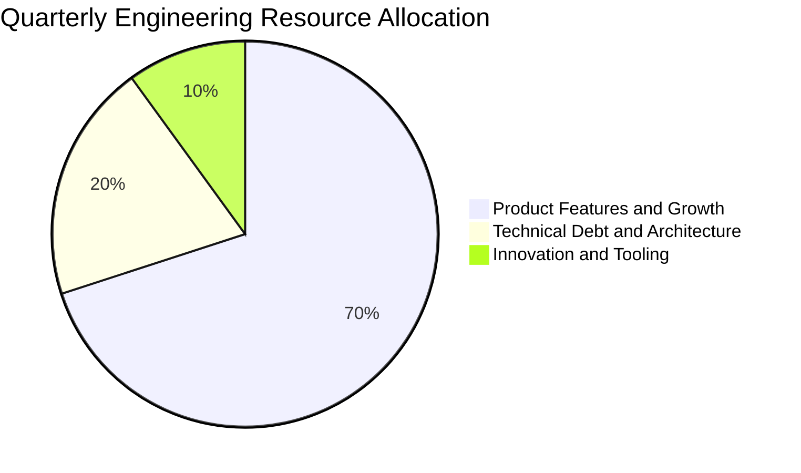

# 🗺️ Engineering Strategy, Roadmapping & Stakeholder Alignment

Staff Engineers and Engineering Managers are responsible for turning strategic company goals into executable engineering roadmaps, driving architectural consensus, and translating complex technical realities to business leaders.

---

## 🧭 The 70-20-10 Engineering Capacity Allocation Model

A healthy engineering organization intentionally allocates engineering sprint capacity across three pillars to avoid technical bankruptcy:



---

## 1. "How do you drive consensus when senior engineers are deadlocked in architectural analysis paralysis?"

### 🎯 Evaluation Goal
Do you let debates drag on for weeks in Slack, or do you have a **systematic, time-boxed decision framework**?

```mermaid
flowchart TD
    D["Architectural Deadlock<br/>(e.g., gRPC vs GraphQL)"] --> RFC["1. Write a Formal RFC / ADR<br/>(Architecture Decision Record with Pros/Cons)"]
    RFC --> SPIKE["2. Time-Boxed Spike (2-Day Benchmark PoC)"]
    SPIKE --> REV["3. Alignment Review Meeting (30 Min)"]
    REV --> DEC["4. Make Call & Disagree-and-Commit"]
    
    style D fill:#1e1e2e,stroke:#f38ba8,stroke-width:2px;
    style RFC fill:#181a24,stroke:#89b4fa,stroke-width:1px;
    style SPIKE fill:#181a24,stroke:#fab387,stroke-width:1px;
    style DEC fill:#181a24,stroke:#a6e3a1,stroke-width:2px;
```



### 📝 Model Answer
> *"When senior engineers disagree passionately, it's usually because both approaches have valid merits and the debate has shifted from data to philosophy. I resolve this using our **RFC & Time-Boxed Spike Framework**:*
>
> 1. ***Formalize the RFC (Request for Comments)***: I ask both proponents to co-author a single 2-page RFC detailing the trade-off matrix: latency impact, operational complexity, developer ramp-up time, and total cost of ownership.
> 2. ***2-Day Empirical Spike***: Instead of theoretical debate, we time-box a 48-hour prototype to benchmark real performance under load.
> 3. ***Final Review & Disagree-and-Commit***: We review the benchmark data against our primary project constraint (e.g., if our constraint is low-latency, the benchmark winner wins; if our constraint is frontend velocity, developer ergonomics win). If consensus is still tied, as Tech Lead I make the final call, document the rationale in our Architecture Decision Record (ADR), and ensure all engineers commit 100% to the execution."*

---

## 2. "How do you explain technical complexity and risks to non-technical stakeholders?"

### 🎯 Evaluation Goal
Can you speak the language of business (Revenue, Risk, Latency, Customer Churn) rather than drowning executives in technical jargon?

### 💬 The Executive Translation Framework

```
┌────────────────────────────────────────┬────────────────────────────────────────┐
│ ❌ Technical Jargon (Confuses Execs)   │ ✅ Business Language (Wins Alignment)   │
├────────────────────────────────────────┼────────────────────────────────────────┤
│ "We need to upgrade from Java 11 to 21 │ "Upgrading our runtime will reduce our │
│  and refactor our thread pool to use   │  AWS server bill by $30,000/year and   │
│  Virtual Threads."                     │  allow us to support 3x more users."   │
├────────────────────────────────────────┼────────────────────────────────────────┤
│ "We have high database lock contention │ "During flash sales, 15% of customers  │
│  on the orders table."                 │  experience checkout errors, risking   │
│                                        │  $50,000 in immediate lost revenue."   │
└────────────────────────────────────────┴────────────────────────────────────────┘
```

### 📝 Model Answer
> *"I always translate technical decisions into **Business Value, Risk, and Cost**.*
>
> *When proposing an architectural overhaul, I structure my executive briefing in 3 bullet points:*
> 1. ***The Customer & Revenue Impact***: How this technical limitation hurts conversion or user retention today.
> 2. ***The Financial Cost of Inaction***: What it will cost the business in lost revenue, compliance fines, or emergency downtime over the next 12 months.
> 3. ***The Phased ROI & Timeline***: The engineering investment required and the clear metrics we will use to measure success (e.g. 50% lower cloud bill, 99.99% uptime, 2x faster feature delivery for Product)."*

---

## 3. "How do you structure an annual or multi-quarter technical roadmap?"

### 📝 Model Answer
> *"I build technical roadmaps using a bottom-up and top-down synthesis:*
> 1. ***Top-Down Alignment***: I start with executive business goals (e.g., 'Expand into European markets', 'Scale to 10M DAU').
> 2. ***Bottom-Up Discovery***: I audit our telemetry, on-call incident post-mortems, and developer friction pain points to identify system bottlenecks.
> 3. ***Prioritization Scoring (RICE Framework)***: We score each initiative by **Reach, Impact, Confidence, and Effort**.
> 4. ***The 70/20/10 Balance***: I ensure our roadmap allocates 70% to direct business features, 20% to architectural tech debt & platform resilience, and 10% to developer tooling and innovation spikes. This ensures steady feature velocity without burning out the infrastructure."*
