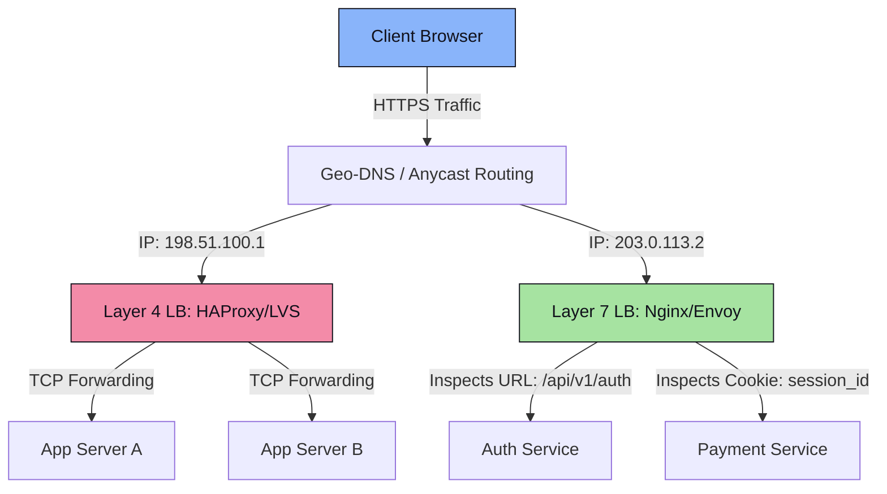
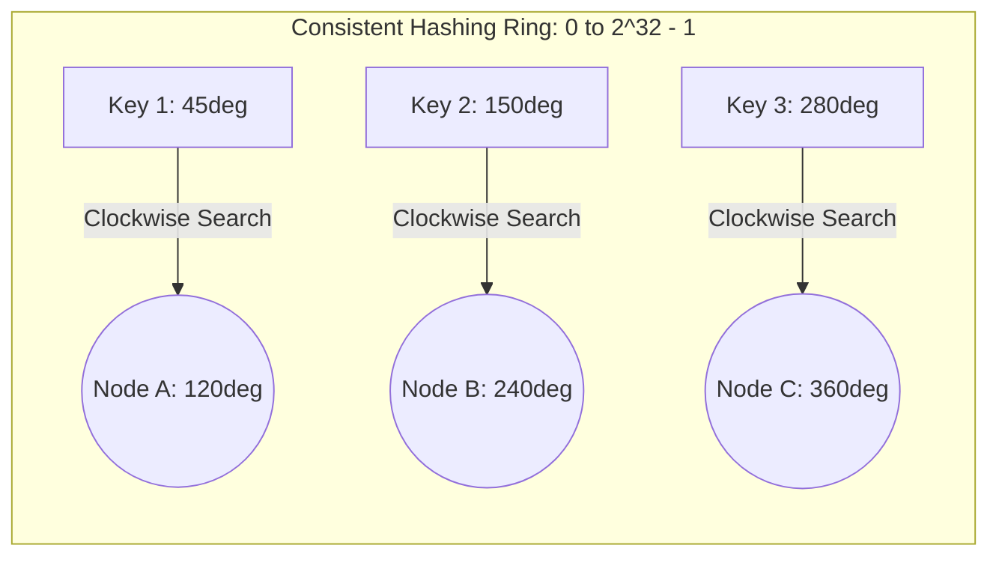
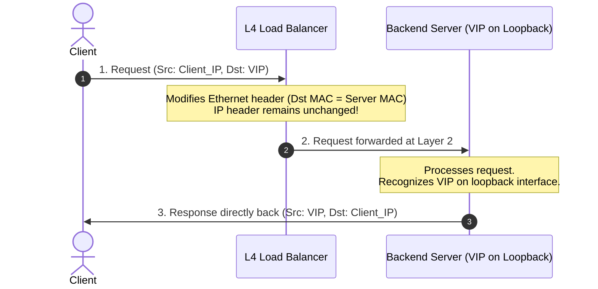
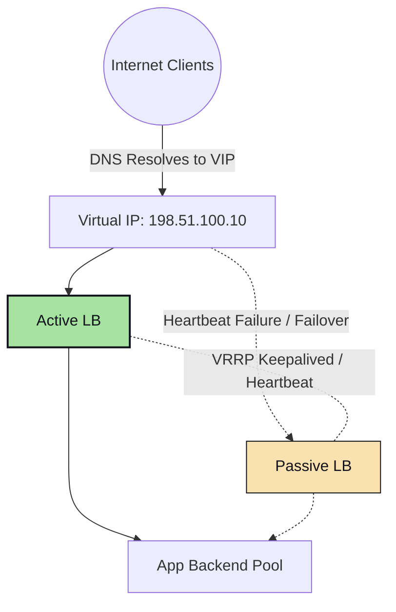

# Component 1.1: Load Balancers

A **Load Balancer (LB)** acts as a reverse proxy that distributes incoming network traffic across multiple servers. Its core goals are to prevent any single server from becoming a bottleneck, minimize latency, and achieve high availability through redundancy.

---

## ⚖️ L4 vs L7 Load Balancing

Load balancing happens primarily at two layers of the OSI model: Layer 4 (Transport) and Layer 7 (Application).

### Comparative Analysis

| Feature | Layer 4 (L4) Load Balancing | Layer 7 (L7) Load Balancing |
| :--- | :--- | :--- |
| **OSI Layer** | Layer 4 (Transport - TCP/UDP) | Layer 7 (Application - HTTP/HTTPS/gRPC) |
| **Routing Criteria** | IP address, port number, protocol. | URL, cookies, HTTP headers, payload content. |
| **Computation Resource** | Low CPU/memory (packet-level routing). | High CPU/memory (must parse application protocols). |
| **Connection Handling** | One TCP connection: client talks directly to backend (NAT) or LB acts as router. | Two TCP connections: Client ↔ LB, and LB ↔ Backend. |
| **SSL Termination** | No (cannot decrypt SSL/TLS packets). | Yes (terminates SSL, inspects content, re-encrypts or forwards HTTP). |
| **Security Capabilities** | Basic packet filtering (DDoS protection at layer 4). | Advanced WAF, SQL injection prevention, rate limiting. |
| **Use Cases** | High-performance raw TCP/UDP stream routing. | Microservices API routing, A/B testing, session affinity. |

---

## 🔄 Load Balancing Algorithms

### 1. Static Algorithms
*   **Round Robin**: Distributes requests sequentially. Best when all backend servers have identical specifications and request processing costs are uniform.
*   **Weighted Round Robin**: Assigns a static weight weight (capacity metric) to each server. A server with weight `3` receives three times more requests than a server with weight `1`.
*   **IP Hash**: Hashes the client’s IP address (`hash(Client_IP) % Number_of_Servers`) to choose the target node. Ensures a client is consistently routed to the same backend (session stickiness), but risks uneven traffic distribution if many clients sit behind a single NAT gateway.

### 2. Dynamic Algorithms
*   **Least Connections**: Routes requests to the server with the fewest active TCP connections. Ideal for transactions that vary widely in execution duration.
*   **Weighted Least Connections**: Combines server capacity (weight) and active connections. Traffic is routed to the node minimizing the ratio: `Active Connections / Server Weight`.
*   **Least Response Time**: Evaluates both active connections and historical response times to send requests to the fastest, least busy node.

### 3. Consistent Hashing (Highly Recommended for Distributed Systems)
In standard modulo hashing (`hash(key) % N`), if a node $N$ is added or removed, almost all keys map to new servers, causing a catastrophic cache stampede. **Consistent Hashing** resolves this.

#### How it Works:
1.  Map servers and keys onto a circular ring using a hash function (like MD5 or SHA-256) which maps values to a range $[0, 2^{32} - 1]$.
2.  To find which server hosts a key, locate the key’s position on the ring, then travel clockwise until you find the first server.
3.  **Virtual Nodes (VNodes)**: To prevent hot-spotting (uneven distribution where one server covers a large segment of the ring), each physical server is represented multiple times across the ring (e.g., `Node A-1`, `Node A-2`, `Node A-3`). This ensures keys are distributed evenly.

---

## 🛠️ Traffic Routing & Packet Flow Models

### 1. NAT Mode (Network Address Translation)
The Load Balancer translates the destination IP address of incoming packets to the selected backend server's IP. 
*   **Inbound**: Client ➔ LB (Destination IP: LB) ➔ LB changes Destination to Server ➔ Server (Source: Client, Destination: Server).
*   **Outbound**: Server ➔ LB (Source: Server, Destination: Client) ➔ LB changes Source to LB ➔ Client.
*   **Bottleneck**: Both inbound and outbound traffic must traverse the load balancer. Since outbound response payloads are typically much larger than requests, this can saturate the load balancer's network interfaces.

### 2. Direct Server Return (DSR)
DSR optimizes performance by removing the load balancer from the response path.

*   **How it Works**: The backend servers are configured with the load balancer’s Virtual IP (VIP) on their loopback interface (making them ignore ARP requests for that VIP). The LB receives the packet and simply alters the **destination MAC address** to point to the chosen backend server, leaving the IP header intact. The backend processes the request and replies directly to the client using its own internet gateway, bypassing the LB completely.
*   **Limitation**: Cannot be used for Layer 7 load balancing since L7 requires terminating the TCP connection at the load balancer to inspect headers/payloads.

---

## 🛡️ High Availability Topologies (Preventing Single Points of Failure)

If a load balancer goes down, the entire system crashes. To prevent this, load balancers must be deployed in high-availability clusters.

### 1. Active-Passive Topology
Uses a primary load balancer (Active) and one or more standby load balancers (Passive).

*   **Mechanism**: The active and passive nodes share a **Virtual IP (VIP)** via protocols like **VRRP (Virtual Router Redundancy Protocol)** or **Keepalived**. The passive node continuously monitors the active node via heartbeats.
*   **Failover**: If the active node fails to send heartbeat packets within a threshold (e.g., 3 seconds), the passive node broadcasts an ARP packet claiming ownership of the VIP, routing all subsequent traffic to itself.

### 2. Active-Active Topology
All load balancers handle traffic simultaneously.
*   **DNS Round-Robin / Geo-DNS**: The DNS server returns multiple A records containing the IPs of different load balancers.
*   **ECMP (Equal-Cost Multi-Path)**: Routers upstream use routing protocols (like BGP) to split traffic equally across multiple active load balancer nodes at the network level. If one node fails, the router immediately stops forwarding packets to its IP.
