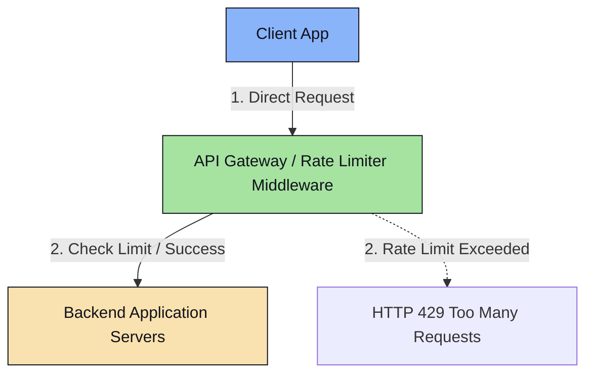
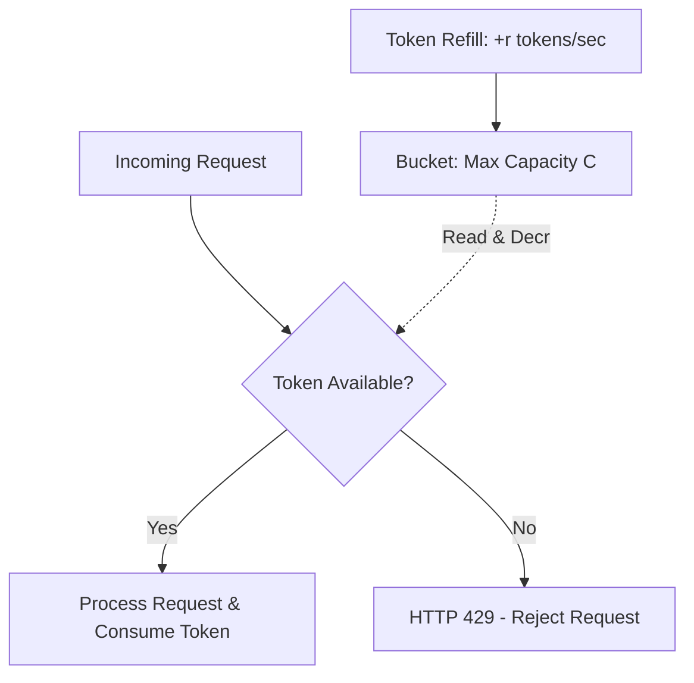
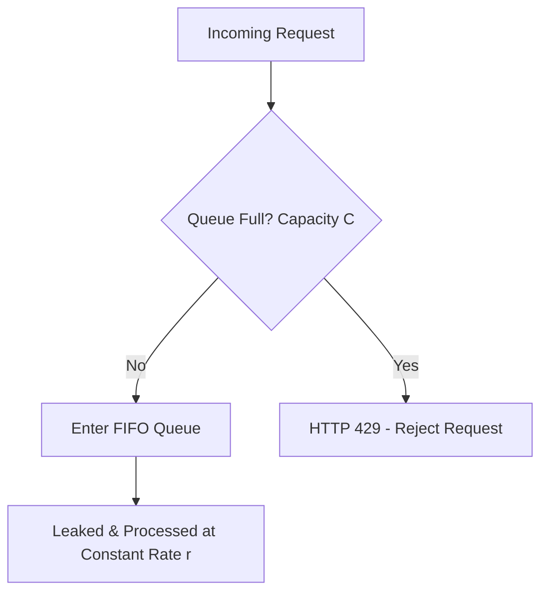
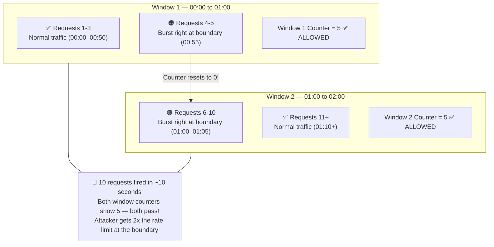
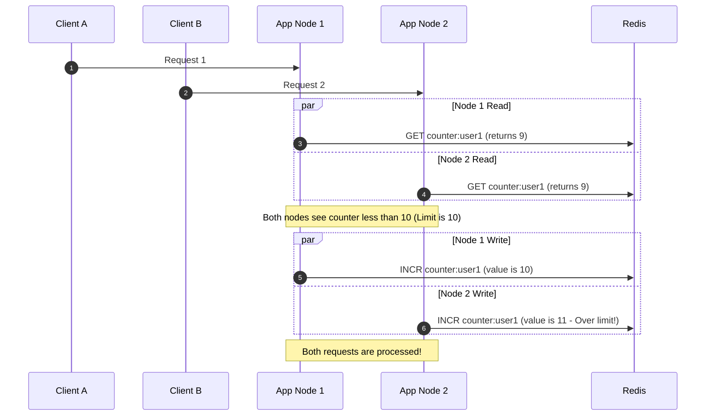

# Component 1.2: Rate Limiters

A **Rate Limiter** controls the rate of traffic sent by a client or user to an API. It limits the number of requests within a defined time window.

### Key Use Cases
1.  **DDoS Mitigation**: Prevents resource exhaustion from malicious botnets.
2.  **Cost Control**: Prevents excessive API usage fees from third-party services (e.g., OpenAI, Twilio).
3.  **Preventing Resource Starvation**: Ensures a single noisy neighbor tenant cannot monopolize shared database pools.

---

## 🧭 Placement Options



*   **Client-Side Limiting**: Generally unreliable because clients can be modified or bypassed easily by malicious actors.
*   **Server-Side (Application Level)**: Good for fine-grained business logic checks, but burdens the application servers with parsing payloads before rejecting requests.
*   **API Gateway / Middleware (Recommended)**: Positioned at the network edge (e.g., Kong, AWS API Gateway, Cloudflare). Inspects headers and rejects requests early (returning `HTTP 429 Too Many Requests`), saving compute capacity on downstream backend nodes.

---

## 🛠️ Core Algorithms: Deep Dive

### 1. Token Bucket
*   **Concept**: A bucket with capacity $C$ holds tokens. Tokens are added at a constant fill rate $r$ tokens/sec. Each request consumes $1$ token. If the bucket is empty, the request is dropped.
*   **Pros**: Allows bursts of traffic up to the bucket capacity $C$. Highly memory efficient (only needs to store the last timestamp and the current token count).
*   **Cons**: Tuning the capacity $C$ and fill rate $r$ can be difficult.



### 2. Leaky Bucket
*   **Concept**: Requests are entered into a FIFO queue (the bucket) of capacity $C$. Requests are processed (leaked) at a constant, uniform rate $r$. If the queue is full, incoming requests are dropped immediately.
*   **Pros**: Smooths out traffic bursts, producing a stable, continuous output rate. Ideal for database write flows.
*   **Cons**: A sudden burst of legitimate requests can fill the queue, causing new requests to suffer high queue latency or get dropped.



### 3. Fixed Window Counter
*   **Concept**: Divides timeline into fixed windows (e.g., 1 minute). Each window maintains a request counter. If counter exceeds threshold, requests are blocked until the next window starts.
*   **Cons (The Boundary Burst Problem)**: If a client sends all their allowed requests right at the end of window $W_1$ and another batch right at the start of window $W_2$, they can double their allowed limit within a short span across the boundary.



### 4. Sliding Window Log
*   **Concept**: Keeps track of every request's exact millisecond timestamp in a sorted set (like Redis ZSET). Upon receiving a request:
    1.  Remove all timestamps older than `Current Time - Window Size`.
    2.  Count the total number of timestamps in the log.
    3.  If the count is less than the limit, allow the request and log the timestamp.
*   **Pros**: Extremely accurate. No boundary burst vulnerabilities.
*   **Cons**: Heavy memory consumption. Storing timestamps for every request from every client consumes massive amounts of RAM.

### 5. Sliding Window Counter
*   **Concept**: Combines Fixed Window's memory efficiency and Sliding Window Log's accuracy. It estimates the current rate using a weighted formula:
    $$\text{Requests} = \text{Count}_{\text{Current Window}} + \text{Count}_{\text{Previous Window}} \times \left(1 - \frac{\text{Time Elapsed in Current Window}}{\text{Window Size}}\right)$$
*   **Pros**: Highly memory efficient (only stores two counters per user) and prevents boundary bursts with a low approximation error ($<5\%$).

---

## 🌐 Distributed Rate Limiting & Race Conditions

In a multi-server setup, rate limit data must be centralized (typically in **Redis**). However, this introduces two major issues: **Race Conditions** and **Synchronization Lag**.

### 1. The Race Condition (Read-Then-Write)
If two requests from the same user arrive at different application nodes at the exact same millisecond:
1.  Node A reads Redis: `Counter = 9` (Limit: 10).
2.  Node B reads Redis: `Counter = 9`.
3.  Node A increments Counter to 10 and processes the request.
4.  Node B increments Counter to 10 and processes the request.
5.  **Result**: The user processed 11 requests, violating the rate limit.



### 2. Resolution: Lua Scripting (Atomic Execution)
Redis executes Lua scripts atomically on the single-threaded Redis server, preventing interleaving reads/writes.

#### Distributed sliding window rate limiter implementation via Redis Lua Script:
```lua
-- KEYS[1]: Rate limit key (e.g., rate:user_id)
-- ARGV[1]: Current timestamp (Unix Epoch in seconds/milliseconds)
-- ARGV[2]: Window size (in seconds)
-- ARGV[3]: Max requests allowed in window

local rate_limit_key = KEYS[1]
local now = tonumber(ARGV[1])
local window = tonumber(ARGV[2])
local limit = tonumber(ARGV[3])

local clear_before = now - window

-- 1. Remove old elements outside the sliding window
redis.call('ZREMRANGEBYSCORE', rate_limit_key, '-inf', clear_before)

-- 2. Count remaining logs
local current_requests = redis.call('ZCARD', rate_limit_key)

-- 3. Check if count exceeds limit
if current_requests < limit then
    -- Add current request timestamp to sorted set (score = timestamp, member = timestamp)
    redis.call('ZADD', rate_limit_key, now, now)
    -- Set TTL on the set to avoid orphaned keys leaking RAM
    redis.call('EXPIRE', rate_limit_key, window)
    return 1 -- Allowed
else
    return 0 -- Blocked
end
```
*Execute using `EVAL <script> 1 rate:user123 1624545600 60 100`*

---

## ⚡ Performance Optimization & Scale

For high-scale setups:
1.  **Local Memory Buffering (Hybrid Hashing)**: To prevent Redis from becoming the bottleneck at millions of QPS, cache rate-limiting checks locally in the API Gateway memory. Sync with Redis asynchronously or every $X$ requests.
2.  **Locality of Reference (IP Geolocation)**: Route requests from Region X to a local Redis cluster. Set up synchronization between regional Redis clusters using CRDTs (Conflict-Free Replicated Data Types) or dynamic primary-replica pools.
