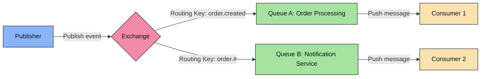
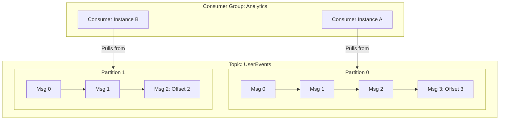

# Component 1.3: Messaging Queues (Kafka vs RabbitMQ)

Message queues and streaming platforms enable asynchronous communication between microservices, decoupling systems, handling spikes (traffic shaping), and providing durable event storage.

---

## 🐇 RabbitMQ: The Smart Message Broker

RabbitMQ is a traditional message broker implementing the **AMQP 0-9-1 (Advanced Message Queuing Protocol)**. It is based on a **Smart Broker / Dumb Consumer** design: the broker handles message lifecycle, routing, and deletion, while consumers remain simple.

### Core Architecture Components
1.  **Publisher**: Sends messages to an Exchange.
2.  **Exchange**: Receives messages and decides how to route them to queues based on bindings and routing keys.
    *   **Direct Exchange**: Routes messages directly to queues based on an exact routing key match.
    *   **Fanout Exchange**: Ignores routing keys and broadcasts messages to all queues bound to it.
    *   **Topic Exchange**: Routes messages using wildcard routing patterns (e.g., `orders.*.completed`).
    *   **Headers Exchange**: Routes based on message headers instead of routing keys.
3.  **Queue**: Buffer that stores messages until consumed.
4.  **Consumer**: Subscribes to queues. RabbitMQ **pushes** messages to consumers.

### Message Acknowledgment & Lifetime
*   Once a consumer processes a message and sends an `ACK` (Acknowledgment) back, RabbitMQ immediately deletes the message from storage.
*   If a consumer crashes without sending an ACK, the broker re-queues the message to another consumer.

---

## 🎼 Apache Kafka: The Distributed Commit Log

Kafka is a distributed streaming platform structured as a **Distributed Commit Log**. It is built on a **Dumb Broker / Smart Consumer** design: Kafka simply appends bytes to disk in order, while consumers keep track of their own positions (offsets).

### Core Architecture Components
1.  **Producer**: Writes messages to Kafka. Producers hash keys to decide which **Partition** inside a **Topic** the write goes to, ensuring order preservation for matching keys.
2.  **Commit Log**: Each partition is an ordered, immutable sequence of records continuously appended to. Each message receives a sequential ID called an **Offset**.
3.  **Consumer Groups**: A group of consumers cooperating to read from a topic.
    *   **Partition Ownership**: Each partition within a topic is read by exactly **one** consumer instance in a group. This guarantees strictly ordered processing per partition.
    *   **Consumer Scale-out Limit**: If a topic has 3 partitions, having 4 consumers in a group means 1 consumer sits idle.
4.  **ZooKeeper / KRaft**: Coordinates partition leaders, monitors broker health, and manages controller elections.

### Key Performance Optimizations in Kafka
*   **Sequential I/O**: Kafka writes to files sequentially on disk. Sequential disk access is extremely fast, rivaling random memory access speeds.
*   **Zero-Copy Execution**: Using the `sendfile` system call, Kafka transfers pages directly from OS Page Cache to the network socket, bypassing the application user-space memory space to reduce CPU overhead.

---

## ⚖️ Head-to-Head Comparison

| Capability | RabbitMQ | Apache Kafka |
| :--- | :--- | :--- |
| **Model** | Classic Queue (Smart Broker, Dumb Consumer). | Distributed Commit Log (Dumb Broker, Smart Consumer). |
| **Data Flow** | **Push-based**: Broker pushes message to consumers. | **Pull-based**: Consumers pull batches from broker. |
| **Storage & Retention**| Transient. Deleted immediately after `ACK`. | Persistent. Retained for configured time/size (e.g., 7 days) regardless of consumption status. |
| **Message Ordering** | Guaranteed only when consuming from a single queue using one consumer. | Strictly ordered **per partition**. Keys hash to the same partition, guaranteeing order. |
| **Scaling Capability** | Difficult to scale queues across nodes dynamically; clustering focuses on high availability. | Highly scalable. Scaled horizontally by adding partitions across multiple brokers. |
| **Throughput** | Moderate (~tens of thousands of messages/sec). | Ultra-High (~millions of messages/sec). |
| **Routing Complexity**| High. Rich routing engines using exchanges and bindings. | Low. Routing is key-based mapping directly to partitions. |

---

## 🎯 When to Use Which?

### Choose RabbitMQ if:
*   You need complex routing patterns (wildcards, multiple bindings).
*   Your system requires transactional workflows (e.g., direct banking state transitions where a message must be processed and verified immediately, then removed).
*   You don't need to replay data (historical auditing is not required).

### Choose Kafka if:
*   You are building an event-driven microservices architecture requiring **Event Sourcing** or audit logs.
*   You need to replay historical messages (e.g., rebuilding read databases or re-running data analytics pipelines from a point in time).
*   You need extremely high throughput (e.g., streaming logs, telemetry tracking, real-time user-activity tracking).
