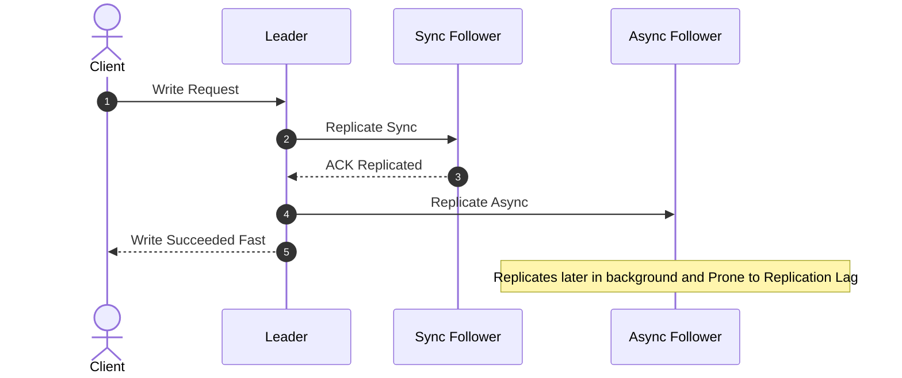
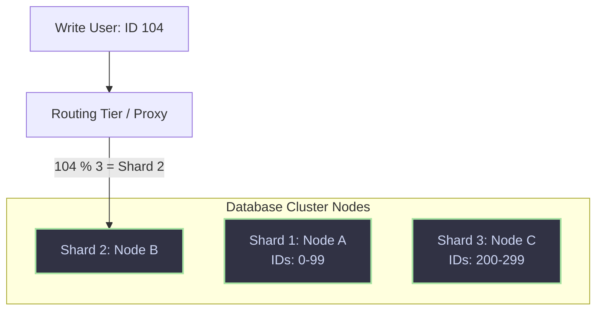
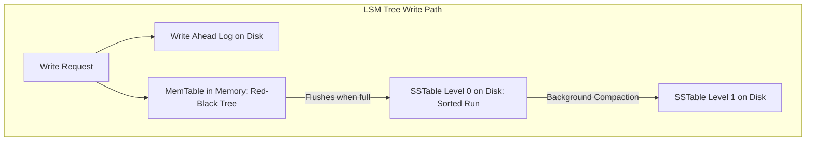
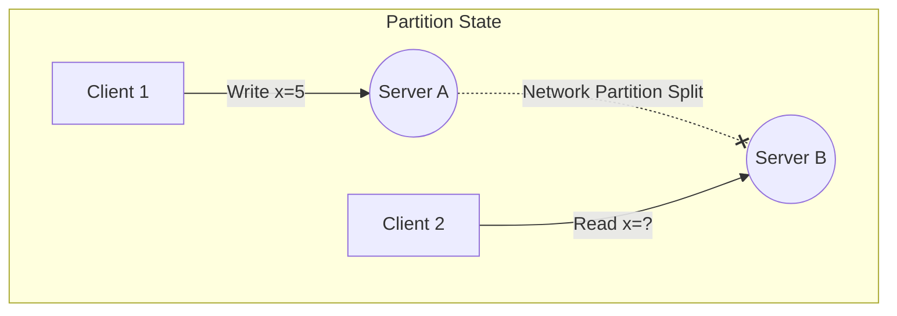

# Component 1.4: Databases & Scaling

Choosing, scaling, and optimizing databases are critical aspects of high-scale system design. This section covers replication, sharding, storage engine internals, and the fundamental trade-offs described by CAP and PACELC.

---

## 🔀 Database Replication Models

Replication copies data across multiple physical machines to guarantee high availability and fault tolerance.

### 1. Single-Leader (Master-Slave)
All writes go to the Leader. The leader writes to its local storage and broadcasts changes to Followers as a replication log. Reads can go to any node.

*   **Synchronous Replication**: The leader waits for the follower to acknowledge replication before returning success to the client. Guarantees consistency but increases write latency and decreases write availability (if the follower crashes, writes block).
*   **Asynchronous Replication**: The leader returns success immediately after local write. High performance, but if the leader dies before changes reach followers, data is lost.
*   **Replication Lag Anomalies**:
    *   **Read-After-Write Consistency**: If a user writes, then refreshes and reads from an async follower, their write might seem to have disappeared. Solution: Read the user's own profile data only from the leader.
    *   **Monotonic Reads**: Ensures a user won't see data go back in time. Solution: Ensure a user always reads from the same follower (routed by hashing user ID).

### 2. Multi-Leader
Multiple nodes act as leaders, accepting write operations.
*   **Use Case**: Multi-datacenter architectures (users write to the nearest local leader for low latency).
*   **Challenge**: Conflict resolution (e.g., two users editing the same row simultaneously). Handled by *Last-Write-Wins (LWW)*, collaborative editing algorithms (OT/CRDT), or custom resolution code.

### 3. Leaderless (Dynamo-Style)
Every node accepts writes and reads. Used by Cassandra and DynamoDB.
*   **Quorum Writes & Reads**: To guarantee consistency with $N$ replicas, write to $W$ nodes and read from $R$ nodes such that:
    $$W + R > N$$
    This mathematical inequality ensures that the read set and the write set overlap in at least one node, guaranteeing that the read returns the latest value.
*   **Resolving Out-of-Sync Data**:
    *   **Read Repair**: When a client reads from multiple nodes and notices one replica has stale data, the client pushes the fresh value back to that stale replica.
    *   **Anti-Entropy Process**: A background process utilizing Merkle Trees (cryptographic hash trees) to find and fix differences between replicas.

---

## ⚡ Database Partitioning & Sharding

Partitioning splits a massive database into smaller subsets. Sharding specifically refers to distributing these partitions across different physical servers.

### Sharding Strategies
1.  **Range-Based Sharding**: Data is partitioned based on continuous ranges of a key (e.g., Shard 1: A-C, Shard 2: D-F).
    *   *Pro*: Simple; range queries on the shard key are highly efficient.
    *   *Con*: Hotspots (e.g., if writing millions of names starting with 'C', Shard 1 is overloaded).
2.  **Hash-Based Sharding (Key-Value modulo)**: A hash function is applied to the shard key (e.g., `hash(user_id) % number_of_shards`).
    *   *Pro*: Distributes writes evenly.
    *   *Con*: Adding/removing shards requires resharding almost the entire dataset. (Mitigated by using **Consistent Hashing**).
3.  **Directory-Based Sharding**: A centralized lookup service tracks which partition map to which physical node.
    *   *Con*: The lookup service becomes a single point of failure (SPOF) and a latency bottleneck.

---

## 📂 Storage Engine Internals: B-Trees vs LSM-Trees

Every database relies on a storage engine. The choice of indexing structure dictates the read/write performance profile.

### 1. B-Trees / B+ Trees
*   **Structure**: Breaks the database down into fixed-size pages (usually 4KB) and builds a balanced search tree of page references. In B+ Trees, data pointers are stored only in leaf nodes, which are linked sequentially to optimize range scans.
*   **Write Path**: Updates modify pages in-place. If a page is full, it splits. Writes require random disk I/O.
*   **Optimized For**: **Read-heavy workloads** (RDBMS: MySQL InnoDB, PostgreSQL). Reads require navigating a logarithmic number of page pointers, which are often cached in RAM.

### 2. Log-Structured Merge-Trees (LSM-Trees)
*   **Structure**: Designed to handle high-volume write operations.
*   **Write Path**:
    1.  Append incoming write to a sequential disk log called the **Write-Ahead Log (WAL)** (used for crash recovery).
    2.  Write the data to an in-memory sorted structure, the **MemTable** (e.g., Red-Black Tree).
    3.  When the MemTable reaches a threshold (e.g., 64MB), flush it to disk as an immutable **Sorted String Table (SSTable)**.
    4.  **Compaction**: A background thread merges sorted SSTables and deletes overwritten or tombstoned (deleted) records.
*   **Optimized For**: **Write-heavy workloads** (NoSQL: Cassandra, RocksDB, InfluxDB). Writes are sequential append operations (extremely fast). Reads are slower because they must search the MemTable and multiple SSTables (mitigated using **Bloom Filters**).

---

## 📐 The CAP and PACELC Theorems

### 1. CAP Theorem
In a distributed system, you can guarantee at most two out of three of:
*   **Consistency (C)**: Every read receives the most recent write or an error.
*   **Availability (A)**: Every non-failing node returns a non-error response (without guarantee of containing the most recent write).
*   **Partition Tolerance (P)**: The system continues to operate despite arbitrary message loss or system failures.

**The Real Trade-off**: Since physical networks are imperfect, **Partition Tolerance (P) is mandatory**. Therefore, when a partition occurs, a system must choose:
*   **CP (Cancel/Block)**: Reject the write or block the read to maintain consistency across the split network.
*   **AP (Allow/Accept)**: Process the write on A and read stale data from B to maintain availability.

### 2. PACELC Theorem
CAP only describes behavior during rare network partitions. **PACELC** expands CAP to describe trade-offs during normal operations:
*   If there is a **Partition (P)**, trade off **Availability (A)** or **Consistency (C)**.
*   **Else (E)**, trade off **Latency (L)** or **Consistency (C)**.

#### Real Database Classification:
*   **MongoDB (CP / EC)**: During partitions, it blocks writes to the minority partition. Under normal operations, it prioritizes consistency (reads block until write replication reaches a majority of nodes).
*   **Cassandra (AP / EL)**: During partitions, it accepts writes globally. Under normal operations, it prioritizes speed (low latency reads from local replicas, resolving consistency asynchronously).
