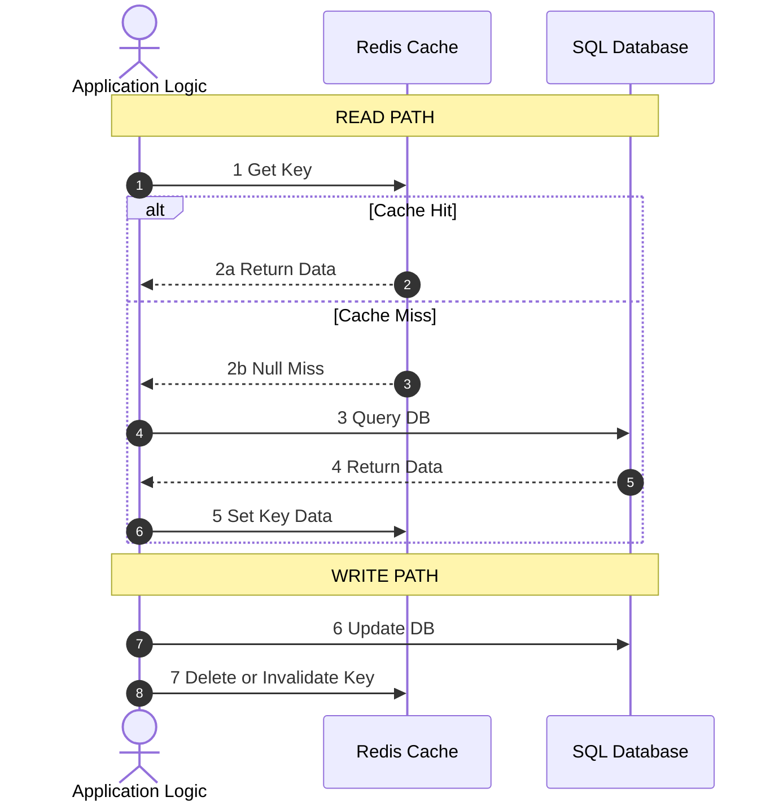
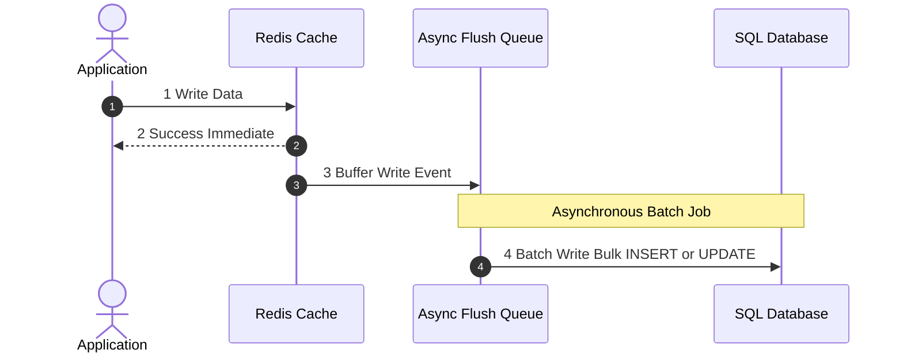
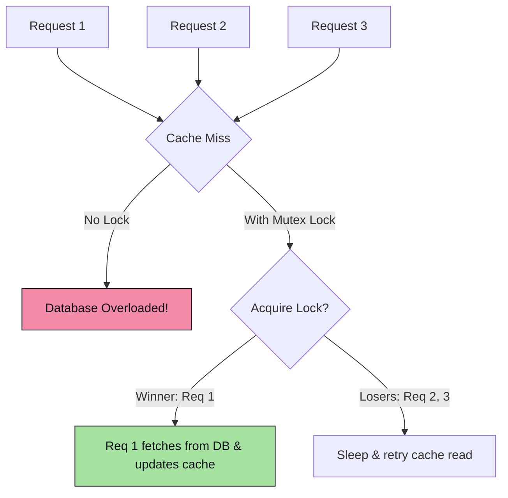

# Component 1.5: Caching Strategies

Caching stores copies of frequently accessed data in high-speed, in-memory systems (like Redis or Memcached) to reduce database load, lower latency, and scale read QPS.

---

## 🔄 Caching Read/Write Patterns

The way data is loaded and updated in the cache determines consistency guarantees and system performance.

### 1. Cache-Aside (Lazy Loading)
The application code directly coordinates reading and writing between the database and the cache.

*   **Read Flow**: If cache hit, return. If cache miss, read from DB, write to cache, return.
*   **Write Flow**: Write to DB first, then **delete (invalidate)** the cache key. (Deletions are safer than updates because two concurrent writes can cause race conditions where cache and DB go out of sync).
*   **Pros**: Failures in cache do not crash the app (falls back to DB). Memory efficient (only caches requested data).
*   **Cons**: Cache miss penalty (three round trips on miss). Potential stale data if DB is modified and cache deletion fails.

### 2. Read-Through / Write-Through
The application treats the cache as the single source of truth. The cache library handles syncing with the database.

*   **Read-Through**: Cache loads missing data from the DB automatically, updates itself, and returns it.
*   **Write-Through**: The application writes to the cache. The cache synchronously writes to the database. Only when both writes succeed does the application receive a success message.
    *   *Pro*: High data consistency.
    *   *Con*: High write latency (writes are bound by database speeds).

### 3. Write-Back (Write-Behind)
The application writes to the cache, which returns success immediately. A background daemon asynchronously gathers writes and batches them to the DB.

*   **Pros**: Extreme write performance. Shaves database spikes. Batching multiple updates to the same row reduces write pressure on the DB.
*   **Cons**: Risk of data loss if the cache server crashes before the background queue flushes writes to the database.

---

## 🧹 Cache Eviction Policies

When the cache memory limits are reached, the system must decide which keys to discard:

1.  **LRU (Least Recently Used)**: Tracks the time of access. Evicts the key that has not been read or written to for the longest time. (Standard choice for general workloads).
2.  **LFU (Least Frequently Used)**: Tracks access counts. Evicts keys with the lowest frequency of access. (Good for keeping static hot keys, but struggles if traffic patterns shift because old hot keys retain high historical counts).
3.  **FIFO (First In First Out)**: Evicts keys in the order they were created.
4.  **TTL (Time-To-Live)**: Active eviction. Keys automatically expire after a set time.

---

## ⚡ Cache Failure Scenarios & Mitigations

Under heavy traffic, cache issues can quickly cause cascading database failures.

### 1. Cache Stampede (Thundering Herd)
A hot key (e.g., home page data) expires. Suddenly, thousands of concurrent requests read the cache, find a miss, and execute identical expensive queries against the database simultaneously, overloading it.

*   **Mitigation (Mutex Locking)**: Use distributed locks (e.g., Redis `SETNX`). Only the request that acquires the lock is allowed to query the database. Other requests wait/sleep for a short duration and check the cache again.

### 2. Cache Penetration
Clients request keys that exist **neither in the cache nor in the database** (e.g., scraping random IDs or DDoS attacks). Since the keys don't exist, every request misses the cache and hits the database.

*   **Mitigation A (Cache Empty Results)**: If the DB returns null, cache that null value with a short TTL (e.g., 5 minutes) to protect the DB from subsequent requests.
*   **Mitigation B (Bloom Filters)**: Set up a Bloom Filter (a space-efficient probabilistic data structure) in front of the cache. The Bloom filter stores all existing database keys. If the Bloom filter says a key does not exist, reject the request immediately without checking the cache or database.

### 3. Cache Avalanche
A large number of cached keys are set to expire at the exact same time (e.g., due to a batch import where all keys have the same TTL). When they expire together, database load spikes sharply.

*   **Mitigation (TTL Jitter)**: Add a random offset (entropy/jitter) to the TTL of every key during creation:
    $$\text{TTL} = \text{Base TTL} + \text{random\_seconds}(0, 300)$$
    This scatters the expiration events evenly over time.

### 4. Cache Breakdown
A highly active hot key expires. Unlike a cache stampede (which is about *concurrent* hits), a breakdown represents a single critical key's expiration causing database collapse.
*   **Mitigation**: Set hot keys to "Never Expire" in the cache. Instead, use an asynchronous background worker to update the key periodically, or compute the value and update the cache proactively before it expires.
