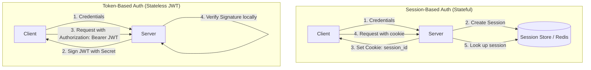
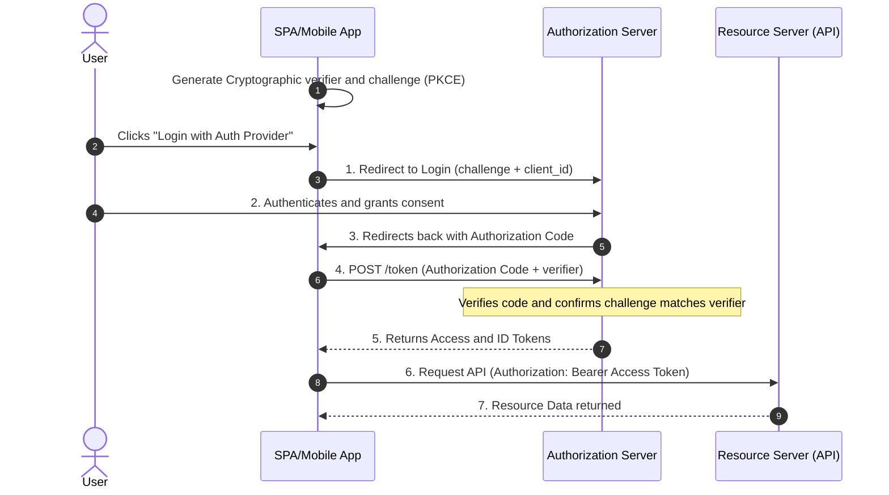
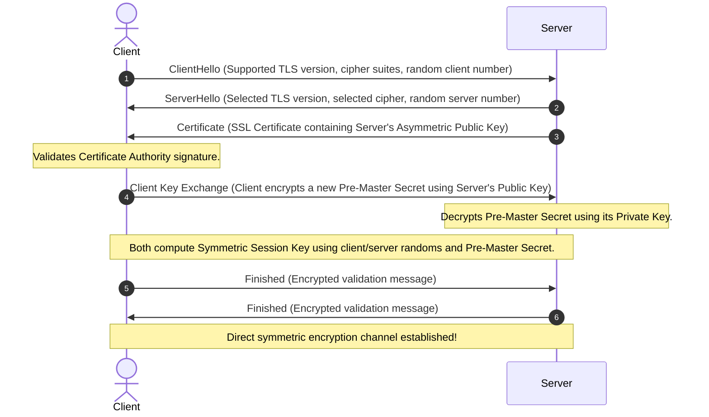

# Component 1.6: Security, Auth & DDoS

Securing web applications requires safeguarding identity, encrypting data in transit, and defending infrastructure from volumetric and application-layer attacks.

---

## 🔐 Authentication (AuthN) vs Authorization (AuthZ)

*   **Authentication (AuthN)**: Validates **who** the user is (e.g., login passwords, multi-factor codes, biometrics).
*   **Authorization (AuthZ)**: Determines **what** the authenticated user can access (e.g., RBAC - Role-Based Access Control, ABAC - Attribute-Based Access Control).

---

## 🎫 Session-Based vs Token-Based (JWT) Auth

### Head-to-Head Comparison

| Attribute | Session-Based Authentication | Token-Based Authentication (JWT) |
| :--- | :--- | :--- |
| **Statefulness** | Stateful. Server stores session data in RAM or DB. | Stateless. Token contains all data; server stores nothing. |
| **Verification** | DB query or cache lookup on every incoming request. | Cryptographic verification of signature (zero DB/Cache I/O). |
| **Scalability** | Harder to scale. Requires sticky sessions or a shared Redis cluster. | Easy to scale. Any server node can verify signature locally. |
| **Revocation** | Easy. Delete the session from the database/cache instantly. | Difficult. JWT is valid until it expires. |
| **Mitigations for Revocation** | N/A | Use short-lived Access Tokens (e.g., 15m) and long-lived Refresh Tokens stored in DB. Implement a Redis Blacklist for revoked active tokens. |

---

## 🌐 OAuth 2.0 Authorization Code Flow (With PKCE)

This is the industry standard flow for Single Page Applications (SPAs) and Mobile Apps, securing against interception attacks.

---

## 🔒 Encryption in Transit: SSL/TLS Handshake

HTTPS uses Transport Layer Security (TLS) to encrypt packets, prevent tampering, and verify server identity.

---

## 🛡️ Distributed Denial of Service (DDoS) Protection

DDoS attacks aim to exhaust system resources (bandwidth, CPU, socket connections) by flooding servers with malicious requests.

### 1. Attack Vectors
*   **Layer 3/4 Volumetric (UDP/ICMP Flooding)**: Floods network lines, exhausting infrastructure bandwidth.
*   **Layer 4 Protocol (SYN Flood)**: Sends spoofed TCP SYN requests without completing the three-way handshake (leaving sockets open in `SYN_RECV` state until timeout, exhausting OS TCP connection tables).
*   **Layer 7 Application (HTTP Flood)**: Mimics legitimate browser requests (e.g., executing complex searches) to exhaust server CPU and database connection pools.

### 2. Mitigation Strategies
*   **Anycast Routing**: Distributes traffic globally across a cluster of servers sharing a single IP address. Incoming traffic automatically routes to the topologically closest datacenter, dispersing the volumetric attack.
*   **Edge Rate-Limiting**: Drops suspicious, high-frequency request flows at the CDN border before they hit the cloud origin network.
*   **Web Application Firewall (WAF)**: Inspects HTTP requests for signatures of malicious traffic (e.g., SQL injections, XSS, specific malicious User-Agents, or suspicious cookie structures).
*   **SYN Cookies**: To defend against SYN Floods, the server replies with a SYN-ACK containing a cryptographically generated sequence number (SYN Cookie) instead of allocating a socket connection in memory. The connection is allocated only when the client sends the final ACK with the correct sequence number.
*   **Geoblocking**: Blocks requests originating from geographical areas that do not belong to the target audience.
