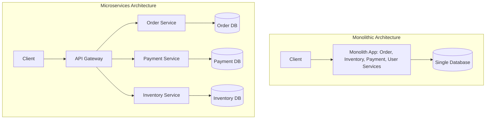
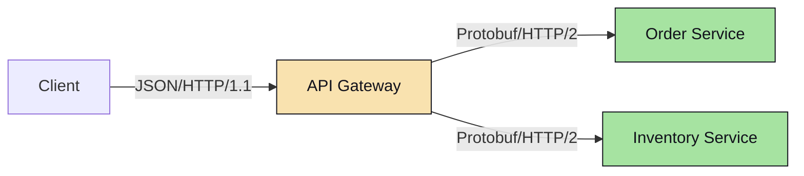
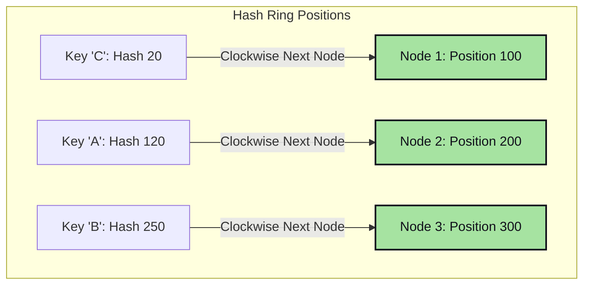
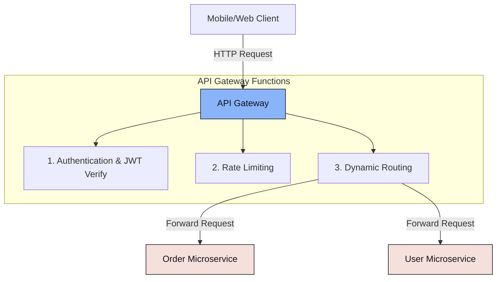

# Fundamentals 2.1: High-Level Design Concepts

High-Level Design (HLD) defines the structural outline of a system: its architecture pattern, protocols, routing topologies, and distributed data structures.

---

## 🏗️ Monoliths vs Microservices

Choosing between a monolith and microservices is a business and operational trade-off.

### Architectural Comparison

| Criteria | Monolithic Architecture | Microservices Architecture |
| :--- | :--- | :--- |
| **Complexity** | Low initial complexity. Easy to test, run, and deploy. | High complexity. Requires CI/CD, container orchestration (Kubernetes), and telemetry. |
| **Deployment** | Single artifact. Updates require redeploying the entire application. | Independent deployment. Teams deploy services without affecting others. |
| **Scaling** | Scaled as a single unit (vertical or horizontal replication of the entire app). | Granular scale. Scale only resource-intensive services (e.g., transcoding service). |
| **Database** | Shared database. Easy transactions (ACID). | Database-per-service. Requires distributed transactions (Saga, Outbox, CQRS). |
| **Failures** | A memory leak or crash in one module can bring down the entire application. | Fault isolation. A crash in the notification service doesn't stop orders. |

---

## 📡 Inter-Service Communication Protocols

Distributed services need to exchange data. The protocol chosen impacts performance, throughput, and system coupling.

### 1. REST (HTTP/1.1)
*   **Payload**: Text-based (typically JSON or XML).
*   **Transport**: HTTP/1.1. Single request/response per TCP connection (unless keep-alive is active). Suffers from **Head-of-Line Blocking** (packets must wait for the preceding packet to complete).
*   **Use Cases**: Public APIs, client-to-server communication where ease of use is valued.

### 2. gRPC (HTTP/2)
*   **Payload**: Binary serialization via **Protocol Buffers (Protobuf)**.
*   **Transport**: HTTP/2. Supports **Multiplexing** (multiple request/response streams interleaved over a single TCP connection), header compression, and bi-directional streaming.
*   **Use Cases**: High-performance internal microservices communication. Reduces serialization CPU time and payload sizes significantly compared to JSON.

### 3. WebSockets (TCP)
*   **Payload**: Frame-based (binary or text).
*   **Transport**: Upgrades from an HTTP request to a persistent, bi-directional TCP connection.
*   **Use Cases**: Real-time communication (e.g., chat applications, live financial tickers, multiplayer games).

---

## 🔄 Consistent Hashing Deep Dive

Consistent hashing solves the problem of mapping requests or cache keys to $N$ servers. When servers are added or removed, standard hashing (`hash(key) % N`) invalidates almost all keys. Consistent Hashing limits key movement to at most $\frac{K}{N}$ keys (where $K$ is the number of keys, and $N$ is the number of servers).

### The Virtual Nodes (VNodes) Optimization
If servers are mapped directly to a single hash ring position, they can be distributed unevenly due to hash function clustering. This causes one server to shoulder a disproportionately large slice of the hash ring (known as the **Hotspot problem**).

To fix this, each physical server is assigned multiple **Virtual Nodes (VNodes)** (e.g., Node 1 is hashed at 200 distinct locations as `Node1-1`, `Node1-2`, ..., `Node1-200`).
*   **Benefits**:
    *   **Uniformity**: Distributes keys almost perfectly evenly across physical nodes.
    *   **Heterogeneous Capacity**: Servers with more hardware capacity (e.g., 64GB RAM vs 16GB RAM) can be assigned a larger number of VNodes, enabling them to naturally pull more traffic from the ring.

---

## 🚪 The API Gateway Pattern

In a microservices architecture, clients should not talk to individual services directly. Instead, they hit an **API Gateway**, which acts as the front door of the system.

### Key Responsibilities:
1.  **Request Routing**: Maps request paths (e.g., `/api/v1/users/*`) to the correct internal microservice IP addresses (integrating with Service Discovery tools like Consul or Kubernetes DNS).
2.  **Cross-Cutting Concerns**: Handles user authentication token checks (verifying JWTs at the gate), SSL/TLS termination, and rate limiting.
3.  **Resiliency (Circuit Breakers)**: Tracks microservice health. If a downstream service starts returning high rates of `5xx` errors, the gateway opens the circuit, immediately returning a fallback error to the client instead of saturating downstream threads.
4.  **Protocol Translation**: Translates REST requests from clients into high-performance gRPC requests for internal communication.
