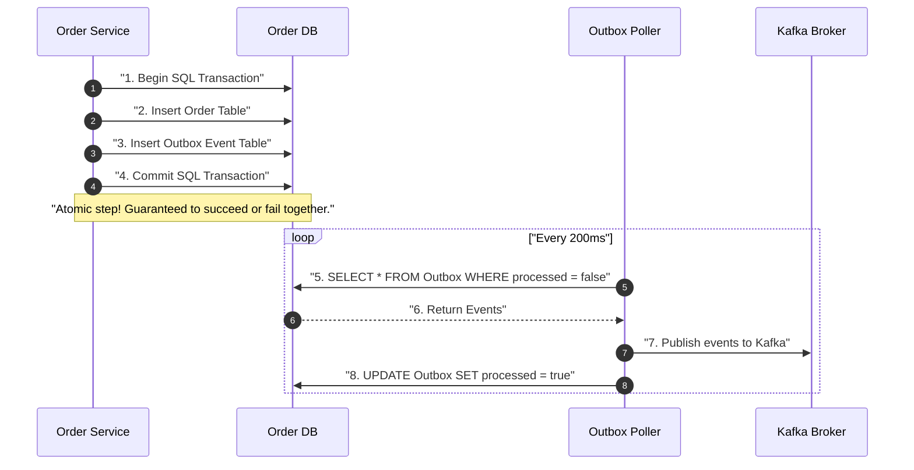
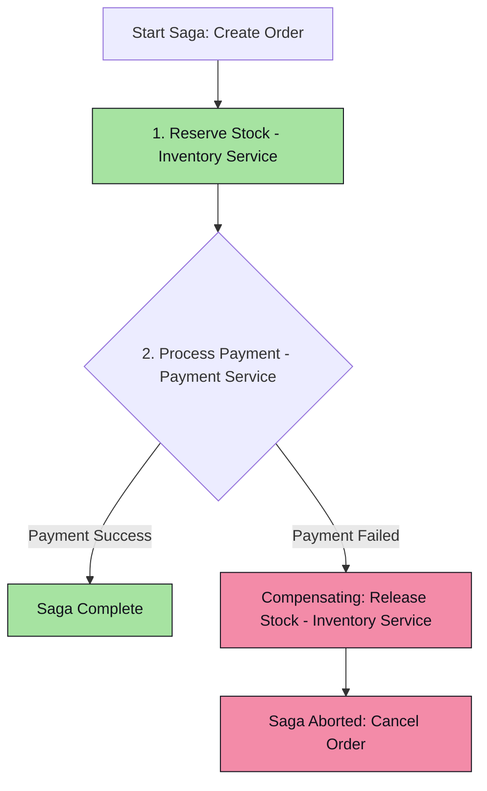
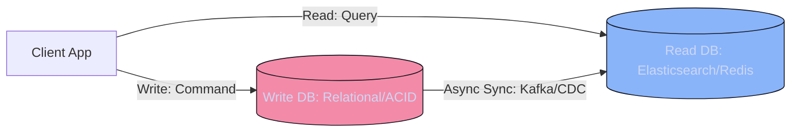

# Fundamentals 2.2: Low-Level Design & SOLID Principles

Low-Level Design (LLD) focuses on class-level architecture, object relationships, design patterns, and clean code practices. In a distributed environment, specific architectural patterns ensure transactional integrity and consistency.

---

## 📐 SOLID Principles (Java Implementation)

### 1. Single Responsibility Principle (SRP)
*   *Definition*: A class should have one, and only one, reason to change.
*   *Java Example*: Avoid writing PDF generation, email notification, and SQL persistence inside a single `OrderService` class. Split them into separate components.

```java
// VIOLATION: Class does too many things
class BadOrderService {
    public void createOrder(Order order) {
        // Save to DB
        // Generate Invoice PDF
        // Send email notification
    }
}

// COMPLIANT: Separate classes for separate responsibilities
class OrderRepository {
    public void save(Order order) { /* DB logic */ }
}

class InvoiceGenerator {
    public byte[] generatePDF(Order order) { return new byte[0]; }
}

class NotificationService {
    public void sendEmail(String recipient, String message) { /* Email logic */ }
}

class OrderService {
    private final OrderRepository repository;
    private final NotificationService notification;

    public OrderService(OrderRepository repository, NotificationService notification) {
        this.repository = repository;
        this.notification = notification;
    }

    public void createOrder(Order order) {
        repository.save(order);
        notification.sendEmail(order.getUserEmail(), "Order created successfully!");
    }
}
```

### 2. Open/Closed Principle (OCP)
*   *Definition*: Software entities (classes, modules, functions) should be open for extension, but closed for modification.
*   *Java Example*: Implementing notification channels via interfaces, allowing the addition of SMS or Slack channels without altering core business classes.

```java
interface NotificationChannel {
    void send(String message);
}

class EmailChannel implements NotificationChannel {
    public void send(String message) { /* Send email */ }
}

class SMSChannel implements NotificationChannel {
    public void send(String message) { /* Send SMS */ }
}

// Compliant: To add Slack, create SlackChannel implements NotificationChannel.
// No modification needed in the NotificationDispatcher.
class NotificationDispatcher {
    private final List<NotificationChannel> channels;

    public NotificationDispatcher(List<NotificationChannel> channels) {
        this.channels = channels;
    }

    public void dispatch(String message) {
        for (NotificationChannel channel : channels) {
            channel.send(message);
        }
    }
}
```

### 3. Liskov Substitution Principle (LSP)
*   *Definition*: Subclasses should be substitutable for their base classes without breaking the correctness of the application.
*   *Java Example*: If a base class `PaymentProcessor` supports `process()`, a subclass `ReadOnlyProcessor` shouldn't throw `UnsupportedOperationException` when calling it.

### 4. Interface Segregation Principle (ISP)
*   *Definition*: Clients should not be forced to depend on interfaces they do not use. Prefer small, focused interfaces over large, bloated ones.

### 5. Dependency Inversion Principle (DIP)
*   *Definition*: High-level modules should not depend on low-level modules. Both should depend on abstractions. Abstractions should not depend on details; details should depend on abstractions.
*   *Java Example*: Spring's Dependency Injection (`@Autowired` or constructor injection using interfaces).

---

## 🔄 Patterns for Distributed Systems

Distributed environments introduce issues like network latency, partition splits, and independent databases. These LLD patterns ensure consistency.

### 1. Transactional Outbox Pattern
A microservice often needs to update its local database and publish an event to a message broker (e.g., Kafka). Doing this in two separate network calls can lead to partial failures (DB update succeeds, but network fails before publishing, causing event loss).



*   **Mechanism**: The application writes both the business entity (e.g., Order record) and the event payload into an **Outbox Table** in the *same* database transaction. A separate background process (or Debezium/CDC tool) polls the outbox table, publishes pending entries to Kafka, and marks them as processed.

### 2. Saga Pattern (Distributed Transactions)
In microservices, you cannot use global locks or 2-Phase Commits (2PC) across databases without severe performance degradation. The **Saga Pattern** manages transactions using a sequence of local transactions.

*   **Choreography-based Saga**: Services publish events, and other services react to these events. No central coordinator.
*   **Orchestration-based Saga**: A central orchestrator service coordinates the sequence of events and directs participant services.



*   **Compensating Transactions**: If step $N$ fails, the Saga Orchestrator must trigger compensating transactions (undo actions) for steps $1$ through $N-1$ in reverse order to ensure eventual consistency.

### 3. CQRS (Command Query Responsibility Segregation)
Separates read operations (Queries) from write operations (Commands).



*   **Why**: Write operations require business validation, updates, and relational consistency. Reads require rapid search, aggregations, and high concurrency.
*   **Implementation**: Maintain two databases. A write database handles commands (e.g., SQL Server), and a read database handles queries (e.g., Elasticsearch or Redis). Sync data asynchronously using Change Data Capture (CDC) or event brokers.
