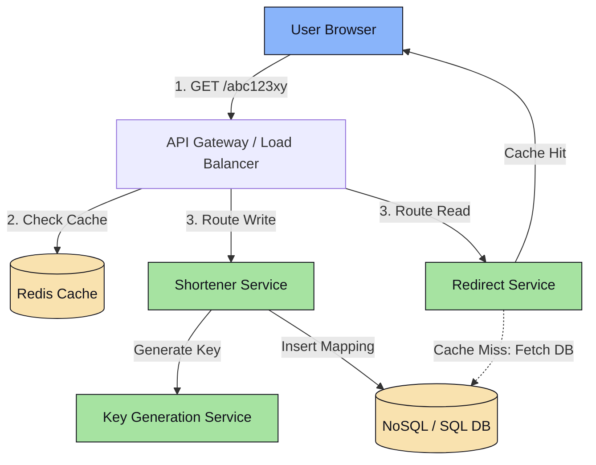

# Platform Design 3.1: URL Shortener (TinyURL)

This system design case study details a scalable, highly available URL shortening service like TinyURL or Bitly.

---

## 📋 System Requirements

### 1. Functional Requirements
*   **Create Short Link**: Given a long URL, the service generates a shorter, unique alias (e.g., `https://tiny.url/abc123xy`).
*   **Redirect**: Accessing the short link redirects the user to the original long URL with an `HTTP 302 Found` status (to ensure browser checks redirect destinations and tracks metrics without caching redirects permanently, which `301 Moved Permanently` would do).
*   **Expiration (Optional)**: Users can specify an optional expiration date for their links.

### 2. Non-Functional Requirements
*   **High Availability**: The system must never go down; redirect operations must always work.
*   **Ultra-Low Latency**: The redirect lookup must take $<100\text{ms}$.
*   **High Scale**: Heavy read-to-write ratio (e.g., 100 reads for every 1 write).

---

## 🧮 Back-of-the-Envelope Estimation

*   **Scale Assumptions**:
    *   New URLs written/day = 10 Million.
    *   Read-to-Write Ratio = 100:1.
    *   Daily Active Reads = 1 Billion redirects/day.
*   **QPS Calculations**:
    *   **Write QPS**: $\frac{10,000,000}{86,400\text{ seconds}} \approx 116\text{ writes/sec}$.
    *   **Read QPS**: $\frac{1,000,000,000}{86,400\text{ seconds}} \approx 11,574\text{ reads/sec}$.
*   **Storage Estimation (5 Years)**:
    *   Assume average record size = 500 bytes (original URL, short code, created timestamp, expiration).
    *   Total records in 5 years: $10,000,000 \times 365 \times 5 = 18.25\text{ Billion}$.
    *   Total Storage: $18.25\text{ Billion} \times 500\text{ bytes} \approx 9.12\text{ TB}$.
*   **Cache Memory Requirement**:
    *   Following the 80/20 rule (20% of URLs generate 80% of traffic).
    *   Daily read traffic = 1 Billion requests.
    *   We cache 20% of daily requests: $200\text{ Million} \times 500\text{ bytes} = 100\text{ GB}$ of RAM.

---

## 📡 API Interface Design

### 1. Shorten URL Endpoint
```http
POST /api/v1/shorten
Content-Type: application/json
Authorization: Bearer <JWT> (Optional)

{
  "longUrl": "https://example.com/very/long/path/name?param=xyz",
  "customAlias": "my-promo-code",
  "expireAt": 1782245600
}
```
**Response (`201 Created`)**:
```json
{
  "shortUrl": "https://tiny.url/my-promo-code",
  "shortCode": "my-promo-code",
  "longUrl": "https://example.com/very/long/path/name?param=xyz",
  "expireAt": 1782245600
}
```

### 2. Redirect Endpoint
```http
GET /{shortCode}
```
**Response (`302 Found`)**:
```http
HTTP/1.1 302 Found
Location: https://example.com/very/long/path/name?param=xyz
Cache-Control: private, max-age=90
```

---

## 🗄️ Database Design

We do not require complex relational joins or transactions. We need simple, highly scalable key-value lookups.
*   **Choice**: **NoSQL Key-Value Store** (e.g., Amazon DynamoDB or Cassandra) or **Relational DB** (PostgreSQL/MySQL) with a B+ Tree index on the `short_code`.
*   **Logical Schema Table**: `url_mappings`

| Column | Type | Description |
| :--- | :--- | :--- |
| **id** (Primary Key) | VARCHAR(64) | Unique ID (e.g., Snowflake ID). |
| **short_code** (Index) | VARCHAR(16) | The short link slug (e.g., `abc123xy`). |
| **original_url** | VARCHAR(2048) | The long target URL. |
| **created_at** | BIGINT | Unix timestamp when created. |
| **expire_at** | BIGINT | Expiration timestamp (nullable). |

---

## 🏗️ High-Level Architecture Diagram



---

## 🔍 Detailed Component Deep Dives

### 1. Generating Unique Short Codes (Base62 Encoding)
A 7-character Base62 string (`[A-Z, a-z, 0-9]`) supports $62^7 \approx 3.52\text{ Trillion}$ unique URLs, which is more than enough for our 18 Billion estimate.

*   **Approach A: Hash-Based Code generation**
    *   Take `MD5(long_url)` producing a 128-bit hash, convert it to Base62, and slice the first 7 characters.
    *   **Collision Problem**: Two different URLs might yield the same first 7 characters.
    *   **Resolution**: Check the database. If collision exists, append a random counter or client IP to the `long_url` and re-hash. This requires an expensive database query during writes.

*   **Approach B: Centralized Key Generation Service (KGS) (Recommended)**
    *   We maintain an independent service (KGS) that pre-generates unique 7-character strings and stores them in a "unused keys" table.
    *   When the Shortener Service receives a write, it grabs a pre-allocated key from the KGS memory buffer instantly.
    *   **KGS Scale-Out Strategy**: KGS buffers a block of keys (e.g., 10,000 keys) in each application node's RAM. If an application node crashes, the buffered keys are lost, but since we have 3.5 Trillion keys, losing a few million keys over time does not matter.

### 2. High-Performance Redirect Path (Reads)
Since reads ($11,574\text{ QPS}$) are 100x higher than writes:
1.  When a redirect request `GET /abc123xy` arrives, the API Gateway sends the query to the Redirect Service.
2.  The service queries **Redis** first.
3.  On cache hit, return `302 Found` immediately.
4.  On cache miss, query the database, write back the result to Redis, and return `302 Found`.
5.  If the short code doesn't exist in the database, cache a `null` value with a short TTL to prevent Cache Penetration.
