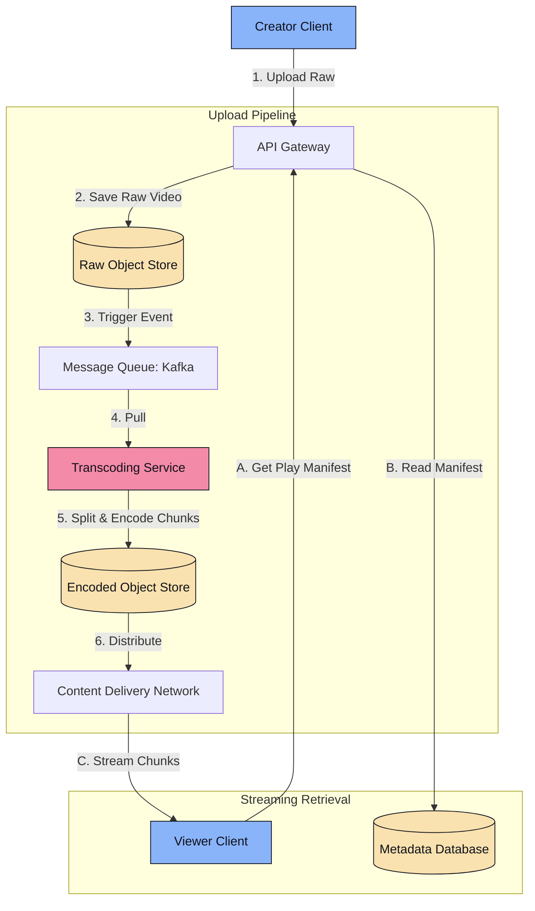
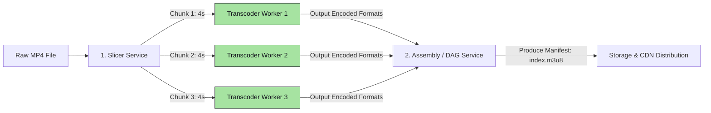

# Platform Design 3.2: Video Streaming (Netflix/YouTube)

This system design case study details a highly scalable video upload, transcoding, and streaming service like YouTube or Netflix.

---

## 📋 System Requirements

### 1. Functional Requirements
*   **Video Upload**: Content creators can upload raw video files.
*   **Stream Playback**: Users can watch videos in real-time, at various qualities, with minimal lag or buffering.
*   **Video Search**: Users can search for videos by title, tag, or description.
*   **Interactions**: Users can view view-counts, like, and comment on videos.

### 2. Non-Functional Requirements
*   **Ultra-Low Latency Playback**: Buffering must be minimized. Streaming startup time should be $<1\text{ second}$.
*   **High Scalability**: Must handle massive write spikes (uploads) and sustained peak read traffic (streaming).
*   **High Availability & Partition Tolerance**: The streaming experience must be highly resilient globally.

---

## 🧮 Back-of-the-Envelope Estimation

*   **Scale Assumptions**:
    *   Daily Active Users (DAU) = 100 Million.
    *   Average viewing time = 30 minutes/user/day.
    *   Average video size (encoded) = 250MB for 30 minutes (mostly 720p/1080p stream mix).
*   **Bandwidth Estimation**:
    *   Total data streamed/day: $100\text{ Million} \times 250\text{ MB} = 25\text{ Petabytes/day}$.
    *   Average Egress Bandwidth: $\frac{25\text{ PB}}{86,400\text{ seconds}} \approx 2.3\text{ Terabits per second (Tbps)}$.
*   **Upload Storage Estimation**:
    *   Assume 1 Million videos uploaded/day.
    *   Average raw video size = 500MB.
    *   Daily raw storage required: $1\text{ Million} \times 500\text{ MB} = 500\text{ Terabytes/day}$.
    *   After transcoding into multiple formats and resolutions, storage expands by a factor of 4: $2\text{ Petabytes/day}$.

---

## 🏗️ High-Level System Architecture



---

## 🔍 Detailed Component Deep Dives

### 1. The Video Upload & Transcoding Pipeline
When a raw 4K video is uploaded, it cannot be streamed directly. We must slice it and encode it for multiple screen sizes (1080p, 720p, 480p) and different network conditions.



#### Step-by-Step Flow:
1.  **Slicing**: The file is split into small physical chunks (e.g., 4-second segments). This allows parallel transcoding. If one node fails, only a 4-second chunk needs to be reprocessed.
2.  **Transcoding**: Workers fetch raw chunks and convert them into target resolutions and formats:
    *   **Codecs**: H.264 (universal compatibility), H.265/HEVC (better compression), VP9/AV1 (high-efficiency open source).
    *   **Streaming Protocols**:
        *   **HLS (HTTP Live Streaming)**: Apple’s standard, runs over HTTP/1.1 or HTTP/2, uses `.m3u8` index manifests and `.ts` chunk files.
        *   **DASH (Dynamic Adaptive Streaming over HTTP)**: Open standard, uses `.mpd` XML index manifests.
3.  **Manifest Generation**: The transcoding pipeline creates a master **Manifest File**. This file contains URLs to all 4-second chunks in all resolutions.

### 2. Adaptive Bitrate Streaming (ABR)
During playback, the client application (e.g., Netflix app or web player) does not download one giant file.

1.  The client fetches the `.m3u8` manifest file.
2.  The client monitors the local user network bandwidth and CPU.
3.  If network speed is high, the client requests the next 4-second chunk in 1080p.
4.  If network speed drops suddenly (e.g., entering a tunnel), the client requests the next chunk in 480p, preventing playback interruptions.

### 3. Content Delivery Network (CDN) & Edge Cache
Streaming 25 Petabytes/day directly from central databases will saturate servers. We offload 95%+ of read traffic to CDNs.

*   **Geographic Localization**: CDNs cache video chunks close to the user's location.
*   **ISP Placement (Netflix Open Connect)**: Netflix distributes custom physical servers (Open Connect Appliances) directly inside ISP server racks globally. If a user watches a popular show, the data is served from a box inside their local internet service provider's warehouse, generating zero external network routing costs.

---

## 🗄️ Database Schema Design

### 1. Video Metadata DB (NoSQL Document Store or Sharded SQL)
Stores video details, titles, descriptions, and user records. Relational tables are sharded by `video_id`.

```sql
CREATE TABLE videos (
    video_id VARCHAR(64) PRIMARY KEY,
    creator_id VARCHAR(64) NOT NULL,
    title VARCHAR(255) NOT NULL,
    description TEXT,
    manifest_url VARCHAR(512) NOT NULL, -- Link to S3 index.m3u8
    view_count BIGINT DEFAULT 0,
    created_at TIMESTAMP
);
```

### 2. Real-Time View Count Analytics
A primary challenge is managing high-frequency concurrent writes to `view_count` fields. Incrementing database records directly on every stream start will lock tables and crash the database.
*   **Resolution**: Route view events through **Kafka**. Read events in batches using a streaming processor (e.g., Spark Streaming or Flink), aggregate counts per video over a 10-second window, and execute batch database updates:
    ```sql
    UPDATE videos SET view_count = view_count + ? WHERE video_id = ?
    ```
