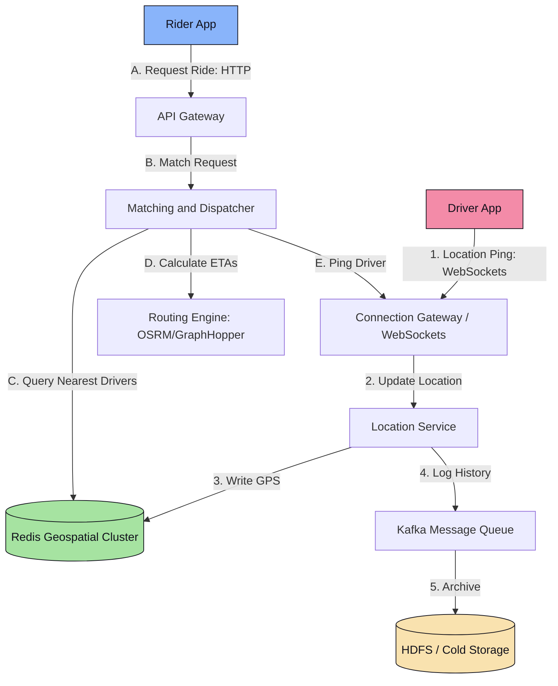
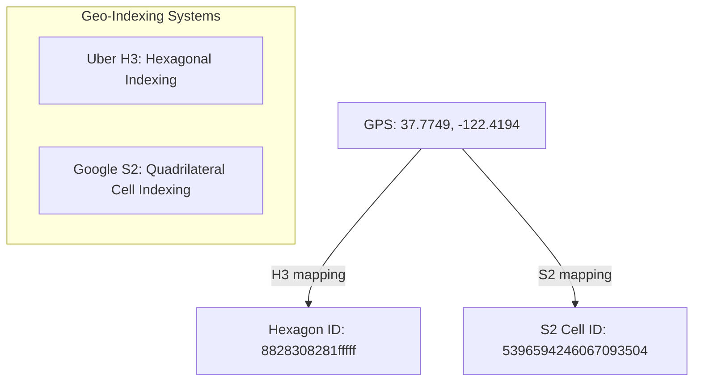

# Platform Design 3.3: Ride-Sharing Service (Uber/Lyft)

This system design case study details a geospatial, real-time matching service like Uber or Lyft.

---

## 📋 System Requirements

### 1. Functional Requirements
*   **Location Update**: Drivers continuously report their GPS coordinates.
*   **Request Ride**: Riders can input a pickup and dropoff location to see upfront pricing and ETAs.
*   **Match System**: The system matches the rider with the nearest available driver.
*   **Real-time Tracking**: Riders can track the driver’s location in real-time.

### 2. Non-Functional Requirements
*   **Real-time Operations**: Driver tracking updates must be rendered with low latency ($<2\text{ seconds}$).
*   **High Write Scale**: Massive incoming stream of GPS coordinate updates (millions of drivers pinging every 4 seconds).
*   **Consistency vs Latency**: Location queries (matching) must be fast. Strong consistency is not required for old location history, but active matches need highly accurate data.

---

## 🧮 Back-of-the-Envelope Estimation

*   **Scale Assumptions**:
    *   Daily Active Riders = 50 Million.
    *   Active Drivers (peak) = 5 Million.
    *   GPS Ping frequency = Once every 4 seconds.
*   **Location Update Write QPS**:
    *   $\frac{5,000,000\text{ drivers}}{4\text{ seconds}} = 1,250,000\text{ writes/sec (QPS)}$.
    *   This is an extreme write workload that traditional databases cannot handle directly without partitioning and in-memory optimizations.
*   **Storage Estimation (Daily Driver History)**:
    *   Assume each ping payload: `[driver_id, latitude, longitude, timestamp]` = 40 bytes.
    *   Daily logs: $1,250,000\text{ pings/sec} \times 86,400\text{ seconds} \approx 108\text{ Billion pings/day}$.
    *   Daily Storage: $108\text{ Billion} \times 40\text{ bytes} \approx 4.32\text{ TB/day}$.
    *   Historical path tracking logs are archived in cold HDFS/S3 storage. Only active driver locations are stored in hot memory.

---

## 🏗️ High-Level System Architecture

---

## 🔍 Detailed Component Deep Dives

### 1. Geospatial Indexing: H3 vs S2
Traditional SQL indexes (`INDEX(latitude, longitude)`) cannot handle spatial queries like *"find all drivers within a 2-mile radius of (Lat, Lon)"* efficiently. Querying this requires a 2D range scan, which degrades under millions of concurrent writes.

Distributed systems map 2D coordinates into 1D strings using geospatial indexing systems:

*   **Google S2**: Divides the sphere into a hierarchical grid of quadrilateral cells based on Hilbert space-filling curves.
*   **Uber H3**: Divides the globe into hexagonal cells.
    *   **Why Hexagons**: In a grid of squares, the distance from a center cell to its diagonal neighbors is $\sqrt{2} \approx 1.41$ times larger than to its adjacent neighbors. Hexagons have the property that the distance from the center to all 6 surrounding neighbors is identical, making radial neighborhood searches (finding drivers within range) much simpler.

### 2. High-Throughput Location Tracking
To handle $1.25\text{ Million QPS}$ of writes:
1.  **WebSocket Connections**: Drivers maintain persistent WebSocket connections with a **Connection Gateway** to minimize the overhead of handshakes.
2.  **In-Memory Store (Redis Geospatial)**: Active locations are stored in a distributed Redis cluster using Redis Geo commands (`GEOADD`, `GEORADIUS`).
    *   Redis is single-threaded and executes operations in RAM, handling up to 100k+ operations per second per node. We shard the Redis cluster using **Consistent Hashing based on the S2/H3 Cell ID** corresponding to the driver's current coordinates.
    *   This ensures that location writes and queries for a specific geographical region land on the same Redis shard, localizing computation.

### 3. The Match & Dispatch Flow
When a rider requests a ride:
1.  The **Matching Service** hashes the rider's pickup location to its H3 Hexagon cell ID.
2.  It queries Redis for all active, online drivers located in that hexagon cell and neighboring hexagons.
3.  The service filters out drivers who are currently busy on another ride.
4.  For the remaining drivers, the service calls the **Routing Engine** (e.g., OSRM - Open Source Routing Machine) to calculate the actual road distance and ETA (instead of straight-line distance).
5.  The system sends the dispatch request to the closest driver via WebSockets. If the driver rejects or times out (e.g., 10 seconds), it cascades to the next closest driver.
