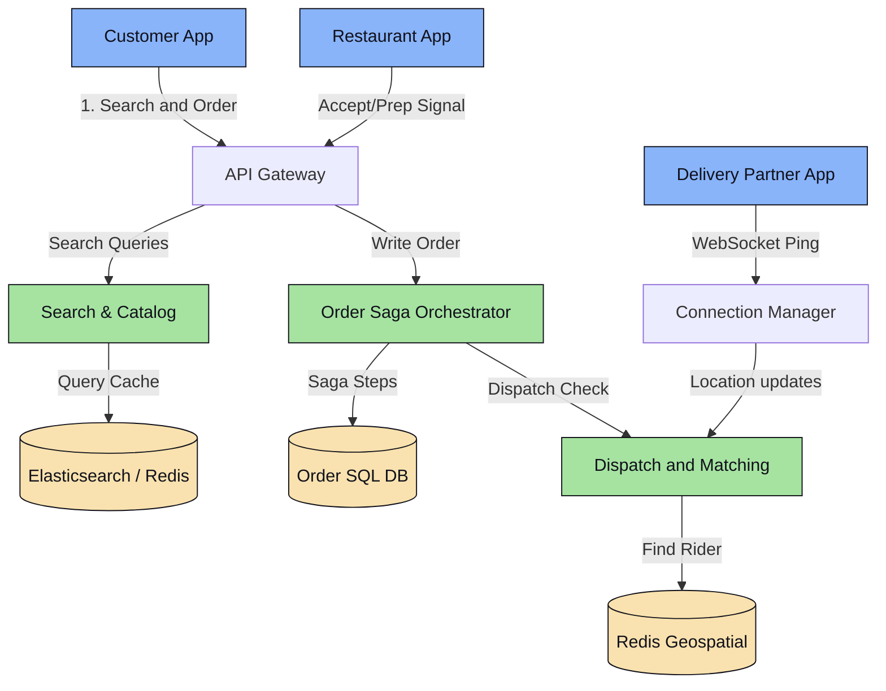
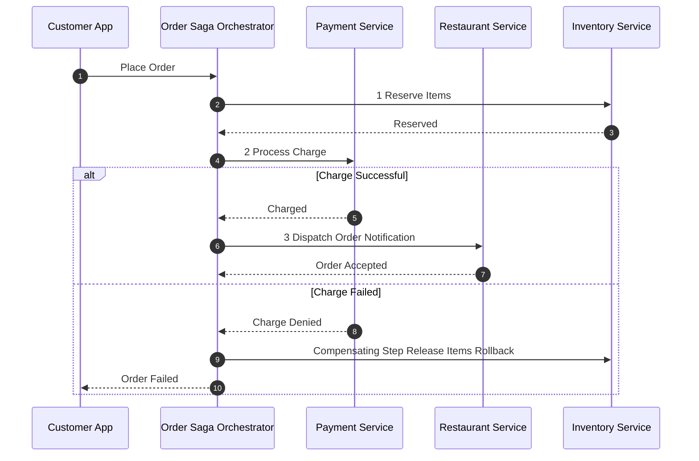

# Platform Design 3.4: Food Delivery Service (Swiggy/Zomato)

This system design case study details a tri-partite marketplace service (Customer, Restaurant, Delivery Partner) like Swiggy, Zomato, or UberEats.

---

## 📋 System Requirements

### 1. Functional Requirements
*   **Search Restaurants**: Customers can search for restaurants by cuisine, location, or food item.
*   **Place Order**: Customers can build a cart, apply coupons, and checkout securely.
*   **Order Tracking**: Customers can track order status (placed, preparing, out for delivery) and the delivery partner's real-time position.
*   **Restaurant Portal**: Restaurants can accept orders, update menus, and signal when food is ready.
*   **Delivery Partner Portal**: Delivery partners can view assigned orders, navigate paths, and mark orders as picked/delivered.

### 2. Non-Functional Requirements
*   **Transactional Consistency**: Order states must remain consistent. We cannot charge a customer for an order that the restaurant never receives or rejects.
*   **Low-Latency Search**: Restaurant catalog queries must return in $<50\text{ms}$.
*   **Optimal Dispatching**: Efficiently matching order preparation times with delivery partner locations.

---

## 🏗️ High-Level System Architecture



---

## 🔍 Detailed Component Deep Dives

### 1. Order Lifecycle & Distributed Transaction Management
An order touches multiple domains: Payment, Inventory, Restaurant, and Delivery. To prevent inconsistencies (e.g., card charged but order database write fails), we use an **Orchestrator-based Saga Pattern**.



#### Orchestration Flow:
1.  **Reserve Inventory**: The orchestrator instructs the Inventory Service to hold ingredients/items.
2.  **Charge Payment**: The orchestrator calls the Payment Service to process the charge.
3.  **Confirm Restaurant**: The orchestrator sends a request to the Restaurant Service. The restaurant has 2 minutes to accept.
4.  **Compensating Transactions (Rollback)**: If the restaurant rejects the order or times out, the Saga Orchestrator runs compensating steps:
    *   Triggers the Payment Service to issue an automatic refund.
    *   Triggers the Inventory Service to release reserved ingredients.
    *   Updates order status to `REJECTED`.

### 2. Optimal Dispatching (Delivery Partner Allocation)
Unlike ride-sharing, where matching happens immediately based on proximity, food delivery involves a physical delay: **Food Preparation Time (FPT)**.

*   **The Proximity Matching Problem**: If a delivery partner (DP) is matched to an order the moment it is placed, the DP arrives at the restaurant quickly and wastes 15-20 minutes waiting for the food to be cooked, reducing their hourly earnings.
*   **The Delay-Match Solution**:
    1.  When an order is accepted, the restaurant sends an estimated FPT (e.g., 20 minutes).
    2.  The matching engine tracks DP transit times to the restaurant.
    3.  Instead of dispatching immediately, the system waits. It assigns the order to a DP located 5 minutes away, sending the match ping exactly 15 minutes after the order was placed.
    4.  **Result**: The DP and the hot food arrive at the restaurant pickup counter at the exact same moment.

---

## 🗄️ Database Schema Design

We need structured, relational consistency for order details, tables must support transactions.
*   **Choice**: **PostgreSQL or MySQL** sharded by `user_id` or `order_id`.

```sql
CREATE TABLE orders (
    order_id VARCHAR(64) PRIMARY KEY,
    user_id VARCHAR(64) NOT NULL,
    restaurant_id VARCHAR(64) NOT NULL,
    total_amount DECIMAL(10, 2) NOT NULL,
    payment_status VARCHAR(32) NOT NULL, -- PENDING, COMPLETED, REFUNDED
    order_status VARCHAR(32) NOT NULL,   -- PLACED, ACCEPTED, PREPARING, OUT_FOR_DELIVERY, DELIVERED
    delivery_partner_id VARCHAR(64),
    created_at TIMESTAMP
);

CREATE TABLE order_items (
    id SERIAL PRIMARY KEY,
    order_id VARCHAR(64) REFERENCES orders(order_id),
    item_id VARCHAR(64) NOT NULL,
    quantity INT NOT NULL,
    price DECIMAL(10, 2) NOT NULL
);
```
*Indexing is set on `user_id` and `delivery_partner_id` to speed up customer active tracking and driver dashboards.*
