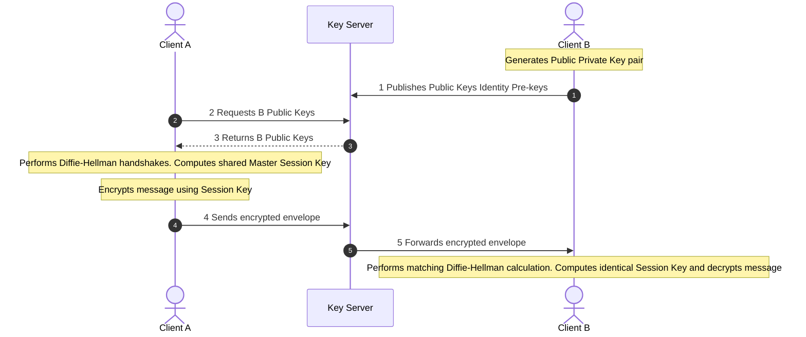
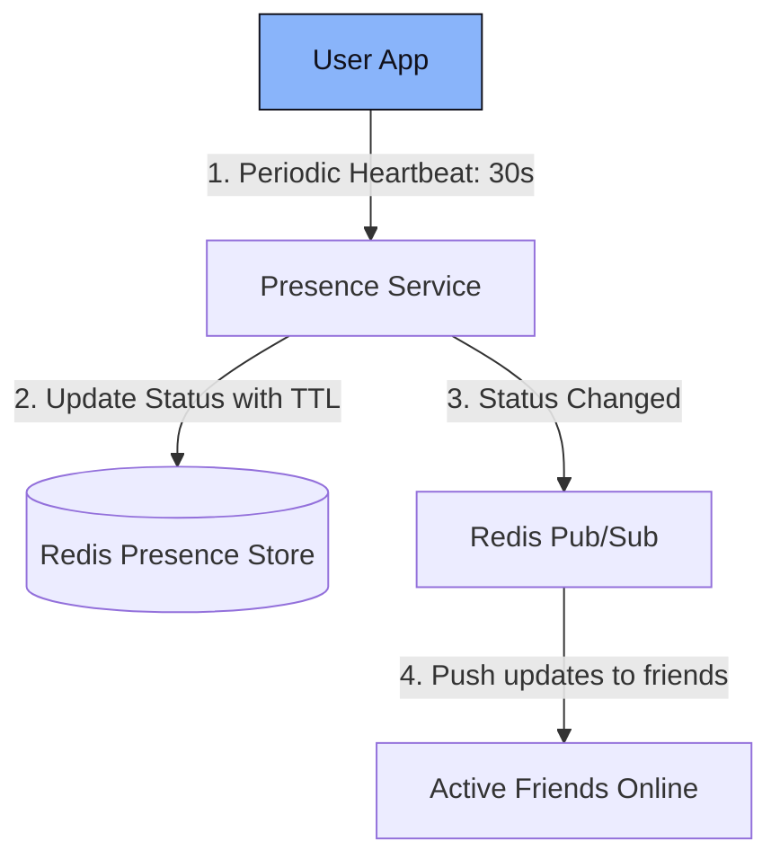

# Platform Design 3.5: Chat / Messenger App (WhatsApp/Slack)

This system design case study details a real-time, end-to-end encrypted messaging service like WhatsApp, Slack, or WeChat.

---

## 📋 System Requirements

### 1. Functional Requirements
*   **One-to-One Chat**: Real-time messaging between two users.
*   **Group Chat**: Channels/Groups with multiple members.
*   **Message Status**: Real-time feedback indicators: Sent (single check), Delivered (double check), Read (blue checks).
*   **Media Sharing**: Support sharing images, videos, and documents.
*   **Presence Status**: Displaying whether a user is Online/Offline and their "Last Seen" timestamp.

### 2. Non-Functional Requirements
*   **Low Latency**: Message delivery should take $<100\text{ms}$ if both users are online.
*   **End-to-End Encryption (E2EE)**: Messages must be encrypted client-side. The servers must act only as routers and should not be able to read message content.
*   **High Scalability**: Supporting billions of active connections and massive concurrent message routing.

---

## 🏗️ High-Level System Architecture

```mermaid
graph TD
    classDef client fill:#89B4FA,stroke:#11111B,color:#11111B;
    classDef service fill:#A6E3A1,stroke:#11111B,color:#11111B;
    classDef registry fill:#F38BA8,stroke:#11111B,color:#11111B;
    classDef storage fill:#F9E2AF,stroke:#11111B,color:#11111B;

    UserA["Client A: Online"]:::client -->|"1. WebSocket Msg"| GateA["Connection Gateway A"]
    UserB["Client B: Online"]:::client <--|"5. Deliver Msg"| GateB["Connection Gateway B"]
    
    GateA -->|"2. Route Msg"| ChatRouter["Chat Routing Service"]:::service
    ChatRouter -->|"3. Query Session"| SessionStore[("Redis Registry")]:::registry
    
    ChatRouter -->|"4a. Online: Forward"| GateB
    ChatRouter -.->|"4b. Offline: Queue"| MessageDB[("Offline Store: Cassandra")]:::storage
```

---

## 🔍 Detailed Component Deep Dives

### 1. Persistent Connections & Routing Path
To achieve instant, low-latency delivery, clients do not poll the server. Instead, they open a persistent bidirectional connection using **WebSockets** (or raw TCP/XMPP) to a **Connection Gateway**.

#### Message Flow (A sends message to B):
1.  **A sends message** over its WebSocket connection to **Gateway A**.
2.  **Gateway A** forwards the packet to the **Chat Routing Service**.
3.  The **Chat Routing Service** queries the **Session Store (Redis)** to check where User B is currently connected:
    *   **Case 1 (B is Online)**: Redis returns `Gateway B IP`. The Chat Router pushes the message to **Gateway B**, which writes it directly to User B's open socket.
    *   **Case 2 (B is Offline)**: Redis returns no active connection. The Chat Router saves the encrypted message to the **Offline Messages DB** (e.g., Apache Cassandra, chosen for high-throughput sequential writes). When B logs back in, B pulls all pending records from the database, and the server deletes them from disk.

### 2. End-to-End Encryption (Signal Protocol)
To ensure privacy, the server must never possess the raw text message.



*   **Key Server**: Houses users' public keys.
*   **Encryption**: Client A requests Client B’s public keys from the server, computes a shared encryption key locally using Diffie-Hellman algorithms, encrypts the message payload, and sends the ciphertext. Only Client B's private key (kept locally on B's phone) can decrypt this payload. The server only sees encrypted metadata.

### 3. Presence Service (Online/Offline Status)
Presence tracking is highly read-heavy. If a user has 500 contacts, and they open their app, checking the online status of all 500 contacts directly from a database creates a massive query bottleneck.



*   **Heartbeat Mechanism**: Every active client sends a heartbeat ping to the **Presence Service** every 30 seconds. Upon receiving a ping, the service updates a Redis key (`user:presence:<user_id> = "online"`) with a TTL of 40 seconds.
*   **Offline Transition**: If the server fails to receive a heartbeat for 40 seconds, the Redis key expires. The user is marked offline.
*   **Publish-Subscribe (Pub/Sub)**: When User A goes online/offline, the Presence Service publishes an event to a Redis Pub/Sub channel dedicated to User A's status. All of A’s online friends subscribe to this channel and receive immediate real-time UI updates on their screens.

---

## 🗄️ Database Design

### 1. Active Connection Registry (Redis Key-Value)
*   `user:session:<user_id> = <gateway_ip>` (TTL = active connection duration)

### 2. Offline Messages (NoSQL Column-Family: Apache Cassandra)
Cassandra is designed for heavy, append-only write patterns, which is ideal since offline messages are written once, read once when the user reconnects, and then immediately deleted.

```sql
CREATE KEYSPACE chat_offline WITH replication = {'class': 'SimpleStrategy', 'replication_factor': 3};

CREATE TABLE offline_messages (
    recipient_id text,
    message_id text,
    sender_id text,
    encrypted_payload blob,
    created_at timestamp,
    PRIMARY KEY (recipient_id, created_at)
) WITH CLUSTERING ORDER BY (created_at ASC);
```
*The primary key structure clusters messages by `recipient_id` ordered by time, allowing the recipient to fetch all pending messages in a single sequential disk scan upon logging in.*
