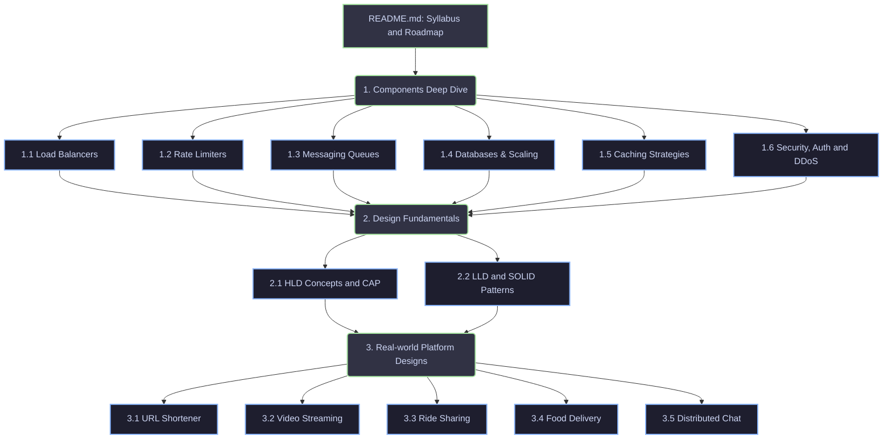

# System Design Mastery Guide

Welcome to the **System Design Mastery Guide**. This repository is a comprehensive, production-grade learning resources hub designed to take you from foundational system components to advanced, real-world platform architectures (often asked in technical design interviews at top tech companies).

Each module consists of:
*   **Deep-Dive Explanations**: Hard engineering choices, trade-offs, and failure modes (no hand-waving).
*   **Mermaid Diagrams**: Architectural flows, packet paths, consensus models, and database design.
*   **Practical Implementations**: Code snippets and algorithms where applicable (e.g., rate limiters, design patterns).

---

## 🗺️ Learning Roadmap

---

## 📚 Curriculum Index & Checklist

Track your progress by checking off the topics as you go:

### ⚙️ Module 1: System Components Deep Dive
*   [ ] **[1.1 Load Balancers](file:///c:/Users/hario/OneDrive/DSA/SystemDesign/1_Components/1.1_Load_Balancers.md)**: Master traffic routing, L4 vs L7 OSI layer proxying, consistent hashing, Nginx, HAProxy, and DNS round-robin.
*   [ ] **[1.2 Rate Limiters](file:///c:/Users/hario/OneDrive/DSA/SystemDesign/1_Components/1.2_Rate_Limiters.md)**: Token bucket, Leaky bucket, Fixed/Sliding Window algorithms, and distributed limits using Redis + Lua.
*   [ ] **[1.3 Messaging Queues](file:///c:/Users/hario/OneDrive/DSA/SystemDesign/1_Components/1.3_Messaging_Queues.md)**: Dive deep into log-append distributed commit logs (Kafka) versus AMQP brokers (RabbitMQ). Learn offsets, partitions, and consumer groups.
*   [ ] **[1.4 Databases & Scaling](file:///c:/Users/hario/OneDrive/DSA/SystemDesign/1_Components/1.4_Databases_Scaling.md)**: Sharding strategies, Master-Slave replication, Leaderless consensus (Paxos/Raft), LSM vs B-Trees indexing.
*   [ ] **[1.5 Caching Strategies](file:///c:/Users/hario/OneDrive/DSA/SystemDesign/1_Components/1.5_Caching_Strategies.md)**: Cache-aside, write-through, write-behind, eviction policies (LRU/LFU), and mitigations for cache stampedes, penetration, and breakdowns.
*   [ ] **[1.6 Security, Auth & DDoS](file:///c:/Users/hario/OneDrive/DSA/SystemDesign/1_Components/1.6_Security_Auth_DDoS.md)**: TLS handshakes, OAuth2/JWT architecture, DDoS protection (WAFs, Cloudflare, rate limits).

### 📐 Module 2: Design Fundamentals
*   [ ] **[2.1 HLD Concepts](file:///c:/Users/hario/OneDrive/DSA/SystemDesign/2_Design_Fundamentals/2.1_HLD_Concepts.md)**: CAP vs PACELC theorems, Consistent Hashing algorithms, API Gateways, and inter-service communication (gRPC, REST, WebSockets).
*   [ ] **[2.2 LLD Principles](file:///c:/Users/hario/OneDrive/DSA/SystemDesign/2_Design_Fundamentals/2.2_LLD_Principles.md)**: Object-Oriented SOLID principles, Clean Architecture, and microservice patterns (Saga, Outbox, CQRS, Event Sourcing).

### 🚀 Module 3: Platform & Interview System Designs
*   [ ] **[3.1 URL Shortener (TinyURL)](file:///c:/Users/hario/OneDrive/DSA/SystemDesign/3_Platform_Designs/3.1_URL_Shortener.md)**: Basic design covering database choice, base-62 encoding, unique ID generation (Snowflake), and high-concurrency redirection.
*   [ ] **[3.2 Video Streaming (Netflix/YouTube)](file:///c:/Users/hario/OneDrive/DSA/SystemDesign/3_Platform_Designs/3.2_Video_Streaming_Netflix.md)**: Advanced design addressing video upload transcoding pipelines, CDNs (Netflix Open Connect), chunk storage, metadata storage, and adaptive bitrate streaming.
*   [ ] **[3.3 Ride Sharing (Uber/Lyft)](file:///c:/Users/hario/OneDrive/DSA/SystemDesign/3_Platform_Designs/3.3_Ride_Sharing_Uber.md)**: Geospatial architectures featuring H3/S2 spatial indexing, dynamic pricing engine (surge pricing), matching algorithms, and massive scale real-time driver tracking.
*   [ ] **[3.4 Food Delivery (Swiggy/Zomato)](file:///c:/Users/hario/OneDrive/DSA/SystemDesign/3_Platform_Designs/3.4_Food_Delivery_Swiggy.md)**: Tri-partite marketplace flow (customer, restaurant, delivery partner), real-time updates, route optimization, and consistency across ordering states.
*   [ ] **[3.5 Distributed Chat (WhatsApp/Slack)](file:///c:/Users/hario/OneDrive/DSA/SystemDesign/3_Platform_Designs/3.5_Chat_App_WhatsApp.md)**: Real-time connections using WebSockets/XMPP, connection registry, message persistence, group chat scale, media attachments, and end-to-end encryption (Signal Protocol).

---

## 💡 System Design Blueprint: How to Approach Any Design

When designing a platform, use the **4-Step Interview Framework**:

1.  **Define Scope (5-10m)**: Identify functional requirements (what it must do) & non-functional requirements (QPS, latency, SLA/availability, consistency preferences).
2.  **Back-of-the-Envelope Estimation (5m)**: Estimate scale parameters like DAU (Daily Active Users), Read QPS vs Write QPS, Storage needed for 5 years, and Network Bandwidth.
3.  **High-Level Architecture (10-15m)**: Draw the API gateway, microservices, databases, caching layers, queues, and draw the core end-to-end data flows.
4.  **Deep-Dive / Bottleneck Analysis (15-20m)**: Zoom in on critical components. For example: How does Uber track drivers? (Geohashes/S2). How does Netflix stream without buffering? (HLS/DASH/CDNs). Explain failure modes, replication lag, and scaling solutions.
